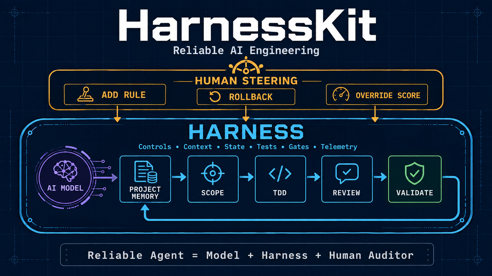
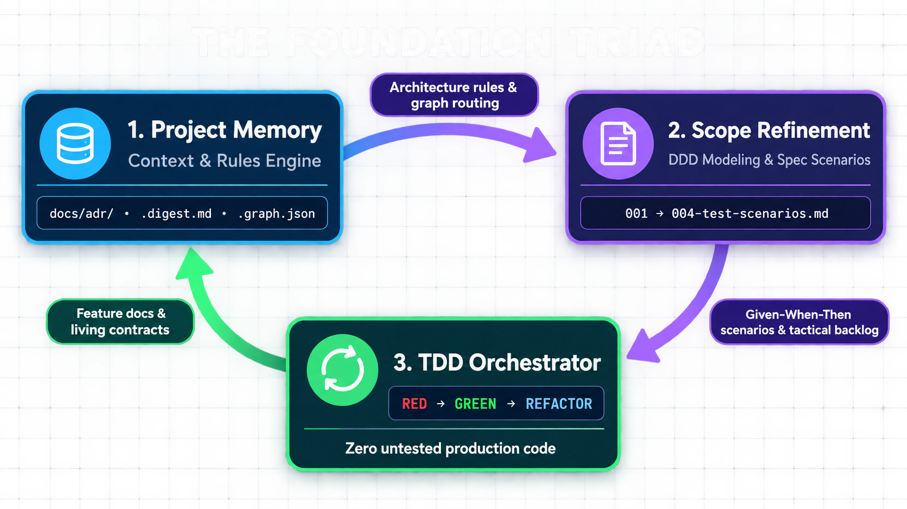
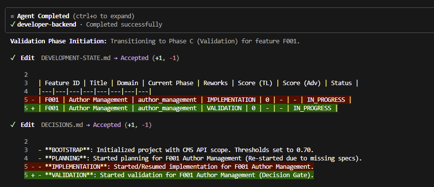
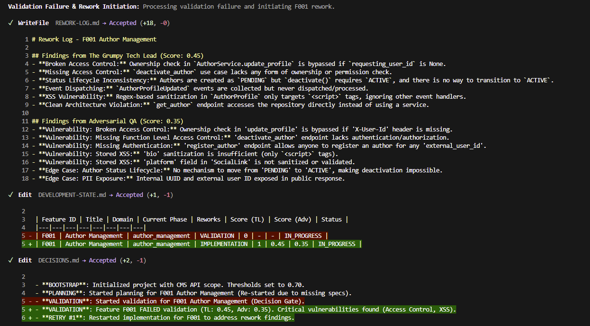

# 🔧 HarnessKit



> **Harness Engineering**: A reliable AI agent is not just a raw model. It is defined as:
> $$\text{Reliable Agent} = \text{Model (AI)} + \text{Harness (Controls)} + \text{Human Auditor}$$

HarnessKit is a complete AI-assisted software engineering framework built on **Harness Engineering**—the principle that true reliability comes from enclosing generative models inside structured execution scaffolds, persistent memory, domain modeling, and strict test-driven quality loops.

---

## 🏛️ The Foundation Triad

At the core of HarnessKit is the **Foundation Triad**: three indispensable skills that establish project context, specify business domains, and guarantee code correctness. Every higher-level workflow—whether manual pair-programming or fully sovereign autonomous execution—rests entirely upon this foundation.



---

### 1. 🧠 Project Memory (`project-memory`)
> **The Persistent Memory & Context Routing Engine**

AI models suffer from context drift and hallucinations across long coding sessions. `project-memory` acts as the agent's long-term brain, creating and maintaining standardized living documentation in `docs/`:

* **Architecture Decision Records (ADRs):** Establishes mandatory baseline rules in `docs/adr/ARCHITECTURE.md` (patterns, layers, constraints) and `docs/adr/TESTS.md` (frameworks, test conventions, coverage bars).
* **Token-Efficient Graph Indexing:** Generates `docs/.digest.md` (fast executive orientation <60 lines) and `docs/.graph.json` (macro relation graph for 1-hop document and dependency lookup).
* **Feature Micrographs:** Embeds machine-readable routing blocks (`entrypoints`, `registration_files`, `reference_files`, `code_files`, `test_files`) directly in `docs/feature/*.md` so agents navigate codebases without costly repository scans.
* **Strict Constraints:** Enforces character caps (<8,000 chars per ADR), imperative rules (`REQUIRED`, `PROHIBITED`), and prevents architectural degradation over time.

---

### 2. 📐 Scope Refinement (`scope-refinement`)
> **The Domain-Driven Design (DDD) Modeling & Specification Engine**

Before writing a single line of production code, `scope-refinement` breaks down requirements through rigorous Domain-Driven Design across four sequential phases:

```text
Phase 1: Problem Space   → 001-problem-space.md (Domain Events, Subdomains, Ubiquitous Language)
Phase 2: Context Map     → 002-context-map.md (Bounded Contexts, Integrations, Upstream/Downstream)
Phase 3: Tactical Design → 003-*-tactical-design.md (Aggregates, Entities, Value Objects, Ordered Tasks)
Phase 4: Test Scenarios  → 004-*-test-scenarios.md (Given-When-Then Scenarios mapped to dev tasks)
```

* **Eliminates Ambiguity:** Resolves domain naming, business invariants, and boundaries prior to implementation.
* **Pre-Specified Verification:** Generates concrete Given-When-Then test cases in Phase 4 that directly dictate what the implementation phase must fulfill.
* **Dual Execution:** Runs interactively with human feedback gates or in headless autonomous mode.

---

### 3. 🧪 TDD Orchestrator (`tdd-orchestrator`)
> **The Test-Driven Development & Verification Engine**

`tdd-orchestrator` coordinates the implementation phase by enforcing the **Iron Law of TDD: no production code without a failing test first**.

* **Step 1 — RED Phase:** Translates the Given-When-Then test scenarios from `004-*-test-scenarios.md` into executable test code. Strictly verifies that tests fail before touching production code.
* **Step 2 — GREEN + REFACTOR:** Implements the minimal code required to pass tests, followed by structural refactoring to eliminate duplication while keeping test suites green.
* **Step 3 — Auto-Debugging Gate:** If tests fail unexpectedly, automatically routes diagnosis to the `developer-debugging` agent for root-cause analysis (5 Whys) before attempting fixes.
* **Step 4 — Final Validation & Doc Sync:** Executes the complete test suite for regression checks and invokes `project-memory` to update living feature docs (`docs/feature/*.md`) and API contracts.

---

## 🔄 The Complete Engineering Cycle

The Foundation Triad forms a closed, self-sustaining loop that transforms raw requirements into verified, fully documented features:

```text
┌─────────────────────────────────────────────────────────────────────────────┐
│ 1. INITIALIZE MEMORY                                                        │
│    `project-memory` scans repo → creates baseline ADRs & graph indexes       │
└──────────────────────────────────────┬──────────────────────────────────────┘
                                       │
                                       ▼
┌─────────────────────────────────────────────────────────────────────────────┐
│ 2. MODEL DOMAIN & SPECS                                                     │
│    `scope-refinement` runs DDD → produces tactical plan & test scenarios    │
└──────────────────────────────────────┬──────────────────────────────────────┘
                                       │
                                       ▼
┌─────────────────────────────────────────────────────────────────────────────┐
│ 3. TEST-DRIVEN IMPLEMENTATION                                               │
│    `tdd-orchestrator` executes RED → GREEN → REFACTOR against test scenarios│
└──────────────────────────────────────┬──────────────────────────────────────┘
                                       │
                                       ▼
┌─────────────────────────────────────────────────────────────────────────────┐
│ 4. SYNC LIVING MEMORY                                                       │
│    `project-memory` updates `docs/feature/*.md` and `.graph.json` indexes   │
└─────────────────────────────────────────────────────────────────────────────┘
```

---

## 🚀 Execution Modes: Interactive vs. Autonomous

HarnessKit supports two primary ways to operate:

### Mode A: Interactive Pair-Programming (Human in the Driver's Seat)
Invoke skills individually during daily development:
* Run `/harness-kit:project-memory` when onboarding a repo or documenting architectural changes.
* Run `/harness-kit:scope-refinement` when planning a complex feature or breaking down a new business domain.
* Run `/harness-kit:tdd-orchestrator` when executing test-first implementation for specific tasks.

### Mode B: Sovereign Autonomous Loop (`autonomous-orchestrator` & CLI)
For hands-off execution, the **`autonomous-orchestrator`** skill chains the entire Foundation Triad together in an atomic, continuous loop:

* **Sovereign Execution:** Executes domain planning, TDD implementation, and validation gates end-to-end without pausing for redundant questions.
* **Live Auditing in the Cockpit:** The human engineer acts as auditor with real-time telemetry and full command:
  * **Pull Emergency Brake (`Ctrl+C`):** Kill execution instantly if architectural drift occurs.
  * **Hot-Interception:** Inject new requirements or edit backlog files mid-flight.
  * **Dynamic Tuning:** Adjust quality gate thresholds (e.g. acceptance scores, `maxReworks`).
* **Product State Machine:** Tracks progress through dynamic transition gates:
  * **`COMPLETED`**: Approved and ready for final PR review.
  * **`RETRY`**: Logs failure details to `REWORK-LOG.md` and loops back to code.
  * **`BLOCKED`**: Critical crash; triggers circuit breaker for immediate human intervention.
  * **`FAILED`**: Non-blocking technical debt; logged for post-hoc audit.



---

## 🛡️ Quality Gates & Self-Optimization

### 🔍 Socratic Code Review (`the-grumpy-tech-lead`)
To expose systemic risks (N+1 queries, memory leaks, race conditions, SOLID violations), HarnessKit employs Socratic code review. Rather than providing copy-paste solutions, `the-grumpy-tech-lead` asks deep architectural questions that guide the engineer (or agent) to solve root causes.



### 🎯 Adversarial QA (`adversarial-qa`)
An autonomous quality agent that analyzes machine-readable specifications, tests, and source code to actively probe edge cases, boundary faults, and security vulnerabilities missed by standard TDD.

### 🧬 Meta-Harness Optimization Loop
HarnessKit continuously evaluates and optimizes its own prompt harnesses based on real execution telemetry:

```text
Sessions (real work)
       ↓
 meta-harness-agent    ← runs harness-tracer (records execution traces to docs/harness-history/)
       ↓
 harness-evaluator     ← aggregates traces, calculates Pareto frontier scores
       ↓
 meta-harness          ← proposes targeted improvements to SKILL.md instructions
       ↓
 Human review & promotion
```

---

## 📦 Installation & Quick Commands

HarnessKit is distributed as a plugin compatible with major AI developer ecosystems:

### Claude Code
```bash
/plugin marketplace add romabeckman/harness-kit
/plugin install harness-kit@harness-kit
/harness-kit:project-memory --help
```

### GitHub Copilot CLI
```bash
copilot plugin marketplace add romabeckman/harness-kit
copilot plugin install harness-kit@harness-kit
```

### Gemini CLI
```bash
agy plugin install https://github.com/romabeckman/harness-kit
```

### Codex CLI
```bash
codex plugin marketplace add https://github.com/romabeckman/harness-kit
codex plugin add harness-kit@harness-kit
```

---

## 💻 SDK & CLI — `@romabeckman/hrns`

For CI/CD pipelines or running sovereign tasks without an open IDE chat session:

```bash
git clone https://github.com/romabeckman/harness-kit.git
cd harness-kit/sdk
npm install
npm run build
npm install -g .
```

Run from any project repository:
```bash
hrns run
```

> 📄 Full SDK documentation: [`sdk/README.md`](sdk/README.md)

---

## 🛠️ What's Inside

### Core Skills (`/skills`)

| Category | Skill | Core Function |
| --- | --- | --- |
| **Foundation** | **[Project Memory](skills/project-memory/SKILL.md)** (`project-memory`) | Creates and maintains persistent technical documentation (`docs/adr/`, `.digest.md`, `.graph.json`). The agent's long-term memory. |
| **Foundation** | **[Scope Refinement](skills/scope-refinement/SKILL.md)** (`scope-refinement`) | DDD orchestrator. Maps Bounded Contexts, Aggregates, and Given-When-Then test scenarios before implementation. |
| **Foundation** | **[TDD Orchestrator](skills/tdd-orchestrator/SKILL.md)** (`tdd-orchestrator`) | Enforces RED → GREEN → REFACTOR. Coordinates test-first implementation and quality gates. |
| **Orchestration** | **[Autonomous Orchestrator](skills/autonomous-orchestrator/SKILL.md)** (`autonomous-orchestrator`) | Sovereign loop manager. Fully automates execution across planning, TDD, validation, and auto-tuning phases. |
| **Orchestration** | **[Read UI Prototype](skills/read-ui-prototype/SKILL.md)** (`read-ui-prototype`) | Translates interface prototypes into structured frontend specs for UI engineers. |
| **Quality Gates** | **[The Grumpy Tech Lead](skills/the-grumpy-tech-lead/SKILL.md)** (`the-grumpy-tech-lead`) | Senior technical reviewer. Uses Socratic questioning to expose architectural vulnerabilities and systemic risks. |
| **Quality Gates** | **[Adversarial QA](skills/adversarial-qa/SKILL.md)** (`adversarial-qa`) | Executes adversarial boundary and security testing, returning structured JSON verdicts. |
| **Optimization** | **[Harness Tracer](skills/harness-tracer/SKILL.md)** (`harness-tracer`) | Records structured execution traces to `docs/harness-history/traces/`. |
| **Optimization** | **[Harness Evaluator](skills/harness-evaluator/SKILL.md)** (`harness-evaluator`) | Computes composite quality scores and identifies Pareto frontier harness configurations. |
| **Optimization** | **[Meta-Harness](skills/meta-harness/SKILL.md)** (`meta-harness`) | Diagnoses failure patterns across sessions and proposes targeted skill prompt improvements. |

### Expert Agents (`/agents`)

| Agent | Role | Focus |
| --- | --- | --- |
| **[Software Architect](agents/software-architect.md)** | System Design & Refinement | DDD modeling, architectural decisions, and tactical planning. |
| **[Developer Backend](agents/developer-backend.md)** | Backend Engineering | Robust APIs, database modeling, and server-side logic with TDD. |
| **[Developer Frontend](agents/developer-frontend.md)** | Frontend Engineering | UI/UX implementation, accessibility, and client-side performance with TDD. |
| **[Developer Debugging](agents/developer-debugging.md)** | Root Cause Specialist | Systematic bug investigation using the "5 Whys" methodology. |
| **[Harness Tech Lead](agents/harness-tech-lead.md)** | Automated Code Review | Evaluates systemic risks, scalability, security, and design patterns. |
| **[Harness QA](agents/harness-qa.md)** | Quality Assurance | Edge-case probing, contract validation, and adversarial QA testing. |
| **[Meta-Harness Agent](agents/meta-harness-agent.md)** | Harness Optimizer | Analyzes trace history and coordinates prompt harness evolution. |
| **[CTO](agents/cto.md)** | Autonomous Strategy | High-level execution strategy and loop governance. |

---

## 📖 Deep-Dive Documentation

Explore the complete knowledge base inside `docs/workflow/`:

* **[Workflow Index](docs/workflow/README.md)** — Main navigation index for documentation.
* **[Daily Use Playbook](docs/workflow/PLAYBOOK-DAILY-USE.md)** — Step-by-step tactical guide and command flows for daily development.
* **[Autonomous Loop Orchestration](docs/workflow/AUTONOMOUS-ORCHESTRATOR.md)** — Complete guide for running sovereign execution loops and hot-interception.
* **[Conceptual & Architectural Foundation](docs/workflow/META-HARNESS.md)** — 3-layer architecture, prompt engineering principles, and continuous optimization.

---

## 💡 Philosophy

* **Harness Engineering** — Reliability comes from controls and constraints, not raw model size.
* **Foundation First** — Strong architecture memory + DDD domain modeling + strict TDD make autonomous execution viable.
* **Test-Driven Development** — Write tests first. Always. No exceptions.
* **Domain-Driven Design** — Model the problem space before writing code.
* **Socratic over Prescriptive** — Ask questions that force root-cause understanding rather than shallow copy-paste answers.
* **Continuous Self-Improvement** — Measure every session and evolve prompts empirically.

---

## Contributing & Community

* **Issues & Feedback:** <https://github.com/romabeckman/harness-kit/issues>
* **Author:** [Romario Beckman](https://www.linkedin.com/in/romabeckman/)
* **Contributors:** [@lnonatto98](https://github.com/lnonatto98), [@correriadev](https://github.com/correriadev)
* **License:** MIT License — see [LICENSE](LICENSE) for details.

### References
* Lee, Y., Nair, R., Zhang, Q., Khattab, O., Finn, C., & Lee, K. (2026). *Meta-Harness: End-to-End Optimization of Model Harnesses*. [arXiv:2603.28052](https://arxiv.org/abs/2603.28052).
* Birgitta Böckeler (2026). [Harness engineering for coding agent users](https://martinfowler.com/articles/harness-engineering.html).
