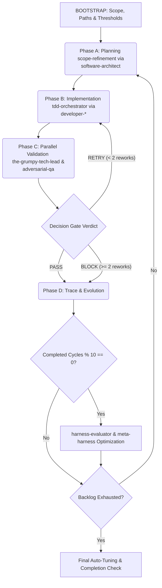

# 🤖 Autonomous Orchestrator Workflow

This document describes the workflow for using the **Autonomous Orchestrator** skill (`skills/autonomous-orchestrator/SKILL.md`). It acts as a sovereign loop manager to coordinate the entire lifecycle of software features—from planning and TDD-driven development to validation and continuous optimization.

---

## 🏗️ The 4-Layer Architecture

The autonomous development cycle operates on a robust **4-layer architectural model**:

| Layer | Component | Description | Managed Artifacts |
| :--- | :--- | :--- | :--- |
| **Layer 1** | **Product State Machine** | Stores development state, prioritization, and completion criteria. | `BACKLOG.md`, `DEVELOPMENT-STATE.md`, `COMPLETION-CRITERIA.md`, `DECISIONS.md` |
| **Layer 2** | **Autonomous Orchestrator** | Coordinates the main execution loop and enforces the decision gate. | `autonomous-orchestrator` / `BOOTSTRAP-CONFIG.md` |
| **Layer 3** | **Contextual Expert Skills** | Specialized skills delegated strictly to isolated agent personas. | `scope-refinement`, `tdd-orchestrator`, `the-grumpy-tech-lead`, `adversarial-qa` |
| **Layer 4** | **Filesystem Database $\mathcal{D}$** | Long-term memory, specifications, and execution history files. | `docs/README.md`, `docs/adr/`, `docs/specs/`, `docs/harness-history/` |

---

## 🔄 The Autonomous Execution Loop

Autonomous Development Cycle:

---

## 🚀 Execution Phases in Detail

Once started, the orchestrator adheres to a **CRITICAL EXECUTION MANDATE**: once initial scope is provided, **never stop or ask questions**. It executes all phases atomically.

### 1. BOOTSTRAP (State Initialization)
Before starting, the orchestrator performs workspace verification:
* **Scope Acquisition**: If `BACKLOG.md` is missing, it **asks once** for the project scope/PRD, then never again.
* **Project Paths**: Collects the absolute local directories involved (`${projectPaths}`).
* **Score Thresholds**: Loads or asks once for target quality thresholds:
  * **Grumpy Tech Lead Score** (`${scoreThresholdTL}`, default: `0.70`)
  * **Adversarial QA Score** (`${scoreThresholdAdv}`, default: `0.70`)
  Both are persisted in `docs/product/BOOTSTRAP-CONFIG.md`.
* **Synthesis**: Synthesizes the initial `docs/product/BACKLOG.md` table and initializes `docs/product/DEVELOPMENT-STATE.md`, `COMPLETION-CRITERIA.md`, `DECISIONS.md`, and the Cycle Counter.

### 2. THE RUNTIME CYCLE

#### 📋 Phase A: Delegation of Planning
* **State Change:** Logs `PLANNING` phase in `DEVELOPMENT-STATE.md`.
* **Delegation:** Invokes `scope-refinement` strictly mapped to the **`software-architect`** agent.
* **Verification:** Waits until all domain specs and test scenario documents (`004-*-test-scenarios.md`) are successfully generated under `docs/specs/{domain}/`.

#### 💻 Phase B: Delegation of Implementation
* **State Change:** Logs `IMPLEMENTATION` phase in `DEVELOPMENT-STATE.md`.
* **Delegation:** Invokes `tdd-orchestrator` strictly mapped to the **`developer-backend`**, **`developer-frontend`**, or **`developer-debugging`** agents.
* **Rework Injection:** If this is a RETRY, automatically injects the compiled `REWORK-LOG.md` containing preceding validation issues.
* **Verification:** Waits until `docs/specs/{domain}/TDD-OUTPUT.json` is generated.

#### 🛡️ Phase C: Validation & Decision Gate
* **State Change:** Logs `VALIDATION` phase in `DEVELOPMENT-STATE.md`.
* **Parallel Dispatch:** Dispatches both validation sensors in parallel:
  1. **Critique:** Invokes `the-grumpy-tech-lead` strictly via the **`harness-tech-lead`** agent.
  2. **Attack:** Invokes `adversarial-qa` strictly via the **`harness-qa`** agent.
* **JSON Extraction Protocol:** Parses validation outputs defensively by searching code fences or extracting text between `{` and `}`.
* **Decision Gate Verdict:**
  * **`PASS`** (Both scores >= thresholds): Sets backlog status to `COMPLETED`, logs decision, increments completed cycles, and proceeds to Phase D.
  * **`RETRY`** (Any score < threshold AND reworks < 2): Increments rework counter, appends validation findings to `REWORK-LOG.md`, sets phase back to `IMPLEMENTATION`, and restarts Phase B.
  * **`BLOCK`** (Any score < threshold AND reworks >= 2): Sets status to `BLOCKED`, logs block decision, increments completed cycles, and proceeds to Phase D.

Below is a visual example of how this Socratic code review occurs during autonomous validation:

> ### 🎯 Understanding the 0.70 Quality Gate & Its Importance
> 
> Think of the **0.70 score threshold** as a **grade of 7 out of 10** required for your feature's resilience, security, and architecture before it is allowed into production.
> 
> * **Why is this threshold so important?**
>   1. **Goes Beyond Simple Tests:** Unit tests only verify that the code *works* (functional validation). The `0.70` gate checks if the code is *production-ready* (structural validation)—auditing for N+1 queries, memory leaks, race conditions, and security exposures.
>   2. **Automates Uncompromising Standards:** If a feature gets a `0.65` (due to missing timeouts or unprotected database endpoints), the loop automatically blocks it. The orchestrator writes the critique directly to a `REWORK-LOG.md` and sends the agent back to code again—no human intervention needed.
>   3. **Balancing Rigor and Progress:** A `0.70` bar ensures high-quality software while preventing the agent from getting stuck on harmless style details, keeping the development momentum high.

#### 📈 Phase D: State, Evolution & Auto-Tuning
* **Trace:** Records session metrics via `harness-tracer`.
* **Auto-Tuning Gate:** Every 10 completed cycles, or upon backlog exhaustion, triggers **`harness-evaluator`** and **`meta-harness`** to automatically diagnose execution history, generate targeted skill optimization candidates, and promote/revert configurations based on Pareto-frontier scores.
* **Completion Check:** Halts only when all items are terminal (`COMPLETED` or `BLOCKED`) and completion criteria are fully met.

---

## 🛡️ Strict Conduct Rules for the Orchestrator

To ensure clean execution, the orchestrator strictly enforces these boundaries:
1. **No Developer Emulation:** The orchestrator coordinates, manages state, and delegates. It never writes source code, edits tests, or modifies implementation files directly.
2. **Subagent Context Isolation:** Technical skills must only run inside their designated agent personas (e.g. `scope-refinement` inside `software-architect`).
3. **Persistence First:** State updates, rework increments, and backlog status changes are saved to disk *before* triggering the next subagent command.
4. **Defensive Parsing:** Employs strict JSON extraction to handle raw LLM responses.

---

## 💡 Best Practice Recommendations

### 📋 1. Initialize Documentation with `project-memory`
> **Use the `project-memory` skill** to establish your baseline project documentation in ADR (Architectural Decision Record) and Feature specification format before initiating development. Starting with a clear documentation memory prevents architectural drift and ensures the Autonomous Orchestrator works with high-fidelity, standardized rules.
> 
> A meticulously prepared **Checklist: Before Starting a Project** (defined in the [Daily Use Playbook](PLAYBOOK-DAILY-USE.md)) is crucial because the orchestrator will not stop to ask questions or resolve missing specifications.

### 🧠 2. Establish High-Fidelity Context with Brainstorming
> For the Autonomous Orchestrator to work effectively, it requires a highly defined context of what to develop. 
> - If your project scope, constraints, or technical strategies are underspecified, **conduct an interactive exploration of the problem space first**.
> - Ensure your context is fully structured and solid before kicking off the autonomous execution loop.
