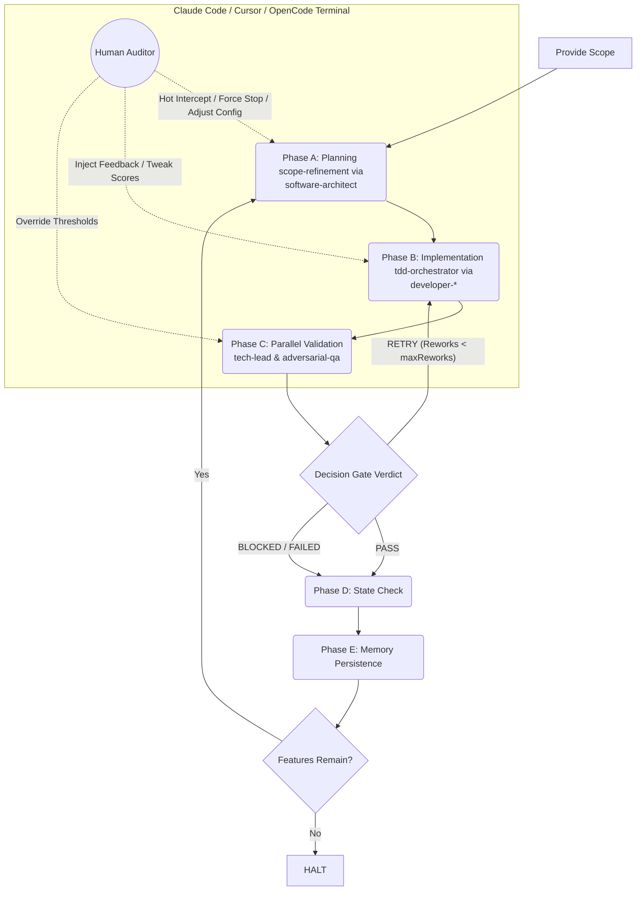

# 🤖 Autonomous Orchestrator Workflow

This document describes the operational workflow for the **Autonomous Orchestrator** skill (`skills/autonomous-orchestrator/SKILL.md`). It operates as a continuous, streaming execution loop that automates feature planning, implementation, and quality gate validation—while giving the human developer live telemetry and real-time interception capabilities.

---

## 🏛️ The 4-Layer Architecture with Live Telemetry

The autonomous cycle executes across a 4-layer model, while the human developer operates concurrently as a **Live Auditor** through modern coding agents (e.g., Claude Code, Cursor, OpenCode, Antigravity):

| Layer | Component | Description | Managed Artifacts |
| --- | --- | --- | --- |
| **Control** | **Live Human Auditor** | **Hot-Interception Vector.** Watches the live streaming execution and can forcefully halt, hot-patch specs, or override configuration mid-loop. | User Terminal / Config Overrides |
| **Layer 1** | **Product State Machine** | Stores development state, prioritization, and completion criteria. | `BACKLOG.md`, `DEVELOPMENT-STATE.md` |
| **Layer 2** | **Autonomous Orchestrator** | Coordinates the main execution loop and enforces the decision gate. | `autonomous-orchestrator` / `BOOTSTRAP-CONFIG.json` |
| **Layer 3** | **Contextual Expert Skills** | Specialized skills delegated strictly to isolated agent personas. | `scope-refinement`, `tdd-orchestrator`, `adversarial-qa`, `the-grumpy-tech-lead` |
| **Layer 4** | **Filesystem Database $\mathcal{D}$** | Long-term memory, specifications, and execution history files. | `docs/README.md`, `docs/adr/`, `docs/specs/` |

---

## 🔄 The Continuous Execution Loop & Interception Flow

The orchestrator adheres to an **Uninterrupted Execution Mandate**: once started, it moves from phase to phase atomically without pausing to ask for permission. It only stops if it completes the backlog, hits a terminal blocker, or if **you** intercept it.

---

## 🚀 Execution Phases & Live Auditing in Practice

### 1. BOOTSTRAP (Unattended Initialization)

* **Action:** The orchestrator acquires the initial scope, reads `docs/product/BOOTSTRAP-CONFIG.json`, and synthesizes the `docs/product/BACKLOG.md` table.

* **Live Telemetry:** The developer sees the backlog being generated in real-time. If the AI misinterprets a requirement, the developer doesn't need to wait—they can immediately halt the loop or hot-patch the file.

### 2. THE RUNTIME CYCLE (Streaming Execution)

#### 📋 Phase A: Delegation of Planning

* **Action:** Automatically invokes `scope-refinement` via the **`software-architect`** persona to generate DDD specs and Gherkin test scenarios under `docs/specs/{domain}/`.

#### 💻 Phase B: Delegation of Implementation

* **Action:** Instantly transitions into invoking `tdd-orchestrator` (delegated to `developer-backend`, `developer-frontend`, or `developer-debugging` agents) to execute the `RED ➔ GREEN ➔ REFACTOR` cycle.

* **Rework Injection:** If the cycle is a `RETRY`, it seamlessly feeds the `REWORK-LOG.md` back into the coding agent.

#### 🛡️ Phase C: Validation & Decision Gate

* **Action:** Runs `the-grumpy-tech-lead` (delegated to `harness-tech-lead` agent) and `adversarial-qa` (delegated to `harness-qa` agent) in parallel to audit architectural and security resilience.

* **Automated Decision:** Compares outputs against `scoreThresholdTL` and `scoreThresholdAdv` (default `0.70`).

---

## ⚡ Hot-Interception: The Ultimate Human Control

Because the orchestrator outputs everything to the console and filesystem transparently, you have complete control over the running engine. You can execute the following overrides **while the loop is running or between subagent transitions**:

### 🛑 1. Force Halt & Course Correction

If you read the streaming terminal output and realize the agent is building an architectural pattern you dislike, you can manually kill the process (`Ctrl+C`). You can then append new constraints directly to `docs/adr/ARCHITECTURE.md` and restart the orchestrator—it will pick up exactly where it left off but with updated knowledge.

### 🎛️ 2. Dynamic Threshold Calibrations

Are the automated quality gates too strict or too loose for this specific feature? You can open `docs/product/BOOTSTRAP-CONFIG.json` change the parameters live:

* **Lower the Score:** Change `0.70` to `0.60` to let a working feature pass even with minor style debts.
* **Increase Max Reworks:** Change `maxReworks` from `3` to `5` if you notice the problem space is highly volatile and requires deeper iterative cycles.

### 📝 3. Live Scope & Refinement Injector

If a new business requirement emerges while the agent is coding in Phase B, you can append it directly into the domain specification files under `docs/specs/{domain}/`. On its next cycle or validation entry, the orchestrator will read the updated filesystem database $\mathcal{D}$ and dynamically realign its execution targets.

---

## 🛡️ Operational States: FAILED vs BLOCKED

When a feature exhausts its maximum retry limits (`maxReworks`), the orchestrator categorizes the exit criteria without human intervention, updating the logs for your final audit:

* **`FAILED` (Continuable Debt):** The feature works and passes all functional tests, but its architectural score remains below the required threshold (e.g., minor security warnings or suboptimal queries). The orchestrator logs the state and **moves forward to the next feature**, leaving the human to audit the technical debt later.

* **`BLOCKED` (Critical Circuit Breaker):** The implementation causes application crashes, compilation errors, or core test failures that prevent further progress. The orchestrator stops the pipeline entirely and triggers an alert, waiting for the human engineer to resolve the core blocker.