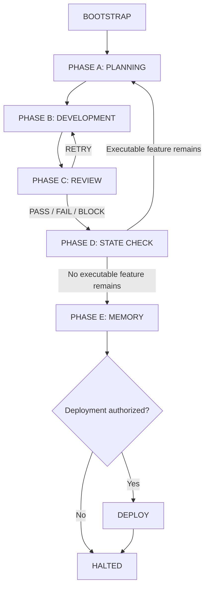

# 🤖 Autonomous Orchestrator Workflow

`autonomous-orchestrator` is the skill-driven sovereign loop. It manages product state and delegates every technical task to specialist agents. It does not write application code or tests itself.

## Invoke

```text
/harness-kit:autonomous-orchestrator
```

## Initial input gate

The skill permits one pause window:

1. Choose `resume` or `reset`.
2. For `reset`, provide the project scope or PRD.
3. Provide project paths if they are not known.

After required bootstrap input exists, the orchestrator continues without phase-by-phase questions. It stops when the backlog finishes, a critical blocker prevents progress, or the human interrupts execution.

`reset` discards files under `docs/product/`. Review that scope before confirming reset.

## Delegation map

| Work | Skill | Agent |
| --- | --- | --- |
| Domain planning | `scope-refinement` | `software-architect` |
| Backend implementation | `tdd-orchestrator` | `developer-backend` |
| Frontend implementation | `tdd-orchestrator` | `developer-frontend` |
| Test-focused implementation | `tdd-orchestrator` | `developer-qa` |
| Infrastructure implementation | `tdd-orchestrator` | `developer-devops` |
| Unexpected test failure diagnosis | investigation workflow | `developer-debugging` |
| Systemic technical review | `the-grumpy-tech-lead` | `harness-tech-lead` |
| Adversarial validation | `adversarial-qa` | `harness-qa` |
| Final project memory | `project-memory` | `software-architect` |

The backlog `Agent` column selects the implementation specialist. `developer-debugging` is diagnostic only.

## State flow



Optional REFINEMENT runs after BOOTSTRAP when enabled by the host and no prior `REFINEMENT.md` exists.

## Phase responsibilities

### BOOTSTRAP

- Create product files from `skills/autonomous-orchestrator/models/` when missing.
- Persist project paths, scope, `currentPhase`, `activeFeatureId`, and cycle count.
- Build cohesive, independently testable features.
- Load default thresholds `0.70` and maximum reworks `2` unless configured otherwise.

### PHASE A: PLANNING

- Mark the feature `IN_PROGRESS`.
- Delegate `scope-refinement` to `software-architect`.
- Require `004-*-test-scenarios.md`.
- Extract ordered task JSON from `003-*-tactical-design.md` into `DEVELOPMENT-STATE.md`.

### PHASE B: DEVELOPMENT

- Mark all pending feature tasks `IN_PROGRESS`.
- Delegate all pending tasks together through `tdd-orchestrator`.
- Require matching `TDD-OUTPUT.json`, `status = "SUCCESS"`, zero failed tests, and a bounded developer handoff.
- Route unexpected test failures through `developer-debugging` before a fix attempt.

### PHASE C: REVIEW

- Run `the-grumpy-tech-lead` and `adversarial-qa` in parallel.
- Read `TL.json` and `QA.json` scores in the `[0.00, 1.00]` range.
- Compare scores with `scoreThresholdTL` and `scoreThresholdAdv`.
- Treat demonstrated HIGH/CRITICAL vulnerabilities and crashes as gate failures regardless of score.

Verdicts:

- `PASS`: thresholds met; no HIGH/CRITICAL vulnerability; no crash. Persist `COMPLETED`.
- `RETRY`: gate failed while rework budget remains. Write `REWORK-LOG.md`, reset tasks, return to development.
- `BLOCK`: budget exhausted with crash or unresolved HIGH/CRITICAL vulnerability. Persist `BLOCKED`.
- `FAIL`: budget exhausted without crash or unresolved HIGH/CRITICAL vulnerability. Persist `FAILED`.

`RETRY`, `PASS`, `BLOCK`, and `FAIL` are gate verdicts. Persisted feature statuses are `NOT_STARTED`, `IN_PROGRESS`, `COMPLETED`, `BLOCKED`, and `FAILED`.

### PHASE D: STATE CHECK

- Validate terminal statuses, scores, and rework counts.
- Cascade `BLOCKED` to dependent features.
- Do not cascade `FAILED`.
- Select the next executable feature or continue to memory.

### PHASE E: MEMORY

- Delegate `project-memory` once after no executable feature remains.
- Update feature docs, relevant existing ADRs, `docs/.digest.md`, and `docs/.graph.json`.
- Keep harness history outside this skill's access.

### DEPLOY

Delegate only when current user and repository rules authorize deployment. If staging, commit, push, or deployment is forbidden, record the skip and halt without those actions.

## Recovery and human control

- Interrupt a drifting run with the host's stop mechanism.
- Resume from persisted `currentPhase` and `activeFeatureId`.
- Change scope or architecture only after stopping active writes.
- Keep `BACKLOG.md`, `DEVELOPMENT-STATE.md`, `DECISIONS.md`, and `BOOTSTRAP-CONFIG.json` consistent when editing manually.
- Inspect `DECISIONS.md` before treating a halted loop as successful.

## Required safety properties

- The orchestrator never emulates a developer agent.
- State changes are written before delegated work starts.
- Review evidence must match the active feature and domain.
- Active skills, agent rules, user rules, and repository rules remain binding throughout delegation.
