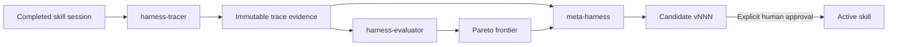

# 🏗️ Architectural and Flow Guide: Harness Optimization with HarnessKit

The meta-harness loop improves skill instructions from recorded execution evidence. Three skills own the evidence lifecycle; `meta-harness-agent` routes between them.

## Components

| Skill | Responsibility | Output |
| --- | --- | --- |
| `harness-tracer` | Record one completed session factually | `docs/harness-history/traces/session-*/` |
| `harness-evaluator` | Score traces and compare skill chains | `docs/harness-history/pareto-frontier.md` |
| `meta-harness` | Propose one targeted skill change | `docs/harness-history/candidates/vNNN/` |

`meta-harness-agent` coordinates these skills. It does not implement product features.

## Agent routing

The agent applies this order:

1. Explicit request for candidate search, evaluation, or promotion: run `meta-harness`.
2. Otherwise, when trace count is a positive multiple of `5`: run `harness-evaluator`.
3. Otherwise: run `harness-tracer`.

Explicit meta-harness work has priority over trace-count routing.

## Evidence flow



## Record a trace

Invoke through the optimizer agent or directly:

```text
/harness-kit:harness-tracer
```

Provide:

- Skill name.
- Agent name.
- One-sentence task summary.
- Actual inputs, context reads, steps, deviations, and outcomes from the completed session.

Each trace contains `metadata.md`, `input.md`, `steps.md`, `score.md`, and `verdict.md`. Record what happened, not what should have happened.

## Evaluate history

```text
/harness-kit:harness-evaluator
```

The evaluator:

- Reads every trace.
- Groups sessions by skill chain.
- Applies weights from `docs/harness-history/config.md`.
- Backfills only blank computed-score blocks in trace `score.md` files.
- Updates `pareto-frontier.md`.
- Treats groups below `3` sessions as insufficient evidence.

The evaluator may run with fewer than `3` total sessions, but its comparison is provisional. It must not declare a reliable winner from an undersized group.

## Propose an improvement

```text
/harness-kit:meta-harness
```

Preconditions:

- At least `3` traces exist.
- `pareto-frontier.md` is current.

The proposer reads the frontier, compares the bottom `3` sessions with the top `2`, identifies one divergence, and creates one targeted candidate. A candidate directory contains:

```text
docs/harness-history/candidates/v001/
├── rationale.md
├── diff.md
├── score.md
└── SKILL.md
```

Candidate creation does not modify the active skill.

## Promotion rule

Require explicit human approval before copying candidate instructions into `skills/{skill}/SKILL.md`. Present the score comparison and diff first.

If candidate score does not beat baseline, keep the active skill unchanged and return a revert decision.

## Interpretation cautions

- Composite score measures configured process metrics, not product correctness alone.
- Compare similar task types and identical skill chains.
- Keep one change per candidate so results remain attributable.
- Preserve raw traces as append-only evidence.
- Never change score weights during the same experiment as a skill change.
- Reject hypotheses that do not cite specific trace evidence.
