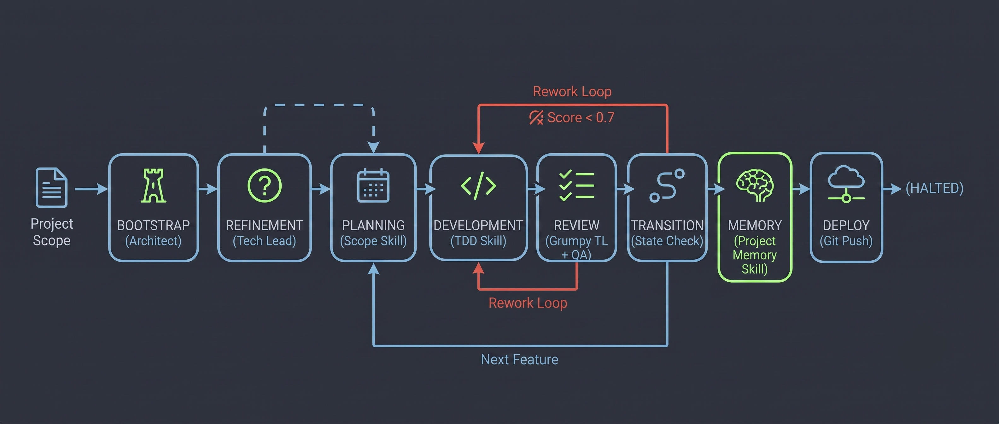

Autonomous orchestrator SDK for [harness-kit](https://github.com/romabeckman/harness-kit). Run a single command and the full TDD loop executes unattended — scope in, backlog built, agents delegated, validation scored, memory persisted.

---

## How the orchestration works

The orchestrator drives a feature through a fixed pipeline of phases. Each phase hands off to the next; failures trigger rework or cascade-blocking rather than silent skips.

```
  ┌──────────────────────────────────────────────────────────────────────┐
  │                         Project Scope                                │
  └──────────────────────────────┬───────────────────────────────────────┘
                                 │
                                 ▼
  ┌──────────────────────────────────────────────────────────────────────┐
  │  BOOTSTRAP  ·  software-architect agent                              │
  │  Parses scope → writes BACKLOG.md with features, layers, priorities  │
  └──────────────────────────────┬───────────────────────────────────────┘
                                 │
                                 ▼  (optional via --refine or --mode deep_thinking)
  ┌──────────────────────────────────────────────────────────────────────┐
  │  REFINEMENT  ·  the-grumpy-tech-lead + software-architect            │
  │  Generates QUESTIONS.json → collects answers → REFINEMENT.md         │
  └──────────────────────────────┬───────────────────────────────────────┘
                                 │  (for each feature)
                                 ▼
  ┌──────────────────────────────────────────────────────────────────────┐
  │  PLANNING  ·  scope-refinement skill                                 │
  │  Writes spec files (user stories, tactical design, test scenarios)   │
  │  Extracts task list into DEVELOPMENT-STATE.md                        │
  └──────────────────────────────┬───────────────────────────────────────┘
                                 │
                                 ▼
  ┌──────────────────────────────────────────────────────────────────────┐
  │  DEVELOPMENT  ·  tdd-orchestrator skill                              │◄──────────┐
  │  Implements tasks in strict TDD order (red → green → refactor)       │           │
  │  Each task must pass its tests before the next begins                │           │
  └──────────────────────────────┬───────────────────────────────────────┘           │
                                 │                                                   │ (rework: score < 0.7)
                                 ▼                                                   │
  ┌──────────────────────────────────────────────────────────────────────┐           │
  │  REVIEW  ·  the-grumpy-tech-lead + adversarial-qa skills             │           │
  │  Code review scores implementation quality (0–10)                    │           │
  │  QA agent hunts security vulnerabilities and missing edge cases      │           │
  │  Scores below threshold → feature returns to DEVELOPMENT (rework)    │───────────┘
  └──────────────────────────────┬───────────────────────────────────────┘
                                 │
                                 ▼
  ┌──────────────────────────────────────────────────────────────────────┐
  │  TRANSITION  ·  (no agent)                                           │
  │  If next NOT_STARTED feature found → returns to PLANNING (loop)      │
  │  If all features done → advances to MEMORY                           │
  │  BLOCKED features cascade their status to dependents                 │
  └──────┬──────────────────────────────────────────────────────┬────────┘
         │  next feature                          all features done
         ▼                                                      │
  (loops to PLANNING)                                           ▼
                                 ┌──────────────────────────────────────────────────────────────────────┐
                                 │  MEMORY  ·  project-memory skill                                     │
                                 │  Persists learnings, decisions, and patterns to long-term memory     │
                                 └──────────────────────────────┬───────────────────────────────────────┘
                                                                │
                                                                ▼
                                 ┌──────────────────────────────────────────────────────────────────────┐
                                 │  DEPLOY  ·  (no agent)                                               │
                                 │  Runs git add/commit/push for each project path                      │
                                 │  Skippable via --skip-deploy → jumps straight to HALTED              │
                                 └──────────────────────────────┬───────────────────────────────────────┘
                                                                │
                                                                ▼
                                                            (HALTED)
```

> Phases DEVELOPMENT → REVIEW loop per rework. A feature can cycle back from REVIEW to DEVELOPMENT up to `maxReworks` times before being marked BLOCKED. BLOCKED features cascade to dependents; FAILED features do not.

---

## Prerequisites

```bash
# 1. Claude Code CLI installed and authenticated
claude --version

# 2. harness-kit plugin installed
/plugin marketplace add romabeckman/harness-kit
```

---

## Installation

### Option A — npx (available soon)

```bash
npx @romabeckman/hrns run
```

> If the package is not yet published to npm, use Option B or C below.

### Option B — install globally

```bash
git clone https://github.com/romabeckman/harness-kit.git
cd harness-kit/sdk
npm install && npm run build
npm install -g .
```

Then from any project directory:

```bash
hrns run
```

> To uninstall: `npm uninstall -g @romabeckman/hrns`

### Option C — run without installing

```bash
git clone https://github.com/romabeckman/harness-kit.git
cd harness-kit/sdk
npm install && npm run build
node dist/cli/run.js
```

---

## CLI commands

> NOTE: CLI mode is under the user's control and responsibility. The SDK CLI is designed for long-running executions.

### `hrns init`

Runs an interactive wizard to initialize your workspace:

1. **Creates tracking files** — `BACKLOG.md`, `DEVELOPMENT-STATE.md`, `DECISIONS.md`, and `BOOTSTRAP-CONFIG.json` under `docs/product/`.
2. **Steering wizard** — prompts for optional custom steering rules per phase (global, bootstrap, planning, implementation, review, memory).
3. **Local settings** — prompts to create `.harness-kit/settings.json` if it does not exist.
4. **Run follow-up** — offers to trigger `hrns run` immediately. Any arguments passed to `init` (e.g. `--agent gemini`) are forwarded automatically.

### `hrns run`

Starts or resumes an orchestration session. If a backlog exists on disk, it picks up exactly where the previous run stopped.

### `hrns settings`

Manages the `settings.json` configuration file interactively. Supports three subcommands:

- `edit` — opens `settings.json` in the default text editor (creates it if missing)
- `renew` — recreates `settings.json` with default values
- `delete` — removes `settings.json`

Prompts to target either the **global** (`~/.config/harness-kit/settings.json`) or **local** (`.harness-kit/settings.json`) file.

```bash
hrns settings           # interactive menu
hrns settings edit      # open in editor directly
hrns settings renew     # recreate with defaults
hrns settings delete    # remove the file
```

### `hrns report`

Prints token usage report for the current session.

### `hrns version` / `hrns help`

Show version or help message.

---

## CLI flags (`hrns run`)

| Flag | Alias | Description | Example |
|---|---|---|---|
| `--agent <type>` | `-a` | Agent runner type (see table below) | `--agent copilot-sdk` |
| `--model <name>` | `-m` | Model override for all phases | `--model gpt-4o` |
| `--effort <level>` | `-e` | Effort level override for all phases (`low`, `medium`, `high`, `max`) | `--effort high` |
| `--reset` | | Force reset (skip interactive prompt) | |
| `--resume` | | Force resume (skip interactive prompt) | |
| `--scope <text>` | | Project scope / PRD (skips editor prompt) | `--scope "REST API with JWT"` |
| `--path <dir>` | | Project directory (repeatable) | `--path ./api --path ./web` |
| `--score <0–1>` | | Acceptance score threshold | `--score 0.8` |
| `--reworks <1–10>` | | Max rework cycles before cascade fail | `--reworks 3` |
| `--steering <text>` | | Additional orchestration rules | `--steering "prefer async/await"` |
| `--refine` | | Enable interactive pre-planning Socratic questionnaire | `--refine` |
| `--mode <mode>` | `-M` | Execution mode: `quick`, `fast`, `thinking` (default), `deep_thinking` | `--mode fast` |
| `--skip-validation` | | Skip Phase C entirely — jump straight to Phase D | |
| `--skip-memory` | | Skip Phase E entirely — jump straight to Phase F | |
| `--skip-deploy` | | Skip DEPLOY phase — pipeline halts after Phase F | |
| `--debug` | | Enable debug output | |

> [!NOTE]
> `--model` overrides the default for **all** phases. For per-phase model tuning, use `settings.json` instead.

> [!TIP]
> `--refine` enables an interactive pre-planning Socratic questionnaire (`Phase.REFINEMENT`). The grumpy tech-lead agent analyzes your project scope, surfaces architectural trade-offs into `docs/product/QUESTIONS.json`, collects human-validated choices, and consolidates them into `docs/product/REFINEMENT.md` prior to Phase A planning.

> [!TIP]
> `--skip-validation` is useful for CI speed-runs or when you want to iterate on Phase B output without paying the cost of two agent reviews. All features are marked **COMPLETED** with neutral scores (TL: 1, Adv: 1) and the run proceeds directly to Phase D (state check) and then Phase E (memory).

> [!TIP]
> `--mode quick` is the fastest cycle: it runs Bootstrap → Planning → Development → Deploy, skipping both the Review (Phase C) and Memory (Phase E) phases. Ideal for rapid prototyping.

> [!TIP]
> `--mode fast` forces complexity `LOW` on Phase A (scope refinement generates only docs `003` + `004`, skipping `001`–`002`). Use it for straightforward bug fixes or minor enhancements.

> [!TIP]
> `--mode deep_thinking` forces complexity `HIGH` on Phase A, generating the full spec suite (`001`–`004`). Use it for large features or cross-domain integrations.

> [!TIP]
> `--skip-memory` skips the Phase E `project-memory` agent entirely. Use it when you want a fast cycle without writing documentation memory, for example during exploration or early prototyping.

> [!TIP]
> `--skip-deploy` skips the git stage/commit/push step. Useful when you want the orchestrator to finish implementation without touching version control.

---

## Agent runners

Each runner is a self-contained strategy for invoking a specific AI backend. The SDK ships nine built-in runners:

| Type | Binary / SDK | Default model |
|---|---|---|
| `claude-cli` | `claude` CLI | _(from settings)_ |
| `claude-sdk` | `@anthropic-ai/sdk` | `anthropic.claude-5-sonnet` |
| `antigravity-cli` | `agy` CLI | `gemini-3.6-flash` |
| `codex-cli` | `codex` CLI | `gpt-5.6-sol` / `gpt-5.6-luna` |
| `copilot-cli` | `copilot` CLI | _(from settings)_ |
| `copilot-sdk` | `@github/copilot-sdk` | `gpt-5.6-sol` / `gpt-5.6-luna` |
| `cursor-cli` | `agent` CLI | _(from settings)_ |
| `cursor-sdk` | `@cursor/sdk` | `gpt-5.3-codex` |
| `kiro-cli` | `kiro-cli` CLI | _(from settings)_ |

### Auto-selection

| Condition | Runner used |
|---|---|
| `ANTHROPIC_API_KEY` set | `claude-sdk` (direct API) |
| No API key | `claude-cli` (local CLI) |

### CLI shorthands

```bash
hrns run --agent codex-cli           # codex-cli
hrns run --agent cursor-sdk          # cursor-sdk (needs CURSOR_API_KEY)
hrns run --agent copilot-cli         # copilot-cli
hrns run --agent cursor-cli          # cursor-cli
hrns run --agent kiro-cli            # kiro-cli
```

---

## Configuration — `settings.json`

Tune model and timeout per runner and phase without touching code. Changes apply on the next run.

### File locations

The SDK reads from two locations and deep-merges them (project overrides global):

| Scope | Path |
|---|---|
| **Global** | `~/.config/harness-kit/settings.json` |
| **Project** | `<projectPath>/.harness-kit/settings.json` |

The global file is created automatically on first run. You can also set `HARNESS_SETTINGS_PATH` to point to a custom path, or `XDG_CONFIG_HOME` to change the base config directory.

### Schema

```json
{
  "<runner-key>": {
    "timeoutMs": 1800000,
    "phases": {
      "<phase-key>": {
        "model": "anthropic.claude-5-sonnet",
        "effort": "high",
        "timeoutMs": 3600000
      }
    }
  }
}
```

| Field | Type | Description |
|---|---|---|
| `timeoutMs` | `number` | Default timeout (ms) for all phases under this runner |
| `phases.<key>.model` | `string` | Model for this specific phase |
| `phases.<key>.effort` | `string` | Reasoning effort: `low`, `medium`, `high`, `max` |
| `phases.<key>.timeoutMs` | `number` | Phase-level timeout override |

### Runner keys

| Key | Applies to |
|---|---|
| `claude` | `claude-cli` and `claude-sdk` |
| `antigravity` | `antigravity-cli` |
| `codex` | `codex-cli` |
| `copilot` | `copilot-cli` and `copilot-sdk` |
| `cursor` | `cursor-cli` and `cursor-sdk` |
| `kiro` | `kiro-cli` |

### Phase keys

| Key | Phase |
|---|---|
| `bootstrap` | Bootstrap — software-architect agent |
| `planning` | Phase A — scope-refinement |
| `implementation` | Phase B — tdd-orchestrator |
| `review_tl` | Phase C — tech-lead review |
| `review_adv` | Phase C — adversarial-qa review |
| `memory` | Phase E — project-memory |

### Default settings

```json
{
  "claude": {
    "timeoutMs": 1800000,
    "phases": {
      "bootstrap":      { "model": "anthropic.claude-5-sonnet", "effort": "medium" },
      "planning":       { "model": "anthropic.claude-5-sonnet", "effort": "high"   },
      "implementation": { "model": "anthropic.claude-5-sonnet", "effort": "medium" },
      "review_tl":      { "model": "anthropic.claude-5-sonnet", "effort": "low"    },
      "review_adv":     { "model": "anthropic.claude-5-sonnet", "effort": "low"    },
      "memory":         { "model": "anthropic.claude-5-sonnet", "effort": "low"    }
    }
  },
  "antigravity": {
    "timeoutMs": 1800000,
    "phases": {
      "bootstrap":      { "model": "gemini-3.6-flash", "effort": "high"   },
      "planning":       { "model": "gemini-3.1-pro",   "effort": "high"   },
      "implementation": { "model": "gemini-3.6-flash", "effort": "medium" },
      "review_tl":      { "model": "gemini-3.1-pro",   "effort": "low"    },
      "review_adv":     { "model": "gemini-3.1-pro",   "effort": "low"    },
      "memory":         { "model": "gemini-3.6-flash", "effort": "low"    }
    }
  },
  "copilot": {
    "timeoutMs": 1800000,
    "phases": {
      "bootstrap":      { "model": "gpt-5.6-sol",  "effort": "medium" },
      "planning":       { "model": "gpt-5.6-sol",  "effort": "high"   },
      "implementation": { "model": "gpt-5.6-luna", "effort": "max"    },
      "review_tl":      { "model": "gpt-5.6-sol",  "effort": "medium" },
      "review_adv":     { "model": "gpt-5.6-sol",  "effort": "medium" },
      "memory":         { "model": "gpt-5.6-luna", "effort": "high"   }
    }
  },
  "cursor": {
    "timeoutMs": 1800000,
    "phases": {
      "bootstrap":      { "model": "gpt-5.3-codex",  "effort": "medium" },
      "planning":       { "model": "anthropic.claude-5-sonnet", "effort": "high"   },
      "implementation": { "model": "gpt-5.3-codex",  "effort": "medium" },
      "review_tl":      { "model": "gpt-5.3-codex",  "effort": "low"    },
      "review_adv":     { "model": "gpt-5.3-codex",  "effort": "low"    },
      "memory":         { "model": "gpt-5.3-codex",  "effort": "low"    }
    }
  },
  "codex": {
    "timeoutMs": 1800000,
    "phases": {
      "bootstrap":      { "model": "gpt-5.6-sol",  "effort": "medium" },
      "planning":       { "model": "gpt-5.6-sol",  "effort": "high"   },
      "implementation": { "model": "gpt-5.6-luna", "effort": "max"    },
      "review_tl":      { "model": "gpt-5.6-sol",  "effort": "medium" },
      "review_adv":     { "model": "gpt-5.6-sol",  "effort": "medium" },
      "memory":         { "model": "gpt-5.6-luna", "effort": "high"   }
    }
  }
}
```

### Example — override Phase B for a project

Create `.harness-kit/settings.json` inside your project root:

```json
{
  "claude": {
    "phases": {
      "implementation": { "model": "claude-opus-4-8", "effort": "high" }
    }
  }
}
```

Only the fields you specify are overridden — everything else falls back to defaults.

---

## Using the SDK programmatically

Install as a dependency:

```bash
npm install @romabeckman/hrns
```

### Example — run with default chain

```typescript
import {
  HarnessOrchestrator,
  AgentRunnerFactory,
  ChainBuilder,
} from '@romabeckman/hrns'
import { Complexity } from '@romabeckman/hrns'

// Pick any registered runner (claude-cli, claude-sdk, antigravity-cli, copilot-sdk, etc.)
const runner = AgentRunnerFactory.create({
  type: 'claude-sdk',   // reads ANTHROPIC_API_KEY from env
  model: 'anthropic.claude-5-sonnet',
})

const orchestrator = new HarnessOrchestrator({
  scope: 'REST API with JWT auth and PostgreSQL',
  projectPaths: ['/path/to/my-api'],
  score: 0.7,           // minimum acceptance score (0–1)
  reworks: 3,           // max rework cycles before cascade-blocking
  complexity: Complexity.AUTO,
  agentRunner: runner,
  chain: ChainBuilder.buildDefault(),
})

await orchestrator.run()
orchestrator.tokenReport()
```

> When a backlog already exists on disk, the orchestrator re-enters at the last persisted phase automatically. The `scope` value is overridden by the persisted scope.

### Example — custom phase chain

```typescript
import {
  HarnessOrchestrator,
  ChainBuilder,
  PlanningHandler,
  DevelopmentHandler,
  ReviewHandler,
  StateCheckHandler,
  TransitionHandler,
  MemoryHandler,
  DeployHandler,
  CascadeBlockedHandler,
} from '@romabeckman/hrns'
import { Complexity } from '@romabeckman/hrns'

const chain = new ChainBuilder()
  .addPhase(new PlanningHandler())
  .addPhase(new DevelopmentHandler())
  .addPhase(new ReviewHandler())
  .addPhase(new StateCheckHandler())
  .addPhase(new TransitionHandler())
  .addPhase(new MemoryHandler())
  .addPhase(new DeployHandler())
  .addPhase(new CascadeBlockedHandler())
  .build()

const orchestrator = new HarnessOrchestrator({
  scope: 'REST API with JWT auth and PostgreSQL',
  projectPaths: ['/path/to/my-api'],
  score: 0.7,      // minimum acceptance score (0–1)
  reworks: 3,      // max rework cycles before cascade-blocking
  agentRunner: runner,
  chain,
})

await orchestrator.run()
orchestrator.tokenReport()
```

> When a backlog already exists on disk, the orchestrator re-enters at the last persisted phase automatically. The `scope` value is overridden by the persisted scope.

---

## Token report

After each run, `docs/product/tokens.jsonl` is written with one entry per agent invocation. Call `tokenReport()` or use `hrns report` to print a summary:

```
harness-kit-sdk — token report
  model:  anthropic.claude-4-6-sonnet, anthropic.claude-4-5-haiku
────────────────────────────────────────────────────────────────────
skill                           input   output  cache_r  cost
────────────────────────────────────────────────────────────────────
harness-kit:autonomous-orchestrator:bootstrap        5      586   81,124  $0.2267
scope-refinement                2,759   14,806  793,672  $2.9909
tdd-orchestrator                1,274   16,776 1,962,417  $2.8600
the-grumpy-tech-lead               57    3,372  287,236  $0.5543
adversarial-qa                     57    3,323  323,149  $0.3755
project-memory                     13    4,684  240,743  $0.7567
────────────────────────────────────────────────────────────────────
TOTAL                           4,165   43,547 3,688,341  $7.7640
  cache_read saved ~$11.0650
```

---

## Build from source

```bash
cd harness-kit/sdk
npm install
npm run build      # compiles TypeScript → dist/
npm test           # runs Vitest (250+ tests)
npm run typecheck  # zero-error type check
```

---

## Security considerations

> [!CAUTION]
> The harness-kit SDK executes AI agents with **elevated permissions** to enable autonomous operation. Read this section carefully before deploying.

### Permission bypass flags (required for autonomous execution)

Every CLI-based agent runner uses vendor-specific flags that **disable interactive permission prompts**. These flags are **necessary** for unattended autonomous execution — without them, the agent would block on confirmation prompts indefinitely. However, they grant the agent unrestricted access to the host filesystem, network, and shell.

| Runner | Flag(s) | What it disables |
|--------|---------|------------------|
| `claude-cli` | `--permission-mode bypassPermissions` | All CLI permission confirmations |
| `antigravity-cli` | `--dangerously-skip-permissions` | All CLI permission confirmations |
| `codex-cli` | `--dangerously-bypass-approvals-and-sandbox` | Both approval prompts **and** the execution sandbox |
| `cursor-cli` | `--force --trust --approve-mcps` | Confirmations, workspace trust, and MCP auto-approval |
| `copilot-cli` | `--allow-all-tools --autopilot` | Tool restrictions and interactive mode |
| `copilot-sdk` | `onPermissionRequest: approveAll` | SDK-level permission callbacks |
| `kiro-cli` | `--trust-all-tools` | Tool trust confirmations |

**Why these flags cannot be removed:** The orchestrator runs agents in a fully autonomous loop (Bootstrap → Planning → Development → Review → Memory). Each phase invokes an agent that must read/write files, run tests, and execute commands without human interaction. Removing these flags would require a human operator to approve every single tool call, breaking the autonomous pipeline.

**Mitigations you should apply:**

1. **Run in containers** — Execute the SDK inside Docker containers with restricted filesystem mounts, no network access to internal services, and resource limits. This is the strongest mitigation.
2. **Use dedicated machines** — Do not run the SDK on machines containing sensitive credentials, production databases, or private keys.
3. **Use Git worktrees** — The HTTP server mode already isolates each job in a Git worktree. Ensure `ALLOWED_WORKSPACES` is configured to restrict accessible paths.
4. **Review agent output** — The orchestrator persists all agent output in `docs/product/`. Review generated code before merging.

### HTTP server hardening

When running the SDK as an HTTP daemon (`hrns serve`), apply these configurations:

```bash
# REQUIRED: Enable authentication (default is NoAuth — no authentication)
AUTH_MODE=jwt                          # Options: basic, bearer, jwt, hmac
AUTH_JWT_SECRET=your-strong-secret     # At least 32 characters

# RECOMMENDED: Restrict network binding (default: 127.0.0.1)
HOST=127.0.0.1                        # Do NOT use 0.0.0.0 without auth
PORT=3000

# RECOMMENDED: Restrict accessible project paths
ALLOWED_WORKSPACES=/path/to/project1,/path/to/project2

# RECOMMENDED: Configure project mappings
PROJECT_MAPPINGS='{"myproject":{"path":"/path/to/project","baseBranch":"main"}}'
```

> [!WARNING]
> Running the server without `AUTH_MODE` configured exposes all endpoints without authentication. Any client that can reach the server can submit orchestration jobs that execute AI agents with full permission bypass. **Always configure authentication in production.**

> [!WARNING]
> The SDK filters sensitive environment variables (API keys, tokens, passwords, database URLs) from child agent processes by default. However, if an agent is compromised via prompt injection, it could still attempt to access environment variables through shell commands. Use container isolation for defense-in-depth.

### Prompt injection awareness

The `scope` and `steeringMessage` fields in HTTP requests are incorporated into agent prompts. The SDK enforces a maximum length of 10,000 characters on the `scope` field and validates steering action outputs, but **no input sanitization can fully prevent prompt injection against LLM agents**. Treat these inputs as untrusted:

- Always enable authentication on the HTTP server
- Use JWT with `allowed_projects` claims to restrict per-user access via RBAC
- Monitor `docs/product/tokens.jsonl` for unusual token consumption patterns
- Review agent-generated code before merging to any protected branch

### JWT authentication limitations

The built-in JWT implementation supports **HS256 only** and validates the `alg` header to prevent algorithm confusion attacks. For production deployments requiring RS256, key rotation, or JWKS integration, consider placing a reverse proxy (nginx, Traefik, or a cloud API gateway) in front of the SDK server.

---

## Further reading

- [Daily Use Playbook](./docs/PLAYBOOK-DAILY-USE.md) — real-world recipes for multi-project setups, POCs, mid-run corrections, and more
- [Agent runner architecture](./docs/feature/sdk_agent_runner.md) — runner internals and extension points
- [Integration with Superpowers](https://github.com/obra/superpowers) — low-level execution tools (Git worktrees, parallel agents, etc.)

---

## Repository

[github.com/romabeckman/harness-kit](https://github.com/romabeckman/harness-kit)
