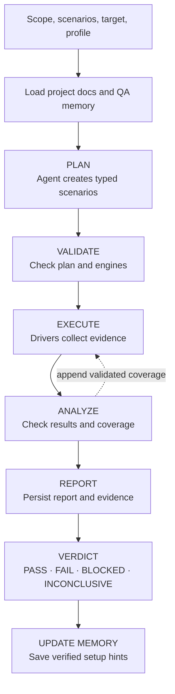

# Harness Kit QA Command

`hrns qa` runs acceptance tests against a working application. It plans realistic scenarios, exercises public interfaces, collects evidence, and produces a human-readable result.

Use this command to answer: **does the product work from a user or client perspective?** It complements unit tests, integration tests, code review, and adversarial review.

## What QA does

A QA run follows five stages:

1. **Planning** — an agent inspects the project and turns the scope into executable scenarios.
2. **Validation** — Harness Kit checks the plan, target, action limits, and execution engines.
3. **Execution** — deterministic drivers perform HTTP calls, browser actions, CLI commands, MCP calls, or WebSocket exchanges.
4. **Analysis** — the agent checks for material coverage gaps and may append scenarios. It cannot change executed scenarios.
5. **Reporting** — Harness Kit reconciles the agent's description with runtime evidence and saves the report.

The agent plans and analyzes tests. Drivers perform the actions. Source code or agent prose alone cannot prove that a scenario passed.

## How the QA orchestration works

The QA orchestrator moves one request through a fixed sequence. Validation stops unsafe or non-executable plans. Runtime execution owns scenario results; adaptive analysis may only append new coverage.



The reporting phase still runs when the target is unavailable or adaptive analysis fails. Cancellation propagates immediately, preserves already written run state, and closes only runtimes created by Harness Kit.

## Quick start

Run QA from the project you want to test:

```text
hrns qa
```

The interactive form asks how to enter the scope, which profile to use, and the target URL or CLI working directory. Select **Auto** to let Harness Kit infer the profile.

For automation or repeatable commands, provide values directly:

```text
hrns qa run --scope "Validate the checkout flow" --target http://localhost:3000 --profile web
```

`hrns qa` is an alias for `hrns qa run`.

## Writing a useful scope

Describe behavior that matters to a user. Include the entry point, important journey, expected result, and relevant failure cases.

Good scope:

```text
Validate order creation through the public API. A valid order must return 201 and be readable afterward. Reject missing products, zero quantity, and unauthorized requests without persisting data.
```

Weak scope:

```text
Test orders.
```

Use `--scenario` for mandatory examples. Repeat it to add more than one:

```text
hrns qa run \
  --scope "Validate checkout as a customer" \
  --scenario "A valid card completes payment" \
  --scenario "A declined card shows a recoverable error" \
  --target http://localhost:3000 \
  --profile web
```

The planner may add scenarios for important functional, negative, boundary, security, accessibility, or resilience gaps.

## Commands

### Run tests

```text
hrns qa run [options]
hrns qa [options]
```

This command plans, validates, executes, analyzes, and reports in one flow.

### Regenerate a report

```text
hrns qa report --run <run-id>
```

This regenerates the report for a completed run using its stored plan and evidence. Omit `--run` to select a completed run interactively:

```text
hrns qa report
```

## Options

| Option | Purpose |
| --- | --- |
| `--scope <text>` | Describe what QA must validate. Omit it to use the interactive form. |
| `--scenario <text>` | Add a mandatory scenario. Repeatable. |
| `--target <value>` | Set the application URL, WebSocket URL, or CLI working directory. |
| `--profile <profile>` | Select an execution profile. |
| `--project <path>` | Select the project to inspect and test. Defaults to the current directory. |
| `--agent <runner>` | Override the agent runner. Defaults to `claude-cli`. |
| `--model <model>` | Override the model used by QA phases. |
| `--effort <level>` | Override reasoning effort used by QA phases. |
| `--debug` | Show runner arguments, prompts, sessions, and complete errors. |
| `--run <id>` | Select a completed run for `hrns qa report`. |

Quote values containing spaces. Both `--scope "x=y"` and `--scope="x=y"` preserve equals signs.

## Profiles and targets

| Profile | What it exercises | Target |
| --- | --- | --- |
| `api` | HTTP requests through curl; status, headers, text, and JSON assertions. | `http://` or `https://` URL |
| `web` | Browser navigation, clicks, forms, keyboard input, and visible assertions. | `http://` or `https://` URL |
| `web-game` | Browser gameplay journeys and repeated keyboard controls. | `http://` or `https://` URL |
| `mobile-web` | Browser journeys with a mobile viewport and touch-capable context. | `http://` or `https://` URL |
| `accessibility` | Deterministic checks for common document and form accessibility issues. | `http://` or `https://` URL |
| `mcp` | MCP JSON-RPC over JSON or Server-Sent Events. | `http://` or `https://` URL |
| `cli` | Executables started without a shell; exit code, stdout, and stderr assertions. | Working directory |
| `websocket` | Bounded message exchanges. | `ws://` or `wss://` URL |
| `security` | Security-focused HTTP or web scenarios. | `http://` or `https://` URL |
| `full` | Relevant supported HTTP and browser profiles in one plan. | Shared `http://` or `https://` URL |

When no target is supplied, Harness Kit can serve a root `index.html` through a temporary local server for browser profiles. It does not start framework servers, APIs, native applications, databases, or external dependencies. Start those services first and pass their target.

For browser profiles, install Chromium if Playwright reports it unavailable:

```text
rtk npx playwright install chromium
```

## Reading progress and verdicts

The terminal shows runtime preparation, each phase, every scenario, and the final report. Scenario failures include their immediate reason.

| Scenario state | Meaning |
| --- | --- |
| `PASSED` | Expected behavior was observed and evidence exists. |
| `FAILED` | An observable result contradicts the expectation. |
| `BLOCKED` | The target, engine, environment, or required capability was unavailable. |
| `INCONCLUSIVE` | Execution did not provide enough reliable evidence to decide. |

| Final verdict | Meaning |
| --- | --- |
| `PASS` | Every required scenario passed with evidence. |
| `FAIL` | At least one required scenario failed. |
| `BLOCKED` | No required scenario failed, but at least one was blocked. |
| `INCONCLUSIVE` | No required scenario failed or blocked, but coverage or evidence was insufficient. |

An adaptive-analysis warning does not discard completed execution. Harness Kit reports collected results and explains which analysis step was skipped.

## Reports and evidence

Harness Kit stores artifacts inside the tested project:

```text
docs/qa/
  plans/<plan-id>/
    SCOPE.md
    <version>.json
  runs/<run-id>/
    state.json
    report.json
    REPORT.md
    evidence/
      001-<scenario>/...
      002-<scenario>/...
```

`REPORT.md` is the readable report. `report.json` is the structured equivalent. Evidence can include sanitized HTTP traffic, browser screenshots and observations, command output, MCP responses, and WebSocket transcripts.

Harness Kit removes common credential fields from persisted evidence. Review artifacts before sharing because application-specific secrets may use names the generic redaction rules do not recognize.

## Execution memory

QA maintains a small operational memory in `docs/qa/execution-memory.json`. It records only:

- the profile used;
- a verified target;
- when that target was verified.

This helps later runs avoid repeating setup mistakes. If a project worked on port `8080`, the planner can use that fact as a hint next time.

Memory does not store pass/fail results, response bodies, screenshots, scenarios, or agent instructions. Entries expire after 30 days. Harness Kit ignores corrupt entries, temporary managed ports, blocked executions, URL credentials, query strings, and fragments. CLI working directories are not currently remembered.

An explicit `--target` or `--profile` always takes precedence. QA revalidates remembered targets on every run. Delete `execution-memory.json` to reset these hints.

Project documentation and execution memory have separate roles:

| Source | Role |
| --- | --- |
| `docs/.digest.md` and `docs/.graph.json` | Explain architecture, commands, constraints, and relevant source locations. |
| `docs/qa/execution-memory.json` | Preserve small verified facts about how the application was reached. |

## Examples

Test an API:

```text
hrns qa run --scope "Validate health and order creation endpoints" --target http://localhost:8080 --profile api
```

Test a website:

```text
hrns qa run --scope "A guest can search, open a product, and add it to the cart" --target http://localhost:3000 --profile web
```

Test a CLI:

```text
hrns qa run --scope "Validate help, version, and invalid command behavior" --target . --profile cli
```

Test MCP:

```text
hrns qa run --scope "Discover tools and validate the public search tool contract" --target http://localhost:3000/mcp --profile mcp
```

Regenerate a stored report:

```text
hrns qa report --run checkout-20260912011530-a1b2c3
```

## Current boundaries

QA supports API, browser, mobile web, accessibility, MCP, CLI, WebSocket, security-focused, and combined HTTP/browser flows. It does not provide native desktop, console, VR, hardware-input, load-testing, or formal security-certification engines.

Known engineering follow-ups include stronger browser navigation boundaries, internal CLI/MCP deadlines, more reliable browser readiness for persistent connections, and stricter Markdown reconciliation with structured verdicts.

## Related documentation

- [`docs/feature/QA_TESTER.md`](./feature/QA_TESTER.md) — implementation contract and engineering boundaries.
- [`docs/adr/ARCHITECTURE.md`](./adr/ARCHITECTURE.md) — SDK architecture and dependency boundaries.
- [`docs/adr/TESTS.md`](./adr/TESTS.md) — repository test strategy and validation commands.
