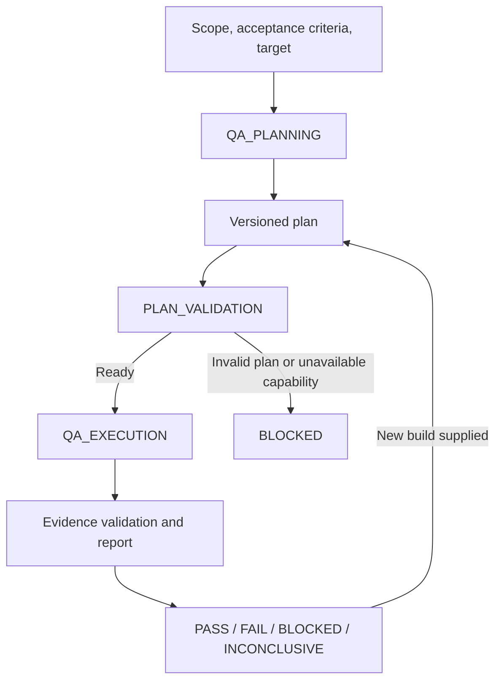

# Independent QA / Tester — Scope and Implementation Status

Status: core standalone workflow implemented under `src/qa/` and exposed by `hrns qa`. This document records the implemented boundary and remaining roadmap items.
Date: 2026-09-11.

## 1. OBJECTIVE

The independent QA workflow plans and performs acceptance testing against a running product. It exercises public interfaces as a user would: HTTP requests for APIs, navigation and input for websites, and gameplay for browser games.

“As a human” means observing the product, choosing an action, performing it through normal controls, and checking the result. Reading source, generating tests, receiving a developer's success claim, or taking an initial screenshot does not demonstrate acceptance. Automated interaction also does not establish subjective human usability or enjoyment.

Deliver separate planning and execution commands, durable evidence, reproducible defects, and an explicit verdict. Allow QA to run against software developed outside Harness. Development integration is optional and consumes the same independent workflow.

## 2. REPOSITORY FINDINGS

These findings reflect current code. Design consequences identify implemented boundaries or explicit roadmap work.

| Existing component | Finding | Design consequence |
| --- | --- | --- |
| [ReviewHandler](../src/orchestrator/phases/ReviewHandler.ts) | Calls Tech Lead and adversarial QA during `REVIEW`. Prompts emphasize code, edge cases, vulnerabilities, and developer handoff. Outputs use `TL.json` and `QA.json`. | Preserve existing reviews; add runtime acceptance as a distinct responsibility. |
| [ValidationGate](../src/validation-gate/ValidationGate.ts) | Evaluates review scores, vulnerability/crash flags, and rework counts. Does not require executed scenarios or runtime evidence. | Acceptance needs a separate deterministic gate; scores cannot substitute for observations. |
| [ReviewHandler](../src/orchestrator/phases/ReviewHandler.ts) | Marks features completed on PASS. `skipValidation` also marks completion using synthetic scores. | An integrated QA gate must run before completion; a skipped review cannot fabricate acceptance. |
| [ChainBuilder](../src/orchestrator/ChainBuilder.ts), [ReentryResolver](../src/orchestrator/ReentryResolver.ts) | Development pipeline owns phase order and resume logic. | A standalone QA state machine avoids requiring development artifacts or a backlog. Integration requires explicit phase and resume changes. |
| [IAgentRunner](../src/agent-runner/IAgentRunner.ts), [runner types](../src/agent-runner/types.ts) | Common contract covers prompts, sessions, results, and cancellation. No shared tool capability or browser-session contract. | Reusing an agent invocation does not prove browser or terminal execution is available. |
| [SettingsSchema](../src/settings/SettingsSchema.ts), [HarnessSettings](../src/settings/HarnessSettings.ts) | Phase settings expose model, effort, and timeout. QA resolves `qa_planning`, `qa_analysis`, and `qa_reporting`. | Keep QA model settings independent from runtime target configuration. |
| [CLI entrypoint](../src/cli/run.ts), [QA CLI service](../src/cli/services/qa-service.ts) | `hrns qa` is registered with agentic and deterministic actions, including plan selection on resume. | Keep CLI prompts at the inbound boundary; delegate execution to `QaAgenticOrchestrator` and `QaService`. |
| [DiagnoseService](../src/diagnose/DiagnoseService.ts) | Demonstrates an independent service with injected ports and separate state. | Keep QA state and lifecycle independent from diagnosis and development orchestration. |
| `src/qa/`, [package.json](../package.json) | QA implementation includes services, phases, terminal presentation, curl, Playwright, and extended drivers. | Extend through injected drivers and services; do not couple verdict policy to a concrete runner. |
| [Testing protocol](./adr/TESTS.md), [E2E helpers](../tests/e2e/helpers/MockAgentCli.ts) | SDK tests use isolated sandboxes and mocked agents. | Keep deterministic tests synthetic and origin-neutral; reserve target HTTP/browser calls for an explicit `hrns qa` runtime run. |

The manifest and lockfile declare Vitest 5.0.0. Use those files as the source of truth for verification commands and dependency versions.

## 3. SCOPE AND ROLLOUT

The implemented standalone workflow covers API, web, browser-game, mobile-web, accessibility, MCP, CLI, and WebSocket drivers. `security` and `full` profiles compose API/web scenarios through the planner and validator. Drivers execute only typed actions represented in a persisted plan. Unsupported capabilities remain visible as `BLOCKED` or `INCONCLUSIVE`; they cannot produce `PASS`.

Native desktop, console, VR, hardware input, load testing, exhaustive security certification, subjective “fun” scoring, deployment, and a graphical dashboard remain out of scope. Optional development gating remains a roadmap item; existing adversarial review and developer tests remain separate signals.

SDK tests use synthetic, origin-neutral data and injected drivers. They do not call external HTTP services or inspect a product workspace. A deliberate `hrns qa` runtime run may target a supplied environment and stores its evidence under that environment's `.harness-kit/qa/` directory.

## 4. INDEPENDENT WORKFLOW



### PLANNING

Inputs: open scope, optional scenario text, target URL/path, and profile hint. The persisted plan contains criteria, typed scenarios, and a schema version; it does not require `TDD-OUTPUT.json`, development sessions, or Harness product files.

Planner responsibilities:

1. Identify all applicable surfaces. A feature can require both API and browser testing.
2. Map every acceptance criterion to observable scenarios, including negative cases and relevant regression journeys.
3. Define typed requests or browser actions and assertions per scenario.
4. Keep each criterion mapped to one required executable scenario.
5. Respect validator limits for scenarios, actions, waits, key presses, arguments, and viewport size.
6. Identify unsupported surfaces. Do not silently invent business rules or remove supplied criteria.
7. Persist a versioned plan before any product test action. Planning performs no target probe or driver execution.

The developer handoff may locate the application, but cannot define whether it passes. A different QA session derives expected behavior from requirements. Changed requirements create a new plan version; executor cannot weaken expected outcomes to match observed failures.

### PREFLIGHT AND EXECUTION

Validate plan schema, target protocol, typed payloads, driver/browser availability, workspace paths, and evidence directory. Honor a supplied target; when no target is supplied, `QaRuntimeManager` serves an existing `index.html` through a temporary loopback static server. It does not start framework, API, or native processes. Record readiness and stop only runtimes owned by the SDK.

Execute an observation/action loop: observe current state, choose an allowed action, execute it, collect the actual tool result, compare with expected behavior, and persist the checkpoint. Keep a browser context alive for each journey; isolate accounts and data between independent journeys.

The SDK owns action execution and evidence collection. The agent proposes typed actions and interprets observations. Free-form agent text cannot create an execution receipt. Capture assertions separately from tool success: a successful click or HTTP response does not necessarily satisfy a business requirement.

On a reproducible defect, save driver evidence and continue independent scenarios where possible. On timeout, cancellation, or unavailable tools, preserve partial results. Stop owned static runtimes and close browser contexts in all terminal paths. Never terminate an externally supplied server.

## 5. INTERACTION PROFILES

| Surface | Required behavior | Required evidence |
| --- | --- | --- |
| API | Execute actual `curl` requests against a running endpoint. Check applicable methods, authentication, permissions, validation, errors, and public readback of mutations. | Sanitized request, response status/headers/body, process exit code, timestamps, and assertions. |
| Web UI | Navigate, click, fill, submit, use keyboard, and revisit relevant routes. Check visible outcomes, persistence after reload where applicable, and page exceptions. | Screenshots, observed assertions, and browser error messages. |
| Browser game | Launch, enter gameplay, exercise supported keyboard controls, observe progress, reach an applicable success/failure state, restart, and test pause/resume when specified. | Input actions, final screenshot, observations, page errors, and outcome assertions. |
| Mobile web | Use a mobile viewport and touch-capable Playwright context for responsive journeys. | Viewport, touch actions, screenshots, assertions, and browser errors. |
| Accessibility | Run deterministic document checks for required labels, names, roles, and keyboard reachability. | Rule results, affected selectors, and captured page state. |
| MCP | Send JSON-RPC or Streamable HTTP requests, parse JSON/SSE responses, and verify structured tool outcomes. | Sanitized request/response, parsed result, state/reason code, and transport errors. |
| CLI | Spawn a validated executable without a shell and check exit code and output. | Sanitized command arguments, stdout/stderr, exit code, and timestamps. |
| WebSocket | Connect to a `ws://` or `wss://` target and exchange bounded messages. | Message transcript, close/error details, and assertions. |
| Native game | Not implemented. Do not advertise desktop, console, VR, or hardware input coverage. | Report the unsupported capability as `BLOCKED` or `INCONCLUSIVE`. |

Use the actual curl executable (`curl.exe` on Windows) through structured arguments. Capture both transport failure and HTTP outcome; neither process exit zero nor HTTP 200 alone establishes success. Keep fixture credentials out of persisted commands and reports.

For web acceptance, use visible controls. Calling page functions, editing storage, injecting scores, or invoking hidden game methods must not count as user interaction. Explicit setup hooks may prepare fixtures but remain separate from acceptance actions.

Canvas/WebGL may provide little semantic UI information. Use captured screenshots and supported keyboard actions. If the visible outcome cannot be established or the game requires unsupported reaction speed, report `INCONCLUSIVE` or `BLOCKED` with the exact missing capability. Do not infer “playable” from a loaded canvas.

## 6. ARCHITECTURE AND DRIVER BOUNDARY

The implementation keeps orchestration, execution, persistence, and presentation separate:

| Implemented component | Responsibility |
| --- | --- |
| `QaAgenticOrchestrator` | Runs planning, validation, execution, adaptive analysis, and reporting phases. |
| `QaService` | Executes typed scenarios, probes targets once, persists runs, and applies the verdict policy. |
| `QaPlanValidator` | Validates identifiers, protocol, same-origin paths, payloads, budgets, and driver availability. |
| `QaRunStore` | Atomically persists immutable plan versions, run `state.json`, reports, and numbered evidence directories. |
| `QaRuntimeManager` | Serves supported static assets on a collision-free loopback port and stops only owned processes. |
| `QaDriver` implementations | Provide `doctor()` and deterministic execution for curl, Playwright, mobile web, accessibility, MCP, CLI, and WebSocket profiles. |
| `QaTerminalView` | Renders typed progress and the final summary frame at the CLI boundary. |

`IAgentRunner` supplies planning, analysis, and reporting text. It never substitutes for a driver receipt or runtime evidence. Extend QA through injected `QaDriver` instances and keep driver selection at composition boundaries. Propagate `AbortSignal` through probes and actions.

Playwright 1.63.0 is declared in `package.json`. Install Chromium explicitly and use `hrns qa doctor` to check availability. Browser screenshots and observations support diagnosis; assertions and driver results decide acceptance. Native desktop, console, VR, and arbitrary OS input need a separate verified adapter before they can be claimed.

Runtime acceptance may target a supplied environment. SDK unit tests remain synthetic and injected: they must not call external HTTP services or read project-specific application data.

## 7. CONTRACTS, STATE, AND EVIDENCE

Implemented artifact layout:

```text
.harness-kit/qa/
  plans/<plan-id>/<version>.json
  runs/<run-id>/
    state.json
    report.json
    evidence/
      001-<scenario-id>/...
      002-<scenario-id>/...
```

Persist through `QaRunStore` using atomic file replacement. Evidence folders use a zero-padded three-digit execution sequence followed by the scenario ID. Do not place runtime acceptance results in the adversarial review's `QA.json`.

Implemented contracts in [`src/qa/types.ts`](../src/qa/types.ts):

- `QaPlan`: schema version, ID/version, target, profile, criteria, and executable scenarios.
- `QaScenario`: stable ID, criterion IDs, required flag, profile, category, and one typed request/action payload.
- `QaRun`: run ID, plan ID/version, target, timestamps, scenario results, and verdict.
- `QaScenarioResult`: scenario ID, required flag, `PASSED`/`FAILED`/`BLOCKED`/`INCONCLUSIVE`, optional status/reason, and evidence references.
- `QaEvidence`: ID, artifact path, capture time, and driver name.
- `QaFinalReport`: verdict, summary, criterion statuses, deduplicated bugs, errors, and coverage matrix.

Plan versions are immutable. Agentic resume selects one saved plan; low-level `resume --run` executes only unfinished scenario IDs. Current runs do not fingerprint builds, acquire target leases, or append event logs. Treat those controls as integration roadmap items, not existing guarantees.

Drivers redact common secrets and write evidence below the run directory. Keep credentials synthetic, avoid external data in SDK tests, and inspect evidence before sharing it. Add retention limits, artifact hashes, and stronger path/symlink policy before using QA artifacts as a cross-build gate.

## 8. VERDICT RULES

| Verdict | Rule |
| --- | --- |
| PASS | Every required result is `PASSED` and includes evidence. |
| FAIL | Any required result is `FAILED`. |
| BLOCKED | No required result failed, and at least one required result is `BLOCKED`. |
| INCONCLUSIVE | No required result failed or blocked, but a required result is inconclusive, has no evidence, or no required scenarios exist. |

Cancellations abort the current operation and preserve any saved run state. A zero-scenario plan, missing evidence, or malformed plan cannot produce `PASS`. Retry with `renew` to create a new immutable plan version; do not overwrite prior evidence.

## 9. IMPLEMENTED CLI AND CONFIGURATION

`hrns qa` supports an agentic flow plus deterministic subcommands:

```text
hrns qa --scope <text> --target <url> --profile <profile>
hrns qa plan --plan <id> --target <url> --criterion <text> [--method <method> --path <path>]
hrns qa execute --plan <id>@<version>
hrns qa renew --plan <id>@<version>
hrns qa resume --run <id>
hrns qa run --plan <id> --target <url> --criterion <text>
hrns qa report --run <id>
hrns qa doctor --profile <profile>
```

When no action, scope, or scenarios are supplied, the CLI offers `resume` or `renew` if saved plans exist. `resume` then selects exactly one plan under `.harness-kit/qa/plans` and runs only that plan. Deterministic `resume --run` skips completed scenario IDs in an existing run.

Resolve model and effort from `qa_planning`, `qa_analysis`, and `qa_reporting` settings. Keep target configuration in the plan; keep agent settings in `settings.json`. The command does not mutate development backlog, deployment, or product source.

## 10. ROADMAP: OPTIONAL DEVELOPMENT INTEGRATION

The current workflow is standalone. If a future release adds a `QA_ACCEPTANCE` phase after `REVIEW` and before `TRANSITION`, that handler must call `QaService` without duplicating QA logic. Planning and execution must remain distinct persisted stages.

For QA-enabled runs, refactor `ReviewHandler` so review PASS records review approval but leaves the feature pending acceptance. Only acceptance PASS for the current artifact can mark it completed. Confirm deploy selection cannot consume a pending acceptance feature.

On acceptance FAIL, send structured reproduction evidence to the existing rework mechanism with bounded retries. QA never edits the product. Development supplies a new artifact, review runs again, and QA retests affected criteria plus required regression journeys. BLOCKED and INCONCLUSIVE pause for the relevant environment/capability issue; they do not automatically consume developer reworks.

Add an explicit acceptance policy, initially disabled for compatibility. If enabled, `quick`, `fast`, `skipValidation`, and manual review-score overrides must not bypass required runtime acceptance. Reports show separate review and acceptance statuses. Legacy completed features remain legacy/unverified; never synthesize historical QA PASS records.

Integration touches `Phase`, `ChainBuilder`, review completion, `ReentryResolver`, persisted state parsing, steering rollback rules, CLI resume choices, progress formatting, session cleanup, and reports. Add resume tests for interruption before acceptance, during execution, and after report persistence but before feature completion.

## 11. REMAINING BACKLOG

| ID | Status | Scope |
| --- | --- | --- |
| QA-01 | Implemented | Typed plans/results, pure verdict policy, atomic plan/run/report store, and numbered evidence paths. Build fingerprints and leases remain absent. |
| QA-02 | Implemented | Agentic planning, criterion mapping, plan validation, driver checks, and separate planning/analysis/reporting sessions. |
| QA-03 | Implemented | Runtime preparation, one target probe, curl driver, CLI actions, report persistence, and deterministic resume. |
| QA-04 | Implemented | Playwright browser driver, Chromium doctor check, browser assertions, screenshots, and mobile-web/accessibility variants. |
| QA-05 | Implemented | MCP JSON/SSE parsing, CLI subprocess, and WebSocket drivers with typed evidence. |
| QA-06 | Partial | Redaction, cancellation, cleanup, adaptive follow-ups, and coverage matrix exist; budgets, telemetry, artifact hashes, and leases need design. |
| QA-07 | Roadmap | Optional development acceptance gate and structured rework handoff. |
| QA-08 | Roadmap | Native desktop/game driver; never infer support from Playwright. |

Keep future HTTP APIs, build identity, retention, and cross-run gates behind explicit design and tests. Current source ownership is `src/qa/`, CLI wiring is `src/cli/services/qa-service.ts`, and defaults are `src/settings/DefaultSettings.ts`.

## 12. VERIFICATION AND COMPLETION CRITERIA

Use unit tests for schemas, validation, verdict policy, path boundaries, evidence numbering, driver payloads, and resume decisions. Inject fetch, subprocess, Playwright loaders, WebSocket exchanges, agent runners, target probes, and runtime managers. Use synthetic responses and origin-neutral sample data; deterministic SDK tests must not make HTTP calls or inspect a product workspace.

Required regression cases: zero scenarios; malformed target; invalid same-origin path; unavailable driver; fabricated receipt; missing evidence; SSE and JSON MCP responses; unexpected MCP errors; CLI argument injection; unsupported WebSocket protocol; cancellation; duplicate resume; and final summary counts. A manual `hrns qa` run against an explicitly supplied environment is operational validation, not part of this deterministic suite.

Follow repository verification order: `rtk npm install`, `rtk npm run lint`, `rtk npm run build`, `rtk npm run typecheck`, then `rtk npm run test`. Run E2E only when a test explicitly opts into a disposable fixture. Keep external APIs and project-specific data out of default tests.

Standalone implementation is complete for supported profiles when plans validate before execution, evidence remains inspectable, verdicts follow `QaVerdictPolicy`, and numbered artifacts persist across resume. Native-game support and development gating require roadmap work.

## 13. ANALYSIS VALIDATION

This scope was checked against current orchestration, runner, settings, CLI, validation, driver, persistence, and terminal-view code. It documents implemented standalone QA behavior, synthetic test boundaries, and explicit roadmap items; it does not claim a product runtime verdict.

## REFERENCES

- [**QA_TESTER.md**](./feature/QA_TESTER.md): Implemented QA feature contract, drivers, phases, and evidence paths.
- [**ARCHITECTURE.md**](./adr/ARCHITECTURE.md): Ports-and-adapters boundaries used by QA services and drivers.
- [**TESTS.md**](./adr/TESTS.md): Deterministic test commands, isolation rules, and verification order.
