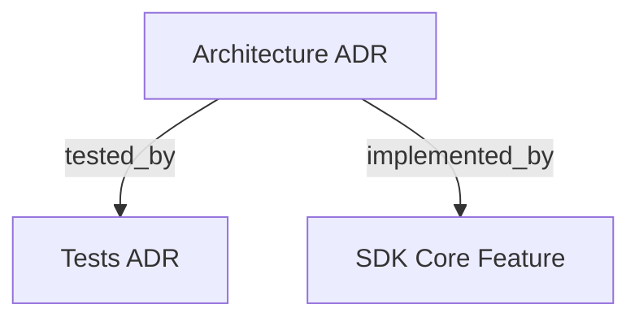

# Arquitetura do Projeto

## OVERVIEW
TypeScript SDK implementing an autonomous TDD orchestration loop using Ports-and-Adapters structure. Uses static registry and factory to decouple agent execution strategies.

## FOLDER STRUCTURE
<folder_structure>
```
sdk/
├── docker/                       # Docker container setup and entrypoint
│   └── entrypoint.sh             # Git bootstrap script (credentials, pre-cloning)
├── src/                          # Main SDK source directory
│   ├── cli/                      # CLI entry point implementation
│   │   └── run.ts                # Main command line parser and orchestrator executor
│   ├── agent-runner/             # Agent runner port and built-in strategies
│   │   ├── __tests__/            # Runner unit and modular integration tests
│   │   ├── IAgentRunner.ts       # Outbound port interface for agent invocation
│   │   ├── AgentRunnerRegistry.ts# Registry for strategy registrations
│   │   ├── AgentRunnerFactory.ts # Factory to instantiate runner strategies
│   │   ├── claude-cli/          # Subdirectory for Claude CLI strategy
│   │   ├── claude-sdk/         # Subdirectory for Anthropic API strategy
│   │   └── antigravity-cli/          # Subdirectory for Google Antigravity strategy
│   ├── orchestrator/             # Core state machine loop and phase chain
│   │   ├── phases/               # Chain-of-Responsibility phase handlers
│   │   ├── services/             # Dedicated domain and infrastructure services
│   │   │   ├── AgentInvocationService.ts # Manages agent invocation and timeout prompts
│   │   │   └── ProjectStateService.ts    # Manages disk state queries and spec verification
│   │   ├── utils/                # Orchestrator-specific utility functions
│   │   │   └── OrchestratorFormatter.ts  # Handles CLI/UI text and box card formatting
│   │   ├── HarnessOrchestrator.ts# Main orchestrator implementing Reviewontext
│   │   ├── SteeringAnalyzer.ts   # LLM-based session steering message parser
│   │   └── ReentryResolver.ts    # Ordered predicate table for phase re-entry
│   ├── context-assembler/        # Per-phase structured payload builders
│   │   └── ContextAssembler.ts   # Builds PlanningPayload, DevelopmenPayload, etc.
│   ├── file-state/               # Filesystem reading and writing port/adapter
│   │   └── parsers/              # Markdown/JSON to domain object parsers
│   ├── json-extraction/          # Defensive JSON parser — never throws
│   │   └── JsonExtractionProtocol.ts # Supports top-level objects and arrays
│   ├── ui/                       # Terminal rendering utilities
│   │   ├── StartupBanner.ts      # ASCII welcome banner
│   │   ├── AnsiHelpers.ts        # Low-level ANSI escape sequences and colors
│   │   └── TerminalProgress.ts   # Animated spinner and progress bar
│   ├── telemetry/                # Usage and token tracking ledger
│   └── index.ts                  # Public package entry point and exports
└── docs/                         # Technical documentation folder
    ├── adr/                      # Architectural Decisions Records
    └── feature/                  # Feature orientations and specs
```
</folder_structure>

## LAYERS
- **Domain Core**: Owns the orchestrator state machine, transition logic, and phase definitions. Has zero external dependencies.
- **Inbound Port**: `IFileStateManager` abstracts all filesystem mutations.
- **Outbound Port**: `IAgentRunner` abstracts agent invocation with timeout AbortSignal propagation.
- **Strategies / Adapters**: Implements concrete execution clients (CLI, API) for target LLM agents.

## MODULES
| Module | Responsibility | Location |
|--------|-----------------|-------------|
| `run.ts` | Main CLI entry point. Parses flags, handles input rules, and boots the HarnessOrchestrator. | `src/cli/` |
| `AgentRunnerRegistry` | Singleton registry storing strategies constructors and validator functions. | `src/agent-runner/` |
| `AgentRunnerFactory` | Instantiates runners and executes strategy validations. Force-imports all built-in runners to trigger self-registration. | `src/agent-runner/` |
| `HarnessOrchestrator` | Core phase transitions and Chain-of-Responsibility dispatch loop. The correct phase flow is: RefinementHandler -> PlanningHandler -> DevelopmentHandler -> ReviewHandler -> StateCheckHandler -> TransitionHandler -> MemoryHandler -> DeployHandler -> HALTED. | `src/orchestrator/` |
| `RefinementHandler` | Optional pre-planning phase. Generates Socratic questions saved to `QUESTIONS.json`, collects developer answers, and consolidates them into `REFINEMENT.md`. | `src/orchestrator/phases/` |
| `AgentInvocationService` | Service that encapsulates agent runner execution, timeout scheduling, and interactive prompt timeouts. | `src/orchestrator/services/` |
| `ProjectStateService` | Service that handles task extraction from specs, spec existence checks, and on-disk state verification. | `src/orchestrator/services/` |
| `OrchestratorFormatter` | Utility containing static layout formatters, duration formatting, and phase descriptions. | `src/orchestrator/utils/` |
| `SteeringAnalyzer` | LLM-based message classifier: translates developer text into structured `SteeringAction` values. | `src/orchestrator/` |
| `ContextAssembler` | Builds per-phase typed payloads injecting steering rules into every agent invocation. | `src/context-assembler/` |
| `JsonExtractionProtocol` | Defensive JSON parser supporting top-level arrays and objects; never throws. Returns `ExtractionResult | ExtractionError`. | `src/json-extraction/` |
| `FileStateManager` | Atomic file reads and writes for all markdown/JSON state files. | `src/file-state/` |
| `TerminalProgress` | Animated CLI spinner and progress bar using ANSI escape codes. | `src/ui/` |
| `AnsiHelpers` | Low-level ANSI escape helpers: cursor-sdk control, color wrappers (`blue`, `cyan`, `green`, `dim`). | `src/ui/` |

## PATTERNS
REQUIRED execute after code development for validation in order:
  - Run `rtk npm install` to check dependencies
  - Run `rtk npm run lint` to check code syntax
  - Run `rtk npm run typecheck`
  - Run `rtk npm run build`

REQUIRED: Use Constructor Dependency Injection to decouple ports from adapters.
REQUIRED: Spelled-out registration of new runner strategies via AgentRunnerRegistry.
REQUIRED: Propagate AbortSignal downwards to child process groups or API requests to prevent leaks.
REQUIRED: Extract numeric thresholds, limits, and configurations into named constants or configuration modules to avoid magic numbers.
REQUIRED: Keep methods short (under 50 lines) and cohesive. Extract complex chunks of logic into private helper methods.
REQUIRED: Separate distinct concerns (e.g. UI formatting, disk state checking, agent runner settings lookup) into dedicated utility classes or domain services.
REQUIRED: Configure and enforce agent execution timeoutMs limits. If the timeout expires in an interactive terminal, prompt the user for continuation or aborting.
REQUIRED: In non-interactive or testing environments (where `process.env.NODE_ENV === 'test'` or stdin is not TTY), automatically abort agent execution upon timeout expiration to avoid infinite hangs.
REQUIRED: Run all CLI workflows, local tests, and build checks through the Rust Token Killer (rtk) proxy wrapper to optimize token usage and caching.
FORBIDDEN: Direct dependency of orchestrator core on concrete runner implementations.
FORBIDDEN: Hardcoding inline numeric literals directly in business logic, loop limits, or configuration blocks.
FORBIDDEN: Monolithic classes or methods that mix unrelated concerns like terminal UI rendering, file state reads, and main run-loop logic.

<code_patterns>
# CORRECT: Strategy self-registration
AgentRunnerRegistry.register({
  type: 'custom-runner',
  constructor: CustomRunner
})

# WRONG: Direct strategy instantiation in core logic
const runner = new ClaudeCLIRunner() // Hard-coded instantiation

# CORRECT: Constants for boundaries and configurations
const MAX_BATCH_SIZE = 5
const DYNAMIC_LIMIT_MULTIPLIER = 2

const groups = Math.ceil(tasks.length / MAX_BATCH_SIZE)
const limit = groups * DYNAMIC_LIMIT_MULTIPLIER

# WRONG: Hardcoded magic numbers in calculations
const groups = Math.ceil(tasks.length / 5) // Magic number 5
const limit = groups * 2 // Magic number 2

# CORRECT: Extract cohesive private methods and helper services
class DevelopmentHandler extends AbstractPhaseHandler {
  async handle(phase: Phase, context: Reviewontext): Promise<Phase | null> {
    const shouldGoToReview = this.handleResumedExecution(activeFeature, tddOutputPath, context)
    if (shouldGoToReview) return Phase.REVIEW
    // ...
  }

  private handleResumedExecution(activeFeature: Feature, tddOutputPath: string, context: Reviewontext): boolean {
    // ...
  }
}

# WRONG: Monolithic long methods mixing resumption, pagination, and file handling
class DevelopmentHandler extends AbstractPhaseHandler {
  async handle(phase: Phase, context: Reviewontext): Promise<Phase | null> {
    // 150 lines of mixed concerns directly inside handle
    const allTasks = context.fsm.loadDevelopmentState().filter(...)
    const inProgressTasks = allTasks.filter(...)
    if (existsSync(tddOutputPath) && inProgressTasks.length > 0) { ... }
    const currentTasks = context.fsm.loadDevelopmentState().filter(...)
    // ...
  }
}
</code_patterns>

## INTEGRATIONS
| External Service / Component | Purpose | Connection / Authentication Method |
|------------------------------|---------|-------------------------------------|
| Anthropic API | Execution of Claude Agent | API Key environment variable |
| Claude Code CLI | Local terminal coding agent | Spawn subprocess using local CLI auth |
| Antigravity CLI | Execution of Google coding agent | Spawn subprocess using agy binary |
| `hrns` CLI | Command-line interface for running and steering feature orchestration | Spawn and run local executable via `npm run` or global symlink |

## DOCUMENT MAP



## REFERENCES
- [**README.md**](../README.md): Main documentation index.
- [**TESTS.md**](./TESTS.md): Testing strategies and commands.
- [**E2E_TESTING_SUITE.md**](../feature/E2E_TESTING_SUITE.md): End-to-End integration and CLI test suite specification.
- [**SDK_AGENT_RUNNER.md**](../feature/SDK_AGENT_RUNNER.md): Implementation details of agent runners including strategy registration and CLI flags.
- [**SDK_CORE.md**](../feature/SDK_CORE.md): Public API surface, orchestrator types, and known limitations.
- [**SDK_TERMINAL_UI.md**](../feature/SDK_TERMINAL_UI.md): Terminal progress, ANSI helpers, and spinner integration.
- [**SDK_STEERING.md**](../feature/SDK_STEERING.md): Session steering analyzer and `steeringRules` configuration.
