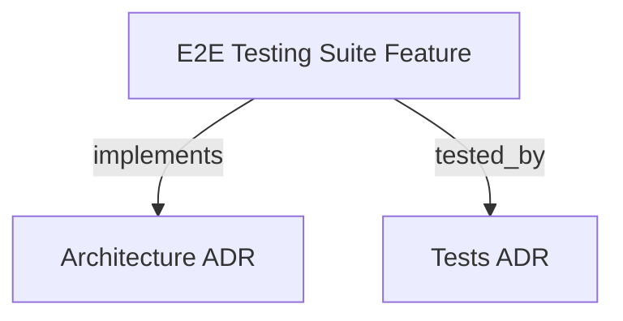

```graph
{"node_id":"feature:e2e_testing_suite","domain":"e2e_testing","implements":["adr:architecture"],"tested_by":["adr:tests"],"entrypoints":["vitest.e2e.config.ts"],"registration_files":[],"reference_files":["tests/e2e/scenarios/02-full-orchestration-cycle.test.ts"],"code_files":["tests/e2e/vitest.e2e.config.ts","tests/e2e/helpers/AssertionHelpers.ts","tests/e2e/helpers/CliRunner.ts","tests/e2e/helpers/MockAgentCli.ts","tests/e2e/helpers/OrchestrationStateValidator.ts","tests/e2e/helpers/SandboxEnvironment.ts"],"test_files":["tests/e2e/helpers/AssertionHelpers.test.ts","tests/e2e/helpers/MockAgentCli.test.ts","tests/e2e/helpers/OrchestrationStateValidator.test.ts","tests/e2e/helpers/SandboxEnvironment.test.ts","tests/e2e/integration/cli-sandbox.test.ts","tests/e2e/scenarios/01-init-and-bootstrap.test.ts","tests/e2e/scenarios/03-session-resume-and-steering.test.ts","tests/e2e/scenarios/04-multi-project-readonly-steering.test.ts","tests/e2e/scenarios/05-report-dashboard-and-telemetry.test.ts","tests/e2e/scenarios/06-quota-exceeded-and-halt-recovery.test.ts","tests/e2e/scenarios/07-http-server-daemon.test.ts","tests/unit/t32-e2e-ci-pipeline-integration.test.ts"]}
```

# END-TO-END (E2E) TESTING SUITE
Provides an end-to-end integration and CLI test suite validating the complete Harness Kit SDK orchestrator lifecycle.

## OVERVIEW
The E2E testing suite executes non-interactive end-to-end test scenarios against compiled CLI binaries (`dist/cli/run.js`). It leverages Vitest with dedicated configuration to verify orchestrator state transitions and safety constraints.

## FOLDER STRUCTURE
<folder_structure>
```
tests/e2e/
├── helpers/                     # Sandbox, CLI, and assertion infrastructure
├── integration/                 # Compiled CLI sandbox integration
├── scenarios/                   # Full lifecycle and daemon scenarios
└── vitest.e2e.config.ts         # Alternate path-aware test configuration
```
</folder_structure>

## E2E SCENARIOS & COMPONENTS

### Scenario Infrastructure
- **`SandboxEnvironment`**: Spawns isolated execution environments in temporary system directories.
- **`MockAgentCli`**: Intercepts agent runner subprocess calls to return predefined TDD responses.
- **`AssertionHelpers`**: Asserts atomic state file integrity.

## HOW TO RUN E2E TESTS

### Prerequisites
1. Compile SDK CLI build (`dist/cli/run.js` must exist via `npm run build`).
2. Install Vitest in Node.js environment.

### Steps
1. Navigate to the project root.
2. Execute the test runner command.

<code_example>
# CORRECT: Running E2E suite after building the binary
rtk npm run build && rtk npm run test:e2e

# WRONG: Running E2E suite on uncompiled source code
rtk npm run test:e2e
</code_example>

## PARAMETERS / CONFIGURATIONS

| Name | Type | Required | Description | Default |
|------|------|----------|-------------|---------|
| testTimeout | int | Yes | Timeout in milliseconds for long-running E2E CLI processes | 30000 |
| include | string[] | Yes | Glob pattern for E2E tests | `['tests/e2e/**/*.test.ts']` |

## BEST PRACTICES
REQUIRED: Clean up sandbox directories after test completion using hooks.
REQUIRED: Execute CLI processes against compiled output rather than source TS files.
PROHIBITED: Modifying workspace root source or production configuration during E2E test execution.

## DOCUMENT MAP



## REFERENCES
- [**ARCHITECTURE.md**](../adr/ARCHITECTURE.md): Core architectural layers and CLI runner patterns.
- [**TESTS.md**](../adr/TESTS.md): Test strategies, tooling, and execution standards.
- [**SDK_CLI.md**](./SDK_CLI.md): CLI command flag definitions and interactive wizard specifications.

