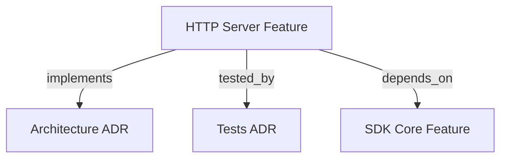

# HTTP SERVER & DOCKER ADAPTER

```graph
{
  "node_id": "feature:http_server",
  "domain": "server",
  "implements": ["adr:architecture"],
  "tested_by": ["adr:tests"],
  "depends_on": ["feature:sdk_core"],
  "entrypoints": [
    "src/server/index.ts",
    "src/server/HttpServer.ts"
  ],
  "registration_files": [
    "src/server/adapters/index.ts",
    "src/server/application/use-cases/index.ts",
    "src/server/adapters/outbound/auth/AuthStrategyFactory.ts"
  ],
  "reference_files": [
    "src/server/adapters/inbound/http/routes/RouteHandlers.ts"
  ],
  "code_files": [
    "src/server/types.ts",
    "src/server/domain/types.ts",
    "src/server/application/ports/inbound/IRunOrchestratorJobUseCase.ts",
    "src/server/application/ports/inbound/IGetJobStatusUseCase.ts",
    "src/server/application/ports/inbound/IResumeOrchestratorJobUseCase.ts",
    "src/server/application/ports/inbound/ICleanJobsAndWorktreesUseCase.ts",
    "src/server/application/ports/inbound/IGetHealthStatusUseCase.ts",
    "src/server/application/ports/inbound/IGetSettingsUseCase.ts",
    "src/server/application/ports/inbound/IUpdateSettingsUseCase.ts",
    "src/server/application/use-cases/RunOrchestratorJobUseCase.ts",
    "src/server/application/use-cases/GetJobStatusUseCase.ts",
    "src/server/application/use-cases/ResumeOrchestratorJobUseCase.ts",
    "src/server/application/use-cases/CleanJobsAndWorktreesUseCase.ts",
    "src/server/application/use-cases/GetHealthStatusUseCase.ts",
    "src/server/application/use-cases/GetOpenApiDocsUseCase.ts",
    "src/server/application/use-cases/GetSettingsUseCase.ts",
    "src/server/application/use-cases/UpdateSettingsUseCase.ts",
    "src/server/application/use-cases/SyncWorkspaceRepositoryUseCase.ts",
    "src/server/adapters/outbound/auth/NoAuthStrategy.ts",
    "src/server/adapters/outbound/auth/BasicAuthStrategy.ts",
    "src/server/adapters/outbound/auth/BearerAuthStrategy.ts",
    "src/server/adapters/outbound/auth/JwtAuthStrategy.ts",
    "src/server/adapters/outbound/auth/HmacAuthStrategy.ts",
    "src/server/application/ports/inbound/IGetReportsSummaryUseCase.ts",
    "src/server/application/ports/inbound/IGetTokensTelemetryUseCase.ts",
    "src/server/application/ports/inbound/index.ts",
    "src/server/application/ports/outbound/index.ts",
    "src/server/application/use-cases/GetReportsSummaryUseCase.ts",
    "src/server/application/use-cases/GetTokensTelemetryUseCase.ts",
    "src/server/adapters/inbound/http/docs/OpenApiSpecGenerator.ts",
    "src/server/adapters/inbound/http/mappers/DtoMappers.ts",
    "src/server/adapters/inbound/http/dto/JobStatusDto.ts",
    "src/server/adapters/inbound/http/dto/ReportsSummaryDto.ts",
    "src/server/adapters/inbound/http/dto/RunRequestDto.ts",
    "src/server/adapters/inbound/http/dto/RunResponseDto.ts",
    "src/server/adapters/inbound/http/dto/TokensTelemetryDto.ts",
    "src/server/adapters/outbound/auth/index.ts",
    "src/server/adapters/outbound/auth/types.ts",
    "src/server/adapters/outbound/mutex/LockRepository.ts",
    "src/server/adapters/outbound/mutex/WorkspaceLockManager.ts",
    "src/server/adapters/outbound/queue/JobQueue.ts",
    "src/server/adapters/outbound/repository/InMemoryJobStore.ts",
    "src/server/adapters/outbound/repository/JobStoreRepository.ts",
    "src/server/adapters/outbound/services/JobRunnerService.ts",
    "src/server/adapters/outbound/services/AsyncWorkerPool.ts",
    "docker/entrypoint.sh",
    "Dockerfile",
    "docker-compose.yml"
  ],
  "test_files": [
    "src/server/__tests__/types.test.ts",
    "src/server/__tests__/HttpServer.test.ts",
    "src/server/__tests__/DockerBuild.test.ts",
    "src/server/adapters/outbound/services/__tests__/AsyncWorkerPool.test.ts",
    "src/server/adapters/outbound/auth/__tests__/AuthStrategies.test.ts",
    "src/server/application/use-cases/__tests__/GetJobStatusUseCase.test.ts",
    "src/server/application/use-cases/__tests__/GetHealthStatusUseCase.test.ts",
    "src/server/application/use-cases/__tests__/ResumeOrchestratorJobUseCase.test.ts",
    "src/server/application/use-cases/__tests__/CleanJobsAndWorktreesUseCase.test.ts",
    "src/server/application/use-cases/__tests__/RunOrchestratorJobUseCase.test.ts",
    "src/server/application/use-cases/__tests__/GetReportsSummaryUseCase.test.ts",
    "src/server/application/use-cases/__tests__/GetTokensTelemetryUseCase.test.ts",
    "src/server/application/use-cases/__tests__/SettingsUseCases.test.ts",
    "src/server/application/use-cases/__tests__/SyncWorkspaceRepositoryUseCase.test.ts",
    "src/server/adapters/inbound/http/mappers/__tests__/DtoMappers.test.ts",
    "src/server/adapters/inbound/http/docs/__tests__/OpenApiSpecGenerator.test.ts",
    "src/server/adapters/inbound/http/routes/__tests__/RouteHandlers.test.ts",
    "src/server/adapters/outbound/mutex/__tests__/WorkspaceLockManager.test.ts",
    "src/server/adapters/outbound/repository/__tests__/InMemoryJobStore.test.ts",
    "src/server/adapters/outbound/queue/__tests__/JobQueue.test.ts",
    "src/server/adapters/outbound/services/__tests__/JobRunnerService.test.ts",
    "tests/e2e/scenarios/07-http-server-daemon.test.ts"
  ]
}
```

Provides a non-interactive HTTP daemon service and Docker container environment for the SDK orchestrator.

## OVERVIEW
The `http_server` module acts as an Inbound Adapter in Hexagonal Architecture. It exposes REST API endpoints for triggering autonomous TDD orchestration jobs, polling execution status, probing container health, triggering git repository synchronization, rendering OpenAPI Swagger documentation, and managing project-local model settings (`settings.json`) without interactive TTY dependencies.

It includes automated Git workspace preparation: container pre-cloning via `docker/entrypoint.sh`, Just-In-Time (JIT) base branch fetching (`baseBranch`), worktree derivation off `origin/<baseBranch>`, and reactive git fetch synchronization via `POST /orchestrator/webhook/sync`.

## MANDATORY RULES: PROJECT, AGENT & GIT PARAMETERS
> [!IMPORTANT]
> **1. Project Identifier Rule:** Clients MUST NEVER send internal server filesystem paths (e.g. `/workspaces/backend`). Clients MUST ONLY send registered project identifiers (e.g. `"project": "backend"` or `?project=backend`).  
> **2. Agent Parameter Rule:** Clients MUST ALWAYS send a valid registered `agent` runner strategy when executing orchestration jobs or configuring settings.  
> **3. Internal Git Management Rule:** Clients MUST NEVER pass `branch`, `baseBranch`, or `useWorktree` in request bodies. `branch` is automatically generated internally using `jobId` (`job-<jobId>`), `baseBranch` is retrieved from environment variables (`BASE_BRANCH`), and `useWorktree` is strictly `true` inside the application kernel.

### Registered Valid Agents (`src/agent-runner/`):
- `claude-cli` (Anthropic Claude CLI agent)
- `claude-sdk` (Anthropic Claude Node.js SDK agent)
- `antigravity-cli` (Google DeepMind Antigravity CLI agent)
- `copilot-sdk` (GitHub Copilot Node.js SDK agent)
- `copilot-cli` (GitHub Copilot CLI agent)
- `cursor-sdk` (Cursor AI SDK agent)
- `cursor-cli` (Cursor AI CLI agent)
- `kiro-cli` (AWS Kiro CLI agent)

If a request omits `agent` or passes an unregistered agent, the server returns `HTTP 400 Bad Request` with error code `MISSING_AGENT_PARAMETER` or `INVALID_AGENT`.

---

## FOLDER STRUCTURE (HEXAGONAL ARCHITECTURE)
```
docker/
└── entrypoint.sh                # Container bootstrap script (Git setup, SSH/PAT, pre-clone)
src/server/
├── domain/                      # Entities, Value Objects, Domain Errors
├── application/
│   ├── ports/
│   │   ├── inbound/             # Primary / Driving Ports (Use Case Interfaces)
│   │   └── outbound/            # Secondary / Driven Ports (Infrastructure Interfaces)
│   └── use-cases/               # Use Case Implementations (Run/GetStatus/Resume/Clean/Health/Settings/Sync)
├── adapters/
│   ├── inbound/http/
│   │   ├── routes/               # HTTP Dispatcher / Controller Adapter
│   │   ├── mappers/              # Anti-Corruption Layer (ACL, DTO <-> Domain)
│   │   ├── docs/                 # Swagger/OpenAPI Specs Adapter
│   │   └── dto/                  # Request & Response Data Transfer Objects
│   └── outbound/                 # Persistence, mutex, queue, auth strategies, worker services
├── HttpServer.ts                 # Application Bootstrap & Lifecycle Manager
└── index.ts                      # Public SDK Exports & Entry Point
```
See top ````graph` block for the exhaustive `code_files`/`test_files` list.

## API ENDPOINTS

### 1. `POST /orchestrator/run`
Enqueues a background orchestration job. Returns `HTTP 202 Accepted` immediately.

- **Request Body** (`RunRequestDtoExtended`):
  ```json
  {
    "idempotencyKey": "client_req_987654321",
    "scope": "implement-feature-x",
    "project": "backend",
    "agent": "claude-cli",
    "mode": "fast"
  }
  ```
- **Response Payload** (`HTTP 202 Accepted`):
  ```json
  {
    "jobId": "6c4e0d4a-5b12-4e9f-8671-123456789abc",
    "status": "queued",
    "workspacePath": "/workspaces/backend",
    "enqueuedAt": "2026-08-06T17:50:00.000Z",
    "statusUrl": "/orchestrator/status/6c4e0d4a-5b12-4e9f-8671-123456789abc"
  }
  ```

### 2. `POST /orchestrator/webhook/sync` & `POST /orchestrator/sync`
Triggers an asynchronous `git fetch origin <baseBranch>` on the target registered project workspace path. Returns `HTTP 200 OK` immediately.

- **Request Body**:
  ```json
  {
    "project": "backend"
  }
  ```
- **Response Payload** (`HTTP 200 OK`):
  ```json
  {
    "status": "synced",
    "project": "backend",
    "workspacePath": "/workspaces/backend",
    "baseBranch": "develop",
    "fetchedAt": "2026-08-07T09:25:00.000Z"
  }
  ```

### 3. `POST /orchestrator/jobs/:id/resume`
Resumes execution of a paused or failed orchestration job identified by `:id` (UUID). Returns `HTTP 202 Accepted` immediately.

- **Request Body** (optional overrides):
  ```json
  {
    "steeringMessage": "focus on fixing unit tests"
  }
  ```
- **Response Payload** (`HTTP 202 Accepted`):
  ```json
  {
    "jobId": "6c4e0d4a-5b12-4e9f-8671-123456789abc",
    "status": "queued",
    "workspacePath": "/workspaces/backend",
    "enqueuedAt": "2026-08-06T17:55:00.000Z",
    "statusUrl": "/orchestrator/status/6c4e0d4a-5b12-4e9f-8671-123456789abc"
  }
  ```

### 4. `GET /orchestrator/status/:id`
Retrieves execution state and progress of an orchestration job.

- **Response Payload** (`HTTP 200 OK`):
  ```json
  {
    "jobId": "6c4e0d4a-5b12-4e9f-8671-123456789abc",
    "status": "running",
    "workspacePath": "/workspaces/backend",
    "createdAt": "2026-08-06T17:50:00.000Z",
    "startedAt": "2026-08-06T17:50:01.000Z",
    "progress": { "phase": "DEVELOPMENT", "step": 2 }
  }
  ```

### 5. `GET /orchestrator/settings?project=backend&agent=claude-cli`
Consults project-local model configuration from `.harness-kit/settings.json`. If the file does not exist in the target project, creates it with default settings.

- **Query Parameters**:
  - `project` (mandatory): Registered project identifier (e.g. `"backend"`).
  - `agent` (optional): Valid agent runner strategy to filter (e.g. `"claude-cli"`).
- **Response Payload** (`HTTP 200 OK`):
  ```json
  {
    "project": "backend",
    "agent": "claude-cli",
    "projectPath": "/workspaces/backend",
    "settings": {
      "claude-cli": {
        "timeoutMs": 60000,
        "phases": { "DEVELOPMENT": { "timeoutMs": 120000 } }
      }
    }
  }
  ```

### 6. `POST /orchestrator/settings`
Creates or updates model configuration in the project's local `.harness-kit/settings.json` file. Supports exclusively the flat request format.

- **Request Body**:
  ```json
  {
    "project": "backend",
    "agent": "antigravity",
    "timeoutMs": 1800000,
    "phases": ["bootstrap", "planning", "implementation", "review_tl", "review_adv", "memory"],
    "model": "gemini-3.1-flash-lite",
    "effort": "high"
  }
  ```
- **Response Payload** (`HTTP 200 OK`):
  ```json
  {
    "project": "backend",
    "agent": "antigravity",
    "settings": {
      "antigravity": {
        "timeoutMs": 1800000,
        "phases": {
          "bootstrap": { "model": "gemini-3.1-flash-lite", "effort": "high" },
          "planning": { "model": "gemini-3.1-flash-lite", "effort": "high" },
          "implementation": { "model": "gemini-3.1-flash-lite", "effort": "high" },
          "review_tl": { "model": "gemini-3.1-flash-lite", "effort": "high" },
          "review_adv": { "model": "gemini-3.1-flash-lite", "effort": "high" },
          "memory": { "model": "gemini-3.1-flash-lite", "effort": "high" }
        }
      }
    }
  }
  ```

### 7. `DELETE /orchestrator/jobs/clean`
Triggers an asynchronous background purge of completed job records and stale `.worktrees` directories.

- **Request Body** (optional):
  ```json
  {
    "maxAgeMs": 3600000
  }
  ```
- **Response Payload** (`HTTP 200 OK`):
  ```json
  {
    "purgedJobs": 2,
    "cleanedWorktrees": 3
  }
  ```

### 8. `GET /orchestrator/telemetry/tokens` & `GET /orchestrator/tokens`
Retrieves token telemetry usage report with full audit traceability, period filtering, and pagination support.

- **Query Parameters**:
  - `project` (mandatory): Registered project identifier (e.g. `"backend"`).
  - `jobId` (optional): Filter entries by job execution UUID.
  - `startDate` (optional): ISO date string filter (e.g. `"2026-08-01T00:00:00.000Z"`).
  - `endDate` (optional): ISO date string filter (e.g. `"2026-08-31T23:59:59.999Z"`).
  - `model` (optional): Model name filter (e.g. `"claude-3-5-sonnet"`).
  - `limit` (optional): Pagination limit (default 50, max 500).
  - `nextToken` (optional): Opaque pagination token returned in previous request.

- **Response Payload** (`HTTP 200 OK`):
  ```json
  {
    "project": "backend",
    "jobId": "e4e9d777-3db4-44d1-907e-bff18ee3342e",
    "entries": [
      {
        "auditId": "aud_9876543210",
        "jobId": "e4e9d777-3db4-44d1-907e-bff18ee3342e",
        "projectId": "backend",
        "tenantId": "org_corp_acme",
        "userId": "usr_dev_456",
        "timestamp": "2026-08-07T11:14:01.000Z",
        "agent": "claude-cli",
        "model": "claude-3-5-sonnet",
        "skill": "tdd-orchestrator",
        "executionMetrics": {
          "durationMs": 4200,
          "status": "success"
        },
        "tokenUsage": {
          "inputTokens": 1250,
          "outputTokens": 450,
          "cacheCreationTokens": 100,
          "cacheReadTokens": 800,
          "calculatedCostUsd": 0.00645
        }
      }
    ],
    "totals": {
      "inputTokens": 1250,
      "outputTokens": 450,
      "cacheCreationTokens": 100,
      "cacheReadTokens": 800,
      "calculatedCostUsd": 0.00645
    },
    "bySkill": {
      "tdd-orchestrator": {
        "inputTokens": 1250,
        "outputTokens": 450,
        "cacheCreationTokens": 100,
        "cacheReadTokens": 800,
        "calculatedCostUsd": 0.00645
      }
    },
    "pagination": {
      "limit": 50,
      "nextToken": null,
      "totalEntries": 1,
      "hasMore": false
    }
  }
  ```

### 9. `GET /orchestrator/reports/summary`
Exhibits consolidated cost view aggregated by Project, Model, and Agent within a target time window.

- **Query Parameters**:
  - `project` (optional): Filter summary by registered project identifier.
  - `startDate` (optional): ISO date string start filter.
  - `endDate` (optional): ISO date string end filter.

- **Response Payload** (`HTTP 200 OK`):
  ```json
  {
    "period": {
      "startDate": "2026-08-01T00:00:00.000Z",
      "endDate": "2026-08-31T23:59:59.999Z"
    },
    "summary": {
      "byProject": {
        "backend": {
          "totalCostUsd": 0.123,
          "inputTokens": 10000,
          "outputTokens": 2000,
          "cacheCreationTokens": 500,
          "cacheReadTokens": 4000,
          "totalInvocations": 15
        }
      },
      "byModel": {
        "claude-3-5-sonnet": {
          "totalCostUsd": 0.123,
          "inputTokens": 10000,
          "outputTokens": 2000,
          "cacheCreationTokens": 500,
          "cacheReadTokens": 4000,
          "totalInvocations": 15
        }
      },
      "byAgent": {
        "claude-cli": {
          "totalCostUsd": 0.123,
          "inputTokens": 10000,
          "outputTokens": 2000,
          "cacheCreationTokens": 500,
          "cacheReadTokens": 4000,
          "totalInvocations": 15
        }
      }
    },
    "grandTotal": {
      "totalCostUsd": 0.123,
      "inputTokens": 10000,
      "outputTokens": 2000,
      "cacheCreationTokens": 500,
      "cacheReadTokens": 4000,
      "totalInvocations": 15
    }
  }
  ```

### 10. `GET /health`
Liveness and readiness probe for container orchestrators (Kubernetes, Docker Swarm, ECS).

- **Response Payload** (`HTTP 200 OK`):
  ```json
  {
    "status": "healthy",
    "uptimeSeconds": 120,
    "timestamp": "2026-08-06T12:00:00.000Z",
    "activeJobs": 1,
    "queuedJobs": 0,
    "memoryUsage": {
      "rssMb": 150.5,
      "heapUsedMb": 85.2
    }
  }
  ```

### 11. `GET /docs` & `GET /docs/openapi.json`
Interactive Swagger UI documentation page (`GET /docs`) and raw OpenAPI 3.0.3 specification JSON (`GET /docs/openapi.json`).

---

## DOCKER & CONTAINER BOOTSTRAP

### Multi-Stage `Dockerfile` with Entrypoint
```dockerfile
FROM node:22-alpine AS builder
WORKDIR /app
COPY package*.json ./
RUN npm ci
COPY . .
RUN npm run build

FROM node:22-alpine AS runner
WORKDIR /app
RUN apk add --no-cache git openssh-client jq

ENV NODE_ENV=production
ENV PORT=3000
ENV HOST=0.0.0.0

COPY package*.json ./
COPY --from=builder /app/dist ./dist
RUN npm ci --omit=dev

COPY docker/entrypoint.sh /usr/local/bin/entrypoint.sh
RUN chmod +x /usr/local/bin/entrypoint.sh

EXPOSE 3000

HEALTHCHECK --interval=30s --timeout=5s CMD wget --quiet --tries=1 --spider http://localhost:3000/health || exit 1

ENTRYPOINT ["entrypoint.sh"]
CMD ["node", "dist/server/index.js"]
```

### Docker Compose Configuration
```yaml
services:
  hrns-server:
    build: .
    ports:
      - "3000:3000"
    volumes:
      - .:/workspace
    environment:
      - PORT=3000
      - HOST=0.0.0.0
      - GIT_COMMIT_AUTHOR_NAME=HRNS Bot
      - GIT_COMMIT_AUTHOR_EMAIL=bot@company.com
      - GIT_TOKEN=ghp_xxxxxxxxxxxx
      - PROJECT_MAPPINGS={"backend":{"path":"/workspace/backend","gitUrl":"https://github.com/org/backend.git","baseBranch":"develop"}}
```

---

## CODE EXAMPLES

```typescript
# CORRECT: Programmatic invocation of HTTP Server
import { startHttpServer } from '@romabeckman/hrns'

const server = await startHttpServer({ port: 3000, host: '0.0.0.0' })
console.log(`Server running on port ${server.getPort()}`)

// Graceful shutdown on process exit
await server.stop()

# CORRECT: Client passes project identifier "backend" and agent "claude-cli"
const payload = { scope: "build-feature", project: "backend", agent: "claude-cli" }

# WRONG: Omitting mandatory agent parameter
// DtoMappers throws HTTP 400 Bad Request (MISSING_AGENT_PARAMETER)
const invalidPayload = { scope: "build", project: "backend" }
```

---

## BEST PRACTICES
REQUIRED: Clients MUST pass registered project identifiers (e.g. `"project": "backend"`) and valid agent runner (`"agent": "claude-cli"`).  
REQUIRED: Use `DtoMappers` ACL to validate incoming payloads before queueing jobs.  
REQUIRED: Settings MUST be persisted locally in the target project's `.harness-kit/settings.json` file.  
REQUIRED: Background jobs automatically derive isolated Git worktrees (`useWorktree: true`) using internal branch naming (`job-<jobId>`) off `origin/<baseBranch>`. Clients MUST NOT pass `branch`, `baseBranch`, or `useWorktree` in request bodies.  
PROHIBITED: Passing interactive stdin prompts (`refine: true` or `mode: "deep_thinking"`) in HTTP requests.

---

## DOCUMENT MAP



## REFERENCES
- [**ARCHITECTURE.md**](../adr/ARCHITECTURE.md): Ports and Adapters architecture pattern.
- [**TESTS.md**](../adr/TESTS.md): Vitest test suite guidelines and coverage targets.
- [**SDK_CORE.md**](./SDK_CORE.md): Core HarnessOrchestrator domain state machine.
