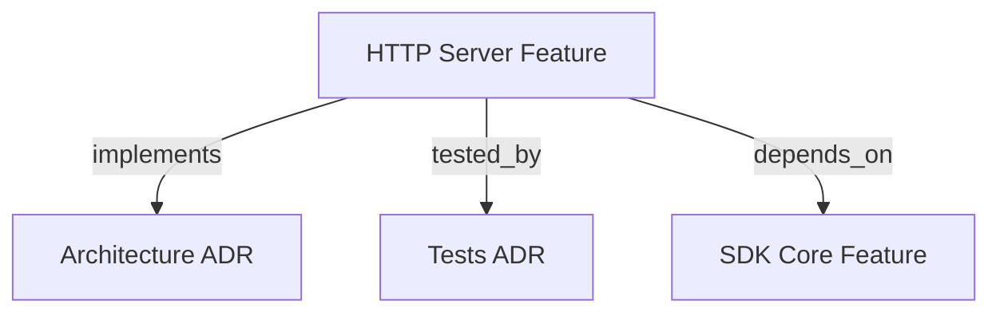

# HTTP SERVER & DOCKER ADAPTER

```graph
{
  "node_id": "feature:http_server",
  "domain": "server",
  "implements": ["adr:architecture"],
  "tested_by": ["adr:tests"],
  "depends_on": ["feature:sdk_core"],
  "code_files": [
    "src/server/HttpServer.ts",
    "src/server/index.ts",
    "src/server/domain/types.ts",
    "src/server/application/ports/inbound/IRunOrchestratorJobUseCase.ts",
    "src/server/application/ports/inbound/IGetJobStatusUseCase.ts",
    "src/server/application/ports/inbound/IResumeOrchestratorJobUseCase.ts",
    "src/server/application/ports/inbound/ICleanJobsAndWorktreesUseCase.ts",
    "src/server/application/ports/inbound/IGetHealthStatusUseCase.ts",
    "src/server/application/ports/inbound/IGetSettingsUseCase.ts",
    "src/server/application/ports/inbound/IUpdateSettingsUseCase.ts",
    "src/server/application/use-cases/RunOrchestratorJobUseCase.ts",
    "src/server/application/use-cases/GetJobStatusUseCase.ts",
    "src/server/application/use-cases/ResumeOrchestratorJobUseCase.ts",
    "src/server/application/use-cases/CleanJobsAndWorktreesUseCase.ts",
    "src/server/application/use-cases/GetHealthStatusUseCase.ts",
    "src/server/application/use-cases/GetOpenApiDocsUseCase.ts",
    "src/server/application/use-cases/GetSettingsUseCase.ts",
    "src/server/application/use-cases/UpdateSettingsUseCase.ts",
    "src/server/adapters/inbound/http/RouteHandlers.ts",
    "src/server/adapters/inbound/http/DtoMappers.ts",
    "src/server/adapters/inbound/http/OpenApiSpecGenerator.ts",
    "Dockerfile",
    "docker-compose.yml"
  ],
  "test_files": [
    "src/server/__tests__/types.test.ts",
    "src/server/__tests__/HttpServer.test.ts",
    "src/server/__tests__/DockerBuild.test.ts",
    "src/server/application/use-cases/__tests__/GetJobStatusUseCase.test.ts",
    "src/server/application/use-cases/__tests__/GetHealthStatusUseCase.test.ts",
    "src/server/application/use-cases/__tests__/ResumeOrchestratorJobUseCase.test.ts",
    "src/server/application/use-cases/__tests__/CleanJobsAndWorktreesUseCase.test.ts",
    "src/server/application/use-cases/__tests__/RunOrchestratorJobUseCase.test.ts",
    "src/server/application/use-cases/__tests__/SettingsUseCases.test.ts",
    "src/server/adapters/inbound/http/mappers/__tests__/DtoMappers.test.ts",
    "src/server/adapters/inbound/http/docs/__tests__/OpenApiSpecGenerator.test.ts",
    "src/server/adapters/inbound/http/routes/__tests__/RouteHandlers.test.ts",
    "src/server/adapters/outbound/mutex/__tests__/WorkspaceLockManager.test.ts",
    "src/server/adapters/outbound/repository/__tests__/InMemoryJobStore.test.ts",
    "src/server/adapters/outbound/queue/__tests__/JobQueue.test.ts",
    "src/server/adapters/outbound/services/__tests__/JobRunnerService.test.ts",
    "tests/e2e/scenarios/07-http-server-daemon.test.ts"
  ]
}
```

Provides a non-interactive HTTP daemon service and Docker container environment for the SDK orchestrator.

## OVERVIEW
The `http_server` module acts as an Inbound Adapter in Hexagonal Architecture. It exposes REST API endpoints for triggering autonomous TDD orchestration jobs, polling execution status, probing container health, rendering OpenAPI Swagger documentation, and managing project-local model settings (`settings.json`) without interactive TTY dependencies.

## MANDATORY RULE: PROJECT IDENTIFIER MAPPING
> [!IMPORTANT]
> **Clients MUST NEVER send internal server filesystem paths (e.g. `/workspaces/backend` or `C:\Users\...\app`).**  
> Clients MUST ONLY send registered **project identifiers** (e.g. `"project": "backend"` or `?project=backend`).

### How Project Identifiers Are Resolved:
The HTTP daemon resolves project names to physical filesystem paths using environment variables configured on the server:

1. **JSON Mapping (`PROJECT_MAPPINGS`)**:
   ```bash
   PROJECT_MAPPINGS={"backend":{"path":"/workspaces/backend","gitUrl":"https://github.com/my-org/backend.git"}}
   ```
2. **Prefixed Environment Variables (`PROJECT_<NAME>_PATH`)**:
   ```bash
   PROJECT_BACKEND_PATH=/workspaces/backend
   PROJECT_BACKEND_GIT_URL=https://github.com/my-org/backend.git
   ```

If a client sends an unregistered project identifier, the server throws `HTTP 400 Bad Request` with error code `PROJECT_NOT_FOUND`.

---

## FOLDER STRUCTURE (HEXAGONAL ARCHITECTURE)
```
src/server/
├── domain/                      # Domain Layer (Entities, Value Objects, Domain Errors)
│   └── types.ts                 # JobStatus, HealthStatusVo, HttpServerError, OrchestrationJob
├── application/                 # Application Layer (Ports & Orchestration)
│   ├── ports/
│   │   ├── inbound/             # Primary / Driving Ports (Use Case Interfaces)
│   │   │   ├── IRunOrchestratorJobUseCase.ts
│   │   │   ├── IGetJobStatusUseCase.ts
│   │   │   ├── IResumeOrchestratorJobUseCase.ts
│   │   │   ├── ICleanJobsAndWorktreesUseCase.ts
│   │   │   ├── IGetHealthStatusUseCase.ts
│   │   │   ├── IGetSettingsUseCase.ts
│   │   │   └── IUpdateSettingsUseCase.ts
│   │   └── outbound/            # Secondary / Driven Ports (Infrastructure Interfaces)
│   │       ├── JobStoreRepository.ts
│   │       ├── LockRepository.ts
│   │       └── IAuthStrategy.ts
│   └── use-cases/               # Use Case Implementations
│       ├── RunOrchestratorJobUseCase.ts
│       ├── GetJobStatusUseCase.ts
│       ├── ResumeOrchestratorJobUseCase.ts
│       ├── CleanJobsAndWorktreesUseCase.ts
│       ├── GetHealthStatusUseCase.ts
│       ├── GetOpenApiDocsUseCase.ts
│       ├── GetSettingsUseCase.ts        # Consults project-local .harness-kit/settings.json
│       └── UpdateSettingsUseCase.ts     # Creates/updates project-local .harness-kit/settings.json
├── adapters/                    # Infrastructure & Technical Adapters Layer
│   ├── inbound/                 # Primary / Driving Adapters
│   │   └── http/
│   │       ├── RouteHandlers.ts # HTTP Dispatcher / Controller Adapter
│   │       ├── DtoMappers.ts    # Anti-Corruption Layer (ACL)
│   │       ├── OpenApiSpecGenerator.ts # Swagger/OpenAPI Specs Adapter
│   │       └── dto/             # Request & Response Data Transfer Objects
│   └── outbound/                # Secondary / Driven Adapters
│       ├── persistence/         # InMemoryJobStore persistence adapter
│       ├── mutex/               # WorkspaceLockManager mutex adapter
│       ├── queue/               # JobQueue FIFO worker adapter
│       ├── auth/                # BasicAuthStrategy, BearerAuthStrategy, NoAuthStrategy
│       └── runner/              # JobRunnerService execution worker adapter
├── HttpServer.ts                # Application Bootstrap & Lifecycle Manager
└── index.ts                     # Public SDK Exports & Entry Point
```

## API ENDPOINTS

### 1. `POST /orchestrator/run`
Enqueues a background orchestration job. Returns `HTTP 202 Accepted` immediately.

- **Request Body** (`RunRequestDtoExtended`):
  ```json
  {
    "scope": "implement-feature-x",
    "project": "backend",
    "branch": "feature/login-auth",
    "mode": "fast",
    "useWorktree": true
  }
  ```
- **Response Payload** (`HTTP 202 Accepted`):
  ```json
  {
    "jobId": "6c4e0d4a-5b12-4e9f-8671-123456789abc",
    "status": "queued",
    "workspacePath": "/workspaces/backend",
    "enqueuedAt": "2026-08-06T17:50:00.000Z",
    "statusUrl": "/orchestrator/status/6c4e0d4a-5b12-4e9f-8671-123456789abc"
  }
  ```

### 2. `GET /orchestrator/status/:id`
Retrieves execution state and progress of an orchestration job.

- **Response Payload** (`HTTP 200 OK`):
  ```json
  {
    "jobId": "6c4e0d4a-5b12-4e9f-8671-123456789abc",
    "status": "running",
    "workspacePath": "/workspaces/backend",
    "createdAt": "2026-08-06T17:50:00.000Z",
    "startedAt": "2026-08-06T17:50:01.000Z",
    "progress": { "phase": "DEVELOPMENT", "step": 2 }
  }
  ```

### 3. `GET /orchestrator/settings?project=backend`
Consults project-local model configuration from `.harness-kit/settings.json`. If the file does not exist in the target project, creates it with default settings.

- **Query Parameters**:
  - `project`: Registered project identifier (e.g. `"backend"`).
- **Response Payload** (`HTTP 200 OK`):
  ```json
  {
    "projectPath": "/workspaces/backend",
    "settings": {
      "claude-cli": {
        "timeoutMs": 60000,
        "phases": { "DEVELOPMENT": { "timeoutMs": 120000 } }
      }
    }
  }
  ```

### 4. `POST /orchestrator/settings`
Creates or updates model configuration in the project's local `.harness-kit/settings.json` file.

- **Request Body**:
  ```json
  {
    "project": "backend",
    "settings": {
      "claude-cli": {
        "timeoutMs": 90000,
        "phases": { "PLANNING": { "timeoutMs": 30000 } }
      }
    }
  }
  ```
- **Response Payload** (`HTTP 200 OK`):
  ```json
  {
    "projectPath": "/workspaces/backend",
    "settings": {
      "claude-cli": {
        "timeoutMs": 90000,
        "phases": { "PLANNING": { "timeoutMs": 30000 } }
      }
    }
  }
  ```

### 5. `GET /health`
Liveness and readiness probe for container orchestrators (Kubernetes, Docker Swarm, ECS).

- **Response Payload** (`HTTP 200 OK`):
  ```json
  {
    "status": "healthy",
    "uptimeSeconds": 3600,
    "timestamp": "2026-08-06T18:00:00.000Z",
    "activeJobs": 1,
    "queuedJobs": 0,
    "memoryUsage": { "rssMb": 85.5, "heapUsedMb": 42.1 }
  }
  ```

### 6. `GET /docs` & `GET /docs/openapi.json`
Interactive Swagger UI documentation page (`GET /docs`) and raw OpenAPI 3.0.3 specification JSON (`GET /docs/openapi.json`).

---

## DOCKER SUPPORT

### Multi-Stage `Dockerfile`
```dockerfile
FROM node:22-alpine AS builder
WORKDIR /app
COPY package*.json ./
RUN npm ci
COPY . .
RUN npm run build

FROM node:22-alpine AS runner
WORKDIR /app
COPY package*.json ./
COPY --from=builder /app/dist ./dist
RUN npm ci --only=production

EXPOSE 3000
HEALTHCHECK --interval=30s --timeout=5s CMD wget --quiet --tries=1 --spider http://localhost:3000/health || exit 1
CMD ["node", "dist/server/index.js"]
```

### Docker Compose Configuration
```yaml
services:
  hrns-server:
    build: .
    ports:
      - "3000:3000"
    volumes:
      - .:/workspace
    environment:
      - PORT=3000
      - HOST=0.0.0.0
      - PROJECT_MAPPINGS={"backend":{"path":"/workspace/backend"}}
```

---

## CODE EXAMPLES

```typescript
# CORRECT: Programmatic invocation of HTTP Server
import { startHttpServer } from '@romabeckman/hrns'

const server = await startHttpServer({ port: 3000, host: '0.0.0.0' })
console.log(`Server running on port ${server.getPort()}`)

// Graceful shutdown on process exit
await server.stop()

# CORRECT: Client passes project identifier "backend"
// Server resolves "backend" -> "/workspaces/backend" via PROJECT_MAPPINGS
const payload = { scope: "build-feature", project: "backend" }

# WRONG: Client passing raw internal server file path
// Violates project identifier rule
const invalidPayload = { scope: "build", projectPaths: ["/internal/server/path"] }
```

---

## BEST PRACTICES
REQUIRED: Clients MUST pass registered project identifiers (e.g. `"project": "backend"`), never direct server file paths.  
REQUIRED: Use `DtoMappers` ACL to validate incoming payloads before queueing jobs.  
REQUIRED: Settings MUST be persisted locally in the target project's `.harness-kit/settings.json` file.  
REQUIRED: Ensure background jobs use isolated Git worktrees (`useWorktree: true` by default) to allow parallel executions on the same repository.  
REQUIRED: Automatic Git commit (`git add -A` + `git commit`) and push (`git push origin <branch>`) occur on job completion before worktree cleanup.  
PROHIBITED: Passing interactive stdin prompts (`refine: true` or `mode: "deep_thinking"`) in HTTP requests.

---

## DOCUMENT MAP



## REFERENCES
- [**ARCHITECTURE.md**](../adr/ARCHITECTURE.md): Ports and Adapters architecture pattern.
- [**TESTS.md**](../adr/TESTS.md): Vitest test suite guidelines and coverage targets.
- [**SDK_CORE.md**](./SDK_CORE.md): Core HarnessOrchestrator domain state machine.
