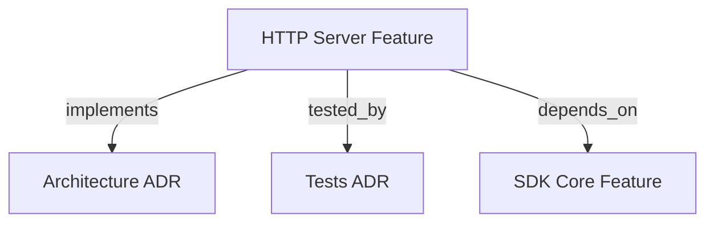

# HTTP SERVER & DOCKER ADAPTER

```graph
{
  "node_id": "feature:http_server",
  "domain": "server",
  "implements": ["adr:architecture"],
  "tested_by": ["adr:tests"],
  "depends_on": ["feature:sdk_core"],
  "code_files": [
    "src/server/HttpServer.ts",
    "src/server/index.ts",
    "src/server/types.ts",
    "src/server/dto/RunRequestDto.ts",
    "src/server/dto/RunResponseDto.ts",
    "src/server/dto/JobStatusDto.ts",
    "src/server/mappers/DtoMappers.ts",
    "src/server/mutex/WorkspaceLockManager.ts",
    "src/server/repository/InMemoryJobStore.ts",
    "src/server/queue/JobQueue.ts",
    "src/server/services/JobRunnerService.ts",
    "src/server/routes/RouteHandlers.ts",
    "src/server/docs/OpenApiSpecGenerator.ts",
    "Dockerfile",
    "docker-compose.yml"
  ],
  "test_files": [
    "src/server/__tests__/types.test.ts",
    "src/server/__tests__/HttpServer.test.ts",
    "src/server/__tests__/DockerBuild.test.ts",
    "src/server/mappers/__tests__/DtoMappers.test.ts",
    "src/server/mutex/__tests__/WorkspaceLockManager.test.ts",
    "src/server/repository/__tests__/InMemoryJobStore.test.ts",
    "src/server/queue/__tests__/JobQueue.test.ts",
    "src/server/services/__tests__/JobRunnerService.test.ts",
    "src/server/routes/__tests__/RouteHandlers.test.ts",
    "src/server/docs/__tests__/OpenApiSpecGenerator.test.ts"
  ]
}
```

Provides a non-interactive HTTP daemon service and Docker container environment for the SDK orchestrator.

## OVERVIEW
The `http_server` module acts as an Inbound Adapter in Hexagonal Architecture. It exposes REST API endpoints for triggering autonomous TDD orchestration jobs, polling execution status, probing container health, and rendering OpenAPI Swagger documentation without interactive TTY dependencies.

## FOLDER STRUCTURE
```
src/server/
├── types.ts                    # Core interfaces & HttpServerError
├── dto/
│   ├── RunRequestDto.ts        # Request payload contracts
│   ├── RunResponseDto.ts       # HTTP 202 response contract
│   └── JobStatusDto.ts         # Status polling read model
├── mappers/
│   └── DtoMappers.ts           # Anti-Corruption Layer (ACL)
├── mutex/
│   ├── LockRepository.ts       # Workspace lock port interface
│   └── WorkspaceLockManager.ts # In-memory per-workspace lock manager
├── repository/
│   ├── JobStoreRepository.ts   # Job state repository port
│   └── InMemoryJobStore.ts     # Thread-safe in-memory job store
├── queue/
│   └── JobQueue.ts             # FIFO job queue & worker notifier
├── services/
│   └── JobRunnerService.ts     # Background worker loop service
├── routes/
│   └── RouteHandlers.ts        # Native Node http.Server route dispatcher
├── docs/
│   └── OpenApiSpecGenerator.ts # OpenAPI 3.0.3 generator & Swagger UI
├── HttpServer.ts               # Server lifecycle manager
└── index.ts                    # Public exports & CLI entry point
```

## API ENDPOINTS

### 1. `POST /orchestrator/run`
Enqueues a background orchestration job. Returns `HTTP 202 Accepted` immediately.

- **Request Body** (`RunRequestDtoExtended`):
  ```json
  {
    "scope": "implement-feature-x",
    "project": "backend",
    "branch": "feature/login-auth",
    "mode": "fast",
    "useWorktree": true
  }
  ```
- **Response Payload** (`HTTP 202 Accepted`):
  ```json
  {
    "jobId": "6c4e0d4a-5b12-4e9f-8671-123456789abc",
    "status": "queued",
    "workspacePath": "/workspace/my-service",
    "enqueuedAt": "2026-08-06T17:50:00.000Z",
    "statusUrl": "/orchestrator/status/6c4e0d4a-5b12-4e9f-8671-123456789abc"
  }
  ```

### 2. `GET /orchestrator/status/:id`
Retrieves execution state and progress of an orchestration job.

- **Response Payload** (`HTTP 200 OK`):
  ```json
  {
    "jobId": "6c4e0d4a-5b12-4e9f-8671-123456789abc",
    "status": "running",
    "workspacePath": "/workspace/my-service",
    "createdAt": "2026-08-06T17:50:00.000Z",
    "startedAt": "2026-08-06T17:50:01.000Z",
    "progress": { "phase": "DEVELOPMENT", "step": 2 }
  }
  ```

### 3. `GET /health`
Liveness and readiness probe for container orchestrators (Kubernetes, Docker Swarm, ECS).

- **Response Payload** (`HTTP 200 OK`):
  ```json
  {
    "status": "healthy",
    "uptimeSeconds": 3600,
    "timestamp": "2026-08-06T18:00:00.000Z",
    "activeJobs": 1,
    "queuedJobs": 0,
    "memoryUsage": { "rssMb": 85.5, "heapUsedMb": 42.1 }
  }
  ```

### 4. `GET /docs` & `GET /docs/openapi.json`
Interactive Swagger UI documentation page (`GET /docs`) and raw OpenAPI 3.0.3 specification JSON (`GET /docs/openapi.json`).

## DOCKER SUPPORT

### Multi-Stage `Dockerfile`
```dockerfile
FROM node:22-alpine AS builder
WORKDIR /app
COPY package*.json ./
RUN npm ci
COPY . .
RUN npm run build

FROM node:22-alpine AS runner
WORKDIR /app
COPY package*.json ./
COPY --from=builder /app/dist ./dist
RUN npm ci --only=production

EXPOSE 3000
HEALTHCHECK --interval=30s --timeout=5s CMD wget --quiet --tries=1 --spider http://localhost:3000/health || exit 1
CMD ["node", "dist/server/index.js"]
```

### Docker Compose Configuration
```yaml
services:
  hrns-server:
    build: .
    ports:
      - "3000:3000"
    volumes:
      - .:/workspace
    environment:
      - PORT=3000
      - HOST=0.0.0.0
```

## CODE EXAMPLES

```typescript
# CORRECT: Programmatic invocation of HTTP Server
import { startHttpServer } from '@romabeckman/hrns'

const server = await startHttpServer({ port: 3000, host: '0.0.0.0' })
console.log(`Server running on port ${server.getPort()}`)

// Graceful shutdown on process exit
await server.stop()

# WRONG: Passing refine: true in HTTP payload
// DtoMappers throws HTTP 400 Bad Request
const payload = { scope: "build", refine: true }
```

## BEST PRACTICES
REQUIRED: Use `DtoMappers` ACL to validate incoming payloads before queueing jobs.  
REQUIRED: Ensure background jobs use isolated Git worktrees (`useWorktree: true` by default) to allow parallel executions on the same repository.  
REQUIRED: Automatic Git commit (`git add -A` + `git commit`) and push (`git push origin <branch>`) occur on job completion before worktree cleanup.  
PROHIBITED: Passing interactive stdin prompts (`refine: true` or `mode: "deep_thinking"`) in HTTP requests.

## DOCUMENT MAP



## REFERENCES
- [**ARCHITECTURE.md**](../adr/ARCHITECTURE.md): Ports and Adapters architecture pattern.
- [**TESTS.md**](../adr/TESTS.md): Vitest test suite guidelines and coverage targets.
- [**SDK_CORE.md**](./SDK_CORE.md): Core HarnessOrchestrator domain state machine.

---

## CHANGE SUMMARY
- **Added:** YAML frontmatter, top embedded micro ````graph` block, and `## DOCUMENT MAP` Mermaid graph.
- **Updated:** UPPERCASE section headers, standard folder structure tree, and code examples with `# CORRECT` / `# WRONG` labels.
