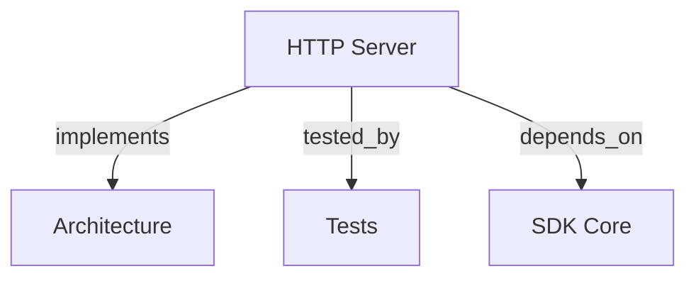

```graph
{"node_id":"feature:http_server","domain":"server","implements":["adr:architecture"],"tested_by":["adr:tests"],"depends_on":["feature:sdk_core"],"entrypoints":["src/server/index.ts","src/server/HttpServer.ts"],"registration_files":["src/server/adapters/index.ts","src/server/application/use-cases/index.ts","src/server/adapters/outbound/auth/AuthStrategyFactory.ts"],"reference_files":["src/server/adapters/inbound/http/routes/RouteHandlers.ts"],"code_files":["src/server/types.ts","src/server/domain/types.ts","src/server/application/ports/inbound/IRunOrchestratorJobUseCase.ts","src/server/application/ports/inbound/IGetJobStatusUseCase.ts","src/server/application/ports/inbound/IResumeOrchestratorJobUseCase.ts","src/server/application/ports/inbound/ICleanJobsAndWorktreesUseCase.ts","src/server/application/ports/inbound/IGetHealthStatusUseCase.ts","src/server/application/ports/inbound/IGetSettingsUseCase.ts","src/server/application/ports/inbound/IUpdateSettingsUseCase.ts","src/server/application/use-cases/RunOrchestratorJobUseCase.ts","src/server/application/use-cases/GetJobStatusUseCase.ts","src/server/application/use-cases/ResumeOrchestratorJobUseCase.ts","src/server/application/use-cases/CleanJobsAndWorktreesUseCase.ts","src/server/application/use-cases/GetHealthStatusUseCase.ts","src/server/application/use-cases/GetOpenApiDocsUseCase.ts","src/server/application/use-cases/GetSettingsUseCase.ts","src/server/application/use-cases/UpdateSettingsUseCase.ts","src/server/application/use-cases/SyncWorkspaceRepositoryUseCase.ts","src/server/adapters/outbound/auth/NoAuthStrategy.ts","src/server/adapters/outbound/auth/BasicAuthStrategy.ts","src/server/adapters/outbound/auth/BearerAuthStrategy.ts","src/server/adapters/outbound/auth/JwtAuthStrategy.ts","src/server/adapters/outbound/auth/HmacAuthStrategy.ts","src/server/application/ports/inbound/IGetReportsSummaryUseCase.ts","src/server/application/ports/inbound/IGetTokensTelemetryUseCase.ts","src/server/application/ports/inbound/index.ts","src/server/application/ports/outbound/index.ts","src/server/application/use-cases/GetReportsSummaryUseCase.ts","src/server/application/use-cases/GetTokensTelemetryUseCase.ts","src/server/adapters/inbound/http/docs/OpenApiSpecGenerator.ts","src/server/adapters/inbound/http/mappers/DtoMappers.ts","src/server/adapters/inbound/http/dto/JobStatusDto.ts","src/server/adapters/inbound/http/dto/ReportsSummaryDto.ts","src/server/adapters/inbound/http/dto/RunRequestDto.ts","src/server/adapters/inbound/http/dto/RunResponseDto.ts","src/server/adapters/inbound/http/dto/TokensTelemetryDto.ts","src/server/adapters/outbound/auth/index.ts","src/server/adapters/outbound/auth/types.ts","src/server/adapters/outbound/mutex/LockRepository.ts","src/server/adapters/outbound/mutex/WorkspaceLockManager.ts","src/server/adapters/outbound/queue/JobQueue.ts","src/server/adapters/outbound/repository/InMemoryJobStore.ts","src/server/adapters/outbound/repository/JobStoreRepository.ts","src/server/adapters/outbound/services/JobRunnerService.ts","src/server/adapters/outbound/services/AsyncWorkerPool.ts","docker/entrypoint.sh","Dockerfile","docker-compose.yml"],"test_files":["src/server/__tests__/types.test.ts","src/server/__tests__/HttpServer.test.ts","src/server/__tests__/DockerBuild.test.ts","src/server/adapters/outbound/services/__tests__/AsyncWorkerPool.test.ts","src/server/adapters/outbound/auth/__tests__/AuthStrategies.test.ts","src/server/application/use-cases/__tests__/GetJobStatusUseCase.test.ts","src/server/application/use-cases/__tests__/GetHealthStatusUseCase.test.ts","src/server/application/use-cases/__tests__/ResumeOrchestratorJobUseCase.test.ts","src/server/application/use-cases/__tests__/CleanJobsAndWorktreesUseCase.test.ts","src/server/application/use-cases/__tests__/RunOrchestratorJobUseCase.test.ts","src/server/application/use-cases/__tests__/GetReportsSummaryUseCase.test.ts","src/server/application/use-cases/__tests__/GetTokensTelemetryUseCase.test.ts","src/server/application/use-cases/__tests__/SettingsUseCases.test.ts","src/server/application/use-cases/__tests__/SyncWorkspaceRepositoryUseCase.test.ts","src/server/adapters/inbound/http/mappers/__tests__/DtoMappers.test.ts","src/server/adapters/inbound/http/docs/__tests__/OpenApiSpecGenerator.test.ts","src/server/adapters/inbound/http/routes/__tests__/RouteHandlers.test.ts","src/server/adapters/outbound/mutex/__tests__/WorkspaceLockManager.test.ts","src/server/adapters/outbound/repository/__tests__/InMemoryJobStore.test.ts","src/server/adapters/outbound/queue/__tests__/JobQueue.test.ts","src/server/adapters/outbound/services/__tests__/JobRunnerService.test.ts","tests/e2e/scenarios/07-http-server-daemon.test.ts"]}
```

# HTTP SERVER AND DOCKER ADAPTER
Expose orchestrator jobs through a non-interactive HTTP daemon.

## OVERVIEW
Use `HttpServer` as an inbound adapter over application use cases. Resolve project IDs to server-owned workspaces and queue jobs asynchronously.

## FOLDER STRUCTURE
<folder_structure>

```text
src/server/
├── domain/                  # Value types and errors
├── application/             # Ports and use cases
├── adapters/inbound/http/   # Routes, DTOs, mappers, and OpenAPI
├── adapters/outbound/       # Auth, locks, queue, jobs, and workers
└── HttpServer.ts            # Lifecycle and composition
```

</folder_structure>

## API ENDPOINTS

| Method | Path | Purpose |
|---|---|---|
| POST | `/orchestrator/run` | Enqueue job. |
| POST | `/orchestrator/jobs/{id}/resume` | Resume job. |
| GET | `/orchestrator/status/{id}` | Read job. |
| DELETE | `/orchestrator/jobs/clean` | Purge jobs and worktrees. |
| POST | `/orchestrator/sync`, `/orchestrator/webhook/sync` | Fetch base branch. |
| GET, POST | `/orchestrator/settings` | Manage settings. |
| GET | `/orchestrator/tokens`, `/orchestrator/telemetry/tokens` | Query telemetry. |
| GET | `/orchestrator/reports/summary` | Aggregate costs. |
| GET | `/health`, `/docs`, `/docs/openapi.json` | Read health or API docs. |

## REQUEST CONTRACT

REQUIRED: Send registered `project` and runner values.
REQUIRED: Use `OpenApiSpecGenerator.ts` as endpoint contract source.
PROHIBITED: Send filesystem paths, `branch`, `baseBranch`, or `useWorktree`.
PROHIBITED: Request interactive refinement through HTTP.

## CONFIGURATION

| Name | Purpose | Default |
|---|---|---|
| `port`, `host` | Listener binding | `3000`, `0.0.0.0` |
| `allowedWorkspaces` | Workspace allowlist | `[]` |
| `auth` | No-auth, Basic, Bearer, JWT, or HMAC | No auth |
| `maxConcurrency` | Concurrent jobs | `4` |
| `PROJECT_MAPPINGS` | Project, workspace, and Git mapping | Environment-defined |

## BEST PRACTICES

REQUIRED: Validate input with `DtoMappers`.
REQUIRED: Persist `.harness-kit/settings.json` per project.
REQUIRED: Derive worktrees from job IDs and configured base branches.
REQUIRED: Sync `OpenApiSpecGenerator.ts` after endpoint changes.
PROHIBITED: Block request handling during agent execution.

## DOCUMENT MAP



## REFERENCES

- [**ARCHITECTURE.md**](../adr/ARCHITECTURE.md): Defines adapter boundaries and integration rules.
- [**TESTS.md**](../adr/TESTS.md): Defines server and E2E validation commands.
- [**SDK_CORE.md**](./SDK_CORE.md): Provides orchestrator execution used by background jobs.
