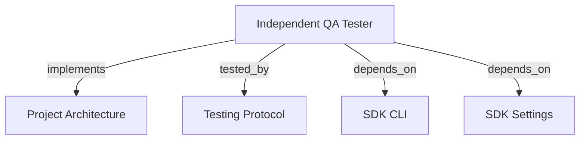

# INDEPENDENT QA TESTER

Run agentic acceptance outside development orchestration, with LLM-planned scenarios, real runtime evidence, and one final report.

```graph
{
  "node_id": "feature:qa_tester",
  "domain": "qa",
  "implements": ["adr:architecture"],
  "tested_by": ["adr:tests"],
  "entrypoints": ["src/qa/QaAgenticOrchestrator.ts", "src/cli/services/qa-service.ts"],
  "registration_files": ["src/cli/run.ts", "src/cli/utils/constants.ts", "src/index.ts", "src/qa/index.ts"],
  "reference_files": ["src/qa/CurlDriver.ts"],
  "code_files": ["src/qa/QaService.ts", "src/qa/types.ts", "src/qa/QaRunStore.ts", "src/qa/QaVerdictPolicy.ts", "src/qa/PlaywrightDriver.ts", "src/qa/phases/types.ts", "src/qa/phases/QaPlanningPhase.ts", "src/qa/phases/QaExecutionPhase.ts", "src/qa/phases/QaReportingPhase.ts", "src/qa/phases/index.ts"],
  "test_files": ["src/qa/__tests__/QaAgenticOrchestrator.test.ts", "src/qa/__tests__/QaService.test.ts", "src/qa/__tests__/QaRunStore.test.ts", "src/cli/services/__tests__/qa-service.test.ts"]
}
```

## OVERVIEW

Use `QaAgenticOrchestrator` independently of backlog, development session, and review score. Accept an open scope or optional detailed scenarios. Persist plans under `.harness-kit/qa/plans/`; persist run state, evidence, and `report.json` under `.harness-kit/qa/runs/` through atomic replacement.

## FOLDER STRUCTURE

<folder_structure>
```text
src/qa/                     # agentic orchestration, plans, reports, and drivers
|-- phases/                 # planning, execution, and reporting handlers
`-- QaAgenticOrchestrator.ts
src/cli/services/            # `hrns qa` command adapter
```
</folder_structure>

## EXECUTION

1. **Supply scope or scenarios** with `hrns qa`.
2. **Plan agentically**: inspect the project, preserve supplied scenario intent, and add missing coverage.
3. **Execute deterministically**: use real `curl` or Playwright actions selected by the plan.
4. **Report agentically**: synthesize bugs and errors while deriving verdict and criterion status from runtime results.
5. **Return only final report** to the CLI user; persist plan, evidence, run state, and report for audit.

```text
# CORRECT: provide open scope; let LLM generate executable scenarios
hrns qa --scope "Test order creation endpoint" --target http://127.0.0.1:3000

# CORRECT: provide optional baseline scenarios; let LLM add gaps
hrns qa --scope "Validate checkout" --scenario "Valid payment succeeds" --profile web

# WRONG: use development validation as runtime acceptance
hrns run --skip-validation
```

## VERDICTS

| Verdict | Condition |
| --- | --- |
| PASS | Every required scenario passed with evidence. |
| FAIL | A required assertion demonstrably failed. |
| BLOCKED | A required scenario cannot execute. |
| INCONCLUSIVE | Required coverage, evidence, or results are insufficient. |

## DRIVERS

`QaPlanningPhase` invokes the configured agent runner and validates its plan before execution. `CurlDriver` invokes real `curl`/`curl.exe`; `PlaywrightDriver` launches Chromium and performs declared human actions. `QaReportingPhase` invokes the LLM again, then reconciles its narrative with deterministic scenario results so failed or blocked checks cannot become `PASS`.

Run this once after dependency changes:

```text
rtk npm install
rtk npx playwright install chromium
```

## LIMITS

REQUIRED: Supply `--scope` or at least one `--scenario`. ALLOWED: Omit scenarios; the planning LLM derives them from scope and project inspection. ALLOWED: Supply scenarios; the LLM preserves their intent and adds coverage gaps. PROHIBITED: Treat LLM prose as verdict truth; runtime results own verdict and criterion status. Runtime acceptance does not yet gate development `REVIEW`/`TRANSITION`, start target applications, retain traces/video, or support native games.

## DOCUMENT MAP



## REFERENCES

- [**ARCHITECTURE.md**](../adr/ARCHITECTURE.md): Ports and adapter boundaries.
- [**TESTS.md**](../adr/TESTS.md): Test commands and isolation rules.
- [**SDK_CLI.md**](./SDK_CLI.md): CLI registration and command conventions.
- [**SDK_SETTINGS.md**](./SDK_SETTINGS.md): Default model and effort for QA planning and reporting phases.
