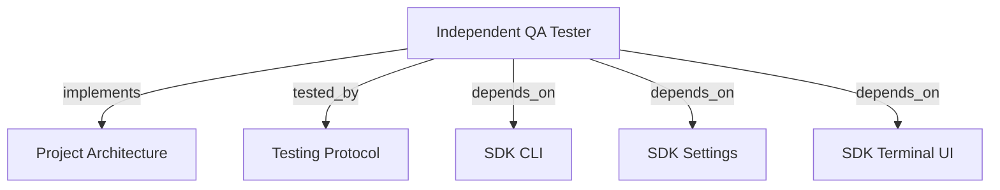

# INDEPENDENT QA TESTER

Run evidence-based acceptance with LLM-planned scenarios and bounded final reports.

```graph
{
  "node_id": "feature:qa_tester",
  "domain": "qa",
  "implements": ["adr:architecture"],
  "tested_by": ["adr:tests"],
  "entrypoints": ["src/qa/QaAgenticOrchestrator.ts", "src/cli/services/qa-service.ts"],
  "registration_files": ["src/cli/run.ts", "src/cli/utils/constants.ts", "src/index.ts", "src/qa/index.ts"],
  "reference_files": ["src/qa/engine/CurlDriver.ts"],
  "code_files": ["src/qa/services/QaService.ts", "src/qa/services/QaPlanValidator.ts", "src/qa/services/QaRuntimeManager.ts", "src/qa/services/QaTargetProbe.ts", "src/qa/types.ts", "src/qa/progress.ts", "src/qa/services/QaRunStore.ts", "src/qa/services/QaVerdictPolicy.ts", "src/qa/engine/PlaywrightDriver.ts", "src/qa/engine/MobileWebDriver.ts", "src/qa/engine/AccessibilityDriver.ts", "src/qa/engine/McpClientDriver.ts", "src/qa/engine/CliDriver.ts", "src/qa/engine/WebSocketDriver.ts", "src/qa/engine/index.ts", "src/qa/services/index.ts", "src/qa/ui/QaTerminalView.ts", "src/qa/phases/types.ts", "src/qa/phases/QaPlanningPhase.ts", "src/qa/phases/QaValidationPhase.ts", "src/qa/phases/QaExecutionPhase.ts", "src/qa/phases/QaAnalysisPhase.ts", "src/qa/phases/QaReportingPhase.ts", "src/qa/phases/index.ts"],
  "test_files": ["src/qa/__tests__/QaArchitecture.test.ts", "src/qa/__tests__/QaExtendedEngines.test.ts", "src/qa/__tests__/QaAgenticOrchestrator.test.ts", "src/qa/__tests__/QaService.test.ts", "src/qa/__tests__/QaRunStore.test.ts", "src/qa/services/__tests__/QaPlanValidator.test.ts", "src/qa/services/__tests__/QaTargetProbe.test.ts", "src/qa/ui/__tests__/QaTerminalView.test.ts", "src/cli/services/__tests__/qa-service.test.ts"]
}
```

## OVERVIEW

Use `QaAgenticOrchestrator` outside development orchestration. Persist numbered plans, runs, evidence, scope, and reports under `.harness-kit/qa/`.

## FOLDER STRUCTURE

<folder_structure>
```text
src/qa/                     # independent QA module
|-- services/               # planning, persistence, runtime, probe, and verdict
|-- engine/                 # curl, Playwright, and extended execution adapters
|-- phases/                 # planning, validation, execution, analysis, reporting
|-- ui/                     # QA-specific terminal presenter
`-- QaAgenticOrchestrator.ts # phase-chain entrypoint
src/cli/services/            # `hrns qa` command adapter
```
</folder_structure>

## EXECUTION

1. **Run QA** with `hrns qa run`; omit the action to use the same flow.
2. **Supply scope** with `--scope`, or choose short input/editor form. Add baselines with `--scenario`.
3. **Prepare runtime**, plan with strict JSON, validate every invariant, and probe the target once.
4. **Execute deterministically** with bounded drivers, target isolation, redaction, and cancellation.
5. **Analyze gaps** and add only evidence-justified scenarios through validated plan revisions.
6. **Report automatically** after execution; persist `report.json` and bounded `REPORT.md`.
7. **Regenerate optionally** with `hrns qa report --run <id>`. Omit `--run` to select a completed run, newest first.
8. **Preserve scope** byte-for-byte and number scenario IDs as `001-<scenario>`, `002-<scenario>`, and so on.

```text
# CORRECT: run full QA flow
hrns qa run --scope "Test order creation endpoint" --target http://127.0.0.1:3000

# WRONG: use a removed QA action
hrns qa execute --plan orders@1
```

## VERDICTS

| Verdict | Condition |
| --- | --- |
| PASS | Every required scenario passed with verified assertions and evidence. |
| FAIL | A required assertion demonstrably failed. |
| BLOCKED | A required scenario cannot execute or target is unavailable. |
| INCONCLUSIVE | Required coverage, evidence, or observations are missing or unverified. |

## TERMINAL PROGRESS

| Event | Terminal output |
| --- | --- |
| `runtime_ready` | Target and managed-server state. |
| `phase_started` | Current phase. |
| `validation_failed` | All plan errors before execution. |
| `scenario_started` | Scenario position and action. |
| `scenario_completed` | Runtime status. |
| `phase_completed` | Count, verdict, cycles, or report state. |

REQUIRED: Emit progress through `QaProgressListener`. REQUIRED: Inject `QaTerminalPresenter` at the CLI boundary. REQUIRED: Disable ANSI without a TTY. PROHIBITED: Couple orchestration or drivers to ANSI output.

## DRIVERS

`QaRuntimeManager` binds temporary static servers to `127.0.0.1:0` and serves public assets. `QaService` probes once; path 4xx/5xx block, root 404 permits relative API routes, and `405` remains reachable.

`QaPlanningPhase` escapes untrusted prompt data and parses strict plan JSON. `QaValidationPhase` checks invariants and drivers. `QaAnalysisPhase` accepts only complete-or-revise JSON. `QaReportingPhase` reconciles runtime evidence, persists `report.json`, and bounds `REPORT.md` to 8,000 characters.

Drivers execute bounded HTTP, browser, mobile, accessibility, MCP, CLI, and WebSocket checks. MCP supports JSON/SSE plus `expectedState`, `expectedReasonCode`, and `expectedIsError`. `CliDriver` never uses a shell.

## LIMITS

REQUIRED: Expose only `run` and `report` QA actions. REQUIRED: Resolve a non-empty scope before `run`. ALLOWED: Omit `report --run` to select a completed run interactively. REQUIRED: Keep `REPORT.md` at or below 8,000 characters; mark truncation. REQUIRED: List blocked, inconclusive, missing-evidence, and material untested risks under **Open Points**. PROHIBITED: Treat LLM prose as verdict truth. Runtime acceptance starts root static sites, but not framework/API processes or native binaries.

## DOCUMENT MAP



## REFERENCES

- [**ARCHITECTURE.md**](../adr/ARCHITECTURE.md): Ports and adapter boundaries.
- [**TESTS.md**](../adr/TESTS.md): Test commands and isolation rules.
- [**SDK_CLI.md**](./SDK_CLI.md): CLI registration and command conventions.
- [**SDK_SETTINGS.md**](./SDK_SETTINGS.md): Default model and effort for QA planning and reporting phases.
- [**SDK_TERMINAL_UI.md**](./SDK_TERMINAL_UI.md): Shared ANSI helpers used by the QA terminal presenter.
