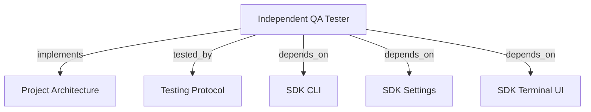

```graph
{
  "node_id": "feature:qa_tester",
  "domain": "qa",
  "implements": ["adr:architecture"],
  "tested_by": ["adr:tests"],
  "entrypoints": ["src/qa/QaAgenticOrchestrator.ts", "src/cli/services/qa-service.ts", "src/cli/services/run-service.ts"],
  "registration_files": ["src/cli/run.ts", "src/cli/utils/constants.ts", "src/cli/services/qa/QaOrchestratorFactory.ts", "src/index.ts", "src/qa/index.ts"],
  "reference_files": ["src/qa/engine/CurlDriver.ts", "src/qa/auth/QaAuthConfigStore.ts", "src/qa/auth/types.ts", "src/cli/services/qa/QaAuthCommand.ts"],
  "code_files": ["src/cli/utils/run-args-parser.ts", "src/cli/services/qa/types.ts", "src/cli/services/qa/QaArgsParser.ts", "src/cli/services/qa/QaDevelopmentRenewal.ts", "src/cli/services/qa/QaExploratoryCommand.ts", "src/cli/services/qa/QaReportOutput.ts", "src/qa/services/QaService.ts", "src/qa/services/QaDeveloperReportGenerator.ts", "src/qa/services/QaExploratoryService.ts", "src/qa/services/QaExecutionMemory.ts", "src/qa/services/QaPlanValidator.ts", "src/qa/services/QaRuntimeManager.ts", "src/qa/services/QaTargetProbe.ts", "src/qa/types.ts", "src/qa/progress.ts", "src/qa/services/QaRunStore.ts", "src/qa/services/QaVerdictPolicy.ts", "src/qa/engine/PlaywrightDriver.ts", "src/qa/engine/MobileWebDriver.ts", "src/qa/engine/AccessibilityDriver.ts", "src/qa/engine/McpClientDriver.ts", "src/qa/engine/CliDriver.ts", "src/qa/engine/WebSocketDriver.ts", "src/qa/engine/QaAuthRedaction.ts", "src/qa/engine/index.ts", "src/qa/services/index.ts", "src/qa/ui/QaTerminalView.ts", "src/qa/utils/QaAgentFileOutput.ts", "src/qa/phases/types.ts", "src/qa/phases/QaPlanningPhase.ts", "src/qa/phases/QaValidationPhase.ts", "src/qa/phases/QaExecutionPhase.ts", "src/qa/phases/QaAnalysisPhase.ts", "src/qa/phases/QaReportingPhase.ts", "src/qa/phases/index.ts"],
  "test_files": ["src/qa/__tests__/PlaywrightDriverIsolation.test.ts", "src/qa/auth/__tests__/QaAuthConfigStore.test.ts", "src/qa/auth/__tests__/QaAuthExecution.test.ts", "src/qa/__tests__/QaArchitecture.test.ts", "src/qa/__tests__/QaExtendedEngines.test.ts", "src/qa/__tests__/QaAuthEngineSecurity.test.ts", "src/qa/__tests__/QaAgenticOrchestrator.test.ts", "src/qa/__tests__/QaService.test.ts", "src/qa/__tests__/QaImprovements.test.ts", "src/qa/__tests__/QaCurlRegressions.test.ts", "src/qa/__tests__/QaRunStore.test.ts", "src/qa/services/__tests__/QaPlanValidator.test.ts", "src/qa/services/__tests__/QaTargetProbe.test.ts", "src/qa/ui/__tests__/QaTerminalView.test.ts", "src/cli/services/__tests__/qa-service.test.ts", "src/cli/services/__tests__/run-service.test.ts", "src/cli/utils/__tests__/run-args-parser.test.ts"]
}
```

# INDEPENDENT QA TESTER

## OVERVIEW

Persist QA plans, runs, evidence, and reports in `docs/qa/`.

## FOLDER STRUCTURE

<folder_structure>
```text
src/qa/              # orchestration, phases, drivers, persistence, UI
src/cli/services/    # hrns qa and hrns run facades
src/cli/services/qa/ # QA parsing, handlers, factories, CLI types
```
</folder_structure>

## EXECUTION

1. **Run** `hrns qa run`; choose resume, analysis, or new when plans exist.
2. **Define** scope with `--scope`; repeat `--scenario` for baselines.
3. **Validate** planner JSON, profile, target, and scenarios.
4. **Execute** in order; use `--analysis` for evidence analysis.
5. **Report** with `hrns qa report --run <id>`; explore with `qa exploratory`.
6. **Authenticate** with `--auth <profile>`.

## REPORT OUTPUT

Use `hrns qa report --run <id> --output <format>`. Omit `--output` for selection; default: `json`.

| Format | Output |
| --- | --- |
| `json` | Overwrites `report.json` |
| `html` | Overwrites `REPORT.html` with every scenario |
| `markdown` | Overwrites `REPORT.md` with every scenario grouped by status |
| `send-to-developer` | Overwrites `DEVELOPER-SCOPE.md` via LLM |

REQUIRED: Overwrite atomically; escape HTML. Use one evidence link per scenario. Modal shows title, image previews, scrollable documents, and direct links. Scope uses results.

REQUIRED: Preserve scope bytes, three-digit scenario IDs, and one runner session. Remove temporary JSON handoffs. Escape raw NUL as `\\u0000` in repair prompts.

```text
# CORRECT: run QA and generate the report during execution
hrns qa run --report --scope "Test order creation endpoint" --target http://127.0.0.1:3000 --agent codex-cli

# CORRECT: fix actionable results from one completed QA run
hrns run --reset --run orders-20260911 --mode fast

```

Adaptive analysis is opt-in: `--analysis` inspects evidence and appends and executes material gaps. Choose **resume with analysis** for saved plans; plain **resume** runs saved scenarios only.

## DEVELOPMENT RENEWAL

Ask **Send failed and blocked scenarios to fix?** with default `false`. After confirmation, require a checkbox for **FAILED** and **BLOCKED** scenarios; preselect all and scope checked items. Skip reports, noninteractive terminals, and actionless runs. REQUIRED: Preserve overrides, `--agent`, and `--debug`. Use `hrns run --reset --run <id>` to scope every actionable result. PROHIBITED: Combine `--run` with `--scope`.

## VERDICTS

| Verdict | Condition |
| --- | --- |
| PASS | Every required scenario passed with verified assertions and evidence. |
| FAIL | A required assertion demonstrably failed. |
| BLOCKED | A required scenario cannot execute or target is unavailable. |
| INCONCLUSIVE | Required coverage, evidence, or observations are missing or unverified. |

## TERMINAL PROGRESS

REQUIRED: Emit runtime, phase, scenario, and completion events via `QaTerminalPresenter`; disable ANSI without a TTY. Include IDs, totals, and errors.

## DRIVERS

Reuse browsers with an isolated context per scenario; close contexts even on failure. Keep login and verification together. Use selector/URL waits. Curl never follows redirects; MCP follows same-origin redirects. Require screenshots.

## AUTHENTICATION

REQUIRED: Define `none`, `basic`, `bearer`, `api-key`, or `cookie` profiles. Prefer environment references; browser form actions use `valueFrom`, never literal secrets. Apply credentials only to same-origin traffic. Redact resolved secrets.

REQUIRED: Keep `hrns qa auth` form-only. Block authenticated CLI without mappings and WebSocket. PROHIBITED: Persist resolved secrets. OAuth2, HMAC, and mTLS remain outside scope.

## EXECUTION MEMORY

`docs/qa/execution-memory.json` retains ten verified target hints for 30 days. REQUIRED: Revalidate hints; explicit input wins. Actionless resume keeps its stored target; use `qa run` when a new target must win. PROHIBITED: Store outcomes, credentials, ports, or agent instructions.

## LIMITS

REQUIRED: Cap `REPORT.md` at 8,000 characters; mark truncation and unresolved **Open Points**. PROHIBITED: LLM prose as verdict truth. Start framework/API processes separately.

## DOCUMENT MAP



## REFERENCES

- [**ARCHITECTURE.md**](../adr/ARCHITECTURE.md): Ports and adapter boundaries.
- [**TESTS.md**](../adr/TESTS.md): Test commands and isolation rules.
- [**SDK_CLI.md**](./SDK_CLI.md): CLI registration and command conventions.
- [**SDK_SETTINGS.md**](./SDK_SETTINGS.md): QA phase defaults.
- [**SDK_TERMINAL_UI.md**](./SDK_TERMINAL_UI.md): Shared terminal helpers.
