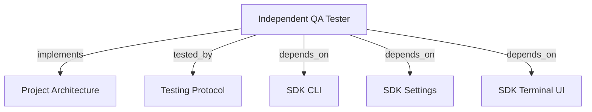

# INDEPENDENT QA TESTER

Run agentic acceptance with LLM-planned scenarios, terminal progress, runtime evidence, and one final report.

```graph
{
  "node_id": "feature:qa_tester",
  "domain": "qa",
  "implements": ["adr:architecture"],
  "tested_by": ["adr:tests"],
  "entrypoints": ["src/qa/QaAgenticOrchestrator.ts", "src/cli/services/qa-service.ts"],
  "registration_files": ["src/cli/run.ts", "src/cli/utils/constants.ts", "src/index.ts", "src/qa/index.ts"],
  "reference_files": ["src/qa/CurlDriver.ts"],
  "code_files": ["src/qa/QaService.ts", "src/qa/QaRuntimeManager.ts", "src/qa/QaTargetProbe.ts", "src/qa/types.ts", "src/qa/progress.ts", "src/qa/QaRunStore.ts", "src/qa/QaVerdictPolicy.ts", "src/qa/PlaywrightDriver.ts", "src/qa/ui/QaTerminalView.ts", "src/qa/phases/types.ts", "src/qa/phases/QaPlanningPhase.ts", "src/qa/phases/QaExecutionPhase.ts", "src/qa/phases/QaReportingPhase.ts", "src/qa/phases/index.ts"],
  "test_files": ["src/qa/__tests__/QaAgenticOrchestrator.test.ts", "src/qa/__tests__/QaService.test.ts", "src/qa/__tests__/QaRunStore.test.ts", "src/qa/ui/__tests__/QaTerminalView.test.ts", "src/cli/services/__tests__/qa-service.test.ts"]
}
```

## OVERVIEW

Use `QaAgenticOrchestrator` independently of development orchestration. Accept a scope and optional scenarios. Emit typed progress without coupling orchestration to terminal output. Persist plans under `.harness-kit/qa/plans/`; persist runs under `.harness-kit/qa/runs/` through atomic replacement.

## FOLDER STRUCTURE

<folder_structure>
```text
src/qa/                     # agentic orchestration, plans, reports, and drivers
|-- phases/                 # planning, execution, and reporting handlers
|-- ui/                     # QA-specific terminal presenter
`-- QaAgenticOrchestrator.ts
src/cli/services/            # `hrns qa` command adapter
```
</folder_structure>

## EXECUTION

1. **Supply scope** with `--scope`, or omit the flag and choose short input or a long editor form. Add optional scenarios with `--scenario`.
2. **Prepare the runtime**: honor an explicit target or serve static web assets on an OS-assigned loopback port (strictly restricting public file extensions).
3. **Plan agentically**: inspect the project, preserve supplied scenario intent, map acceptance criteria, enforce the risk coverage matrix, and select appropriate profiles (`api`, `web`, `web-game`, `security`, or `full`).
4. **Probe once** before scenario execution and block the run without invoking drivers when the target is unavailable.
5. **Execute deterministically**: use real `curl` or Playwright actions selected by the plan with target origin checks, secret redaction, and cancellation signal handling.
6. **Analyze and adapt**: evaluate observations and evidence to uncover untested states, adding bounded scenarios through an adaptive replanning loop within explicit iteration budgets.
7. **Report agentically**: synthesize verified bugs and errors, reconcile claims against runtime evidence, compute deterministic risk coverage matrices, and provide fallback reporting on LLM failures.
8. **Stop managed runtimes** after success or failure, then persist immutable plan versions, run state, evidence, and `report.json`.

```text
# CORRECT: provide open scope; let LLM generate executable scenarios
hrns qa --scope "Test order creation endpoint" --target http://127.0.0.1:3000

# CORRECT: omit --scope and select short input or editor in the interactive form
hrns qa --target http://127.0.0.1:3000

# CORRECT: provide optional baseline scenarios; let LLM add gaps
hrns qa --scope "Validate checkout" --scenario "Valid payment succeeds" --profile web

# CORRECT: run integrated end-to-end acceptance across API and browser
hrns qa --scope "Validate order workflow" --profile full

# WRONG: use development validation as runtime acceptance
hrns run --skip-validation
```

## VERDICTS

| Verdict | Condition |
| --- | --- |
| PASS | Every required scenario passed with verified assertions and evidence. |
| FAIL | A required assertion demonstrably failed. |
| BLOCKED | A required scenario cannot execute or target is unavailable. |
| INCONCLUSIVE | Required coverage, evidence, or observations are missing or unverified. |

## TERMINAL PROGRESS

| Event | Terminal output |
| --- | --- |
| `runtime_ready` | Resolved target and whether the CLI started a temporary static server. |
| `phase_started` | Current planning, execution, analysis, or reporting phase. |
| `scenario_started` | Scenario position and human-readable action. |
| `scenario_completed` | Deterministic runtime status for the scenario. |
| `phase_completed` | Planned count, runtime verdict, adaptive cycles, or report readiness with coverage matrix. |

REQUIRED: Emit progress through `QaProgressListener`; keep orchestrator and drivers independent from ANSI output. REQUIRED: Inject `QaTerminalPresenter` at the CLI boundary. REQUIRED: Disable ANSI styles automatically when stdout is not a TTY.

## DRIVERS

`QaRuntimeManager` owns temporary static servers and cleanup. It binds `127.0.0.1` to port `0`, allowing the operating system to select a collision-free port, and makes that URL authoritative over guessed planner origins. Static serving is strictly whitelisted to public web assets (`.html`, `.css`, `.js`, `.mjs`, `.json`, images, fonts, wasm) and forbids source code or hidden configurations. `QaService` probes the target once before dispatching any driver; one unavailable target produces blocked scenarios and one deduplicated report error.

`QaPlanningPhase` validates the agent plan before execution. `CurlDriver` uses real `curl`/`curl.exe` with origin isolation, bounds, and secret redaction. `PlaywrightDriver` performs human actions and observable assertions. `QaAnalysisPhase` generates bounded follow-up scenarios from evidence. `QaReportingPhase` reconciles findings with evidence and guarantees a final report on LLM failure.

Run this once after dependency changes:

```text
rtk npm install
rtk npx playwright install chromium
```

## LIMITS

REQUIRED: Resolve a non-empty scope before agentic QA starts. ALLOWED: Supply `--scope` to skip the form. ALLOWED: Omit `--scope` and choose short input or a long editor form. ALLOWED: Omit scenarios; the planning LLM derives them from scope and project inspection. ALLOWED: Supply scenarios; the LLM preserves their intent and adds coverage gaps. PROHIBITED: Treat LLM prose as verdict truth; runtime results own verdict, evidence, and criterion status. Runtime acceptance starts root static sites automatically, but does not yet start arbitrary framework or API processes, gate development `REVIEW`/`TRANSITION`, retain video, or support native desktop binaries.

## DOCUMENT MAP



## REFERENCES

- [**ARCHITECTURE.md**](../adr/ARCHITECTURE.md): Ports and adapter boundaries.
- [**TESTS.md**](../adr/TESTS.md): Test commands and isolation rules.
- [**SDK_CLI.md**](./SDK_CLI.md): CLI registration and command conventions.
- [**SDK_SETTINGS.md**](./SDK_SETTINGS.md): Default model and effort for QA planning and reporting phases.
- [**SDK_TERMINAL_UI.md**](./SDK_TERMINAL_UI.md): Shared ANSI helpers used by the QA terminal presenter.
