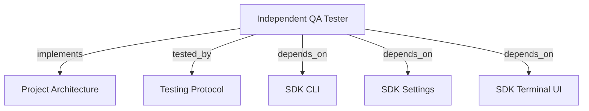

```graph
{
  "node_id": "feature:qa_tester",
  "domain": "qa",
  "implements": ["adr:architecture"],
  "tested_by": ["adr:tests"],
  "entrypoints": ["src/qa/QaAgenticOrchestrator.ts", "src/cli/services/qa-service.ts"],
  "registration_files": ["src/cli/run.ts", "src/cli/utils/constants.ts", "src/index.ts", "src/qa/index.ts"],
  "reference_files": ["src/qa/engine/CurlDriver.ts"],
  "code_files": ["src/qa/services/QaService.ts", "src/qa/services/QaExecutionMemory.ts", "src/qa/services/QaPlanValidator.ts", "src/qa/services/QaRuntimeManager.ts", "src/qa/services/QaTargetProbe.ts", "src/qa/types.ts", "src/qa/progress.ts", "src/qa/services/QaRunStore.ts", "src/qa/services/QaVerdictPolicy.ts", "src/qa/engine/PlaywrightDriver.ts", "src/qa/engine/MobileWebDriver.ts", "src/qa/engine/AccessibilityDriver.ts", "src/qa/engine/McpClientDriver.ts", "src/qa/engine/CliDriver.ts", "src/qa/engine/WebSocketDriver.ts", "src/qa/engine/index.ts", "src/qa/services/index.ts", "src/qa/ui/QaTerminalView.ts", "src/qa/phases/types.ts", "src/qa/phases/QaPlanningPhase.ts", "src/qa/phases/QaValidationPhase.ts", "src/qa/phases/QaExecutionPhase.ts", "src/qa/phases/QaAnalysisPhase.ts", "src/qa/phases/QaReportingPhase.ts", "src/qa/phases/index.ts"],
  "test_files": ["src/qa/__tests__/QaArchitecture.test.ts", "src/qa/__tests__/QaExtendedEngines.test.ts", "src/qa/__tests__/QaAgenticOrchestrator.test.ts", "src/qa/__tests__/QaService.test.ts", "src/qa/__tests__/QaImprovements.test.ts", "src/qa/__tests__/QaCurlRegressions.test.ts", "src/qa/__tests__/QaRunStore.test.ts", "src/qa/services/__tests__/QaPlanValidator.test.ts", "src/qa/services/__tests__/QaTargetProbe.test.ts", "src/qa/ui/__tests__/QaTerminalView.test.ts", "src/cli/services/__tests__/qa-service.test.ts"]
}
```

# INDEPENDENT QA TESTER

## OVERVIEW

Run QA independently. Persist plans, runs, evidence, scope, and reports under `docs/qa/`.

## FOLDER STRUCTURE

<folder_structure>
```text
src/qa/                     # independent QA module
|-- services/               # planning, persistence, runtime, probe, and verdict
|-- engine/                 # curl, Playwright, and extended execution adapters
|-- phases/                 # planning, validation, execution, analysis, reporting
|-- ui/                     # QA-specific terminal presenter
`-- QaAgenticOrchestrator.ts # phase-chain entrypoint
src/cli/services/            # `hrns qa` command adapter
```
</folder_structure>

## EXECUTION

1. **Run QA** with `hrns qa run`; omit the action for the same flow. With saved plans and no scope or scenarios, choose `resume` or `new`.
2. **Supply scope** with `--scope`, or use the scope/editor, profile, and target prompts. Add baselines with `--scenario`. Reject blank scope and invalid target URLs; preserve inline `=` values. Resolve CLI directories against the workspace.
3. **Plan and validate** with strict JSON and one parse-repair retry. Honor the requested profile. Probe the target before execution.
4. **Execute**, then append evidence-justified scenarios. Reject adaptive changes to executed scenarios or their order; show analysis failures as warnings.
5. **Report optionally** with `hrns qa run --report`; generate `report.json`, bounded `REPORT.md`, and terminal output during the run. Without `--report`, persist only run state; propagate cancellation.
6. **Regenerate** with `hrns qa report --run <id>`; omit the ID for completed-run selection.
7. **Offer development renewal** after new or resumed QA execution when at least one scenario is `FAILED` or `BLOCKED`.
8. **Preserve scope** byte-for-byte; number scenarios as `001-<scenario>`, `002-<scenario>`.

```text
# CORRECT: run QA and generate the report during execution
hrns qa run --report --scope "Test order creation endpoint" --target http://127.0.0.1:3000

# WRONG: use a removed QA action
hrns qa execute --plan orders@1
```

## DEVELOPMENT RENEWAL

After QA completes, ask **Send failed and blocked scenarios to fix?** with default `false`. Skip this prompt without actionable results, during reporting, or outside an interactive terminal.

When accepted, start `hrns run --reset --mode quick` in the QA workspace. Build its scope only from matching persisted plan scenarios and results.

REQUIRED: Preserve explicit `--agent`, `--model`, `--effort`, and `--debug` options. PROHIBITED: Include `PASSED` or `INCONCLUSIVE` scenarios in the development scope.

## VERDICTS

| Verdict | Condition |
| --- | --- |
| PASS | Every required scenario passed with verified assertions and evidence. |
| FAIL | A required assertion demonstrably failed. |
| BLOCKED | A required scenario cannot execute or target is unavailable. |
| INCONCLUSIVE | Required coverage, evidence, or observations are missing or unverified. |

## TERMINAL PROGRESS

| Event | Terminal output |
| --- | --- |
| `runtime_ready` | Target and managed-server state. |
| `phase_started` | Current phase. |
| `validation_failed` | All plan errors before execution. |
| `scenario_started` | Scenario position and action. |
| `scenario_completed` | Runtime status and failure reason. |
| `phase_warning` | Skipped analysis or unavailable optional memory. |
| `phase_completed` | Count, verdict, cycles, or report state. |

REQUIRED: Emit `QaProgressListener` events; inject `QaTerminalPresenter` at the CLI boundary. Disable ANSI without a TTY. PROHIBITED: ANSI in drivers or orchestration.

## DRIVERS

Use temporary static servers for inferred/browser/full profiles. Explicit API, CLI, MCP, security, and WebSocket profiles skip hosting. 4xx/5xx paths block probes; root 404/405 remain reachable.

Route security HTTP through the API driver unless a custom security driver exists. Curl observes redirects without following and compares JSON arrays by order/length, with partial nested objects. Browser evidence requires a nonempty screenshot. MCP supports JSON/SSE and structured expectations; CLI uses no shell.

## EXECUTION MEMORY

Use project-memory's digest, graph, and routed contracts during planning. `docs/qa/execution-memory.json` stores target, profile, and verification timestamp; retain the latest per profile for 30 days, up to ten entries. Learn from PASSED/FAILED scenarios with evidence; ignore blocked runs, temporary ports, credentials, queries, fragments, and CLI directories.

REQUIRED: Treat memory as advisory; revalidate each run; explicit inputs win. PROHIBITED: Store outcomes or agent instructions. Ignore corrupt/expired entries; expose write failures without losing reports. Remove file to reset targets.

## LIMITS

REQUIRED: Cap `REPORT.md` at 8,000 characters; mark truncation and unresolved **Open Points**. PROHIBITED: LLM prose as verdict truth. Start framework/API processes separately.

## DOCUMENT MAP



## REFERENCES

- [**ARCHITECTURE.md**](../adr/ARCHITECTURE.md): Ports and adapter boundaries.
- [**TESTS.md**](../adr/TESTS.md): Test commands and isolation rules.
- [**SDK_CLI.md**](./SDK_CLI.md): CLI registration and command conventions.
- [**SDK_SETTINGS.md**](./SDK_SETTINGS.md): QA phase defaults.
- [**SDK_TERMINAL_UI.md**](./SDK_TERMINAL_UI.md): Shared terminal helpers.
