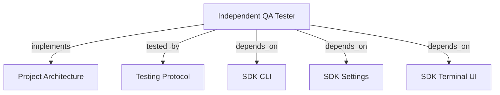

```graph
{
  "node_id": "feature:qa_tester",
  "domain": "qa",
  "implements": ["adr:architecture"],
  "tested_by": ["adr:tests"],
  "entrypoints": ["src/qa/QaAgenticOrchestrator.ts", "src/cli/services/qa-service.ts"],
  "registration_files": ["src/cli/run.ts", "src/cli/utils/constants.ts", "src/cli/services/qa/QaOrchestratorFactory.ts", "src/index.ts", "src/qa/index.ts"],
  "reference_files": ["src/qa/engine/CurlDriver.ts"],
  "code_files": ["src/cli/services/qa/types.ts", "src/cli/services/qa/QaArgsParser.ts", "src/cli/services/qa/QaDevelopmentRenewal.ts", "src/cli/services/qa/QaExploratoryCommand.ts", "src/qa/services/QaService.ts", "src/qa/services/QaExploratoryService.ts", "src/qa/services/QaExecutionMemory.ts", "src/qa/services/QaPlanValidator.ts", "src/qa/services/QaRuntimeManager.ts", "src/qa/services/QaTargetProbe.ts", "src/qa/types.ts", "src/qa/progress.ts", "src/qa/services/QaRunStore.ts", "src/qa/services/QaVerdictPolicy.ts", "src/qa/engine/PlaywrightDriver.ts", "src/qa/engine/MobileWebDriver.ts", "src/qa/engine/AccessibilityDriver.ts", "src/qa/engine/McpClientDriver.ts", "src/qa/engine/CliDriver.ts", "src/qa/engine/WebSocketDriver.ts", "src/qa/engine/index.ts", "src/qa/services/index.ts", "src/qa/ui/QaTerminalView.ts", "src/qa/phases/types.ts", "src/qa/phases/QaPlanningPhase.ts", "src/qa/phases/QaValidationPhase.ts", "src/qa/phases/QaExecutionPhase.ts", "src/qa/phases/QaAnalysisPhase.ts", "src/qa/phases/QaReportingPhase.ts", "src/qa/phases/index.ts"],
  "test_files": ["src/qa/__tests__/QaArchitecture.test.ts", "src/qa/__tests__/QaExtendedEngines.test.ts", "src/qa/__tests__/QaAgenticOrchestrator.test.ts", "src/qa/__tests__/QaService.test.ts", "src/qa/__tests__/QaImprovements.test.ts", "src/qa/__tests__/QaCurlRegressions.test.ts", "src/qa/__tests__/QaRunStore.test.ts", "src/qa/services/__tests__/QaPlanValidator.test.ts", "src/qa/services/__tests__/QaTargetProbe.test.ts", "src/qa/ui/__tests__/QaTerminalView.test.ts", "src/cli/services/__tests__/qa-service.test.ts"]
}
```

# INDEPENDENT QA TESTER

## OVERVIEW

Run QA independently. Persist plans, runs, evidence, scope, and reports under `docs/qa/`.

## FOLDER STRUCTURE

<folder_structure>
```text
src/qa/                     # independent QA module
|-- services/               # planning, persistence, runtime, probe, and verdict
|-- engine/                 # curl, Playwright, and extended execution adapters
|-- phases/                 # planning, validation, execution, analysis, reporting
|-- ui/                     # QA-specific terminal presenter
`-- QaAgenticOrchestrator.ts # phase-chain entrypoint
src/cli/services/            # `hrns qa` command facade
src/cli/services/qa/         # parsing, command handlers, factories, and CLI types
```
</folder_structure>

## EXECUTION

1. **Run** with `hrns qa run`; saved plans offer `resume` or `new`.
2. **Supply scope** with `--scope` or prompts and baselines with repeated `--scenario`.
3. **Validate** strict JSON, profiles, targets, and executable scenarios.
4. **Execute** scenarios, preserve order, then analyze evidence for material gaps.
5. **Report** with `--report`, or regenerate through `hrns qa report --run <id>`.
6. **Renew development** only for `FAILED` or `BLOCKED` scenarios.
7. **Preserve scope** byte-for-byte and number scenario IDs with three digits.
8. **Reuse one session** per QA execution, never across executions.
9. **Run saved suites** with `hrns qa exploratory`. Execute each latest plan version sequentially without adaptive additions. Continue after plan errors. Save `docs/qa/exploratory/<id>/report.json`.

```text
# CORRECT: run QA and generate the report during execution
hrns qa run --report --scope "Test order creation endpoint" --target http://127.0.0.1:3000

# CORRECT: execute all scenarios from every latest saved plan version
hrns qa exploratory --target http://127.0.0.1:3000

# WRONG: use a removed QA action
hrns qa execute --plan orders@1
```

## DEVELOPMENT RENEWAL

Ask **Send failed and blocked scenarios to fix?** with default `false`. Skip reports, noninteractive terminals, and runs without actionable results. Run `hrns run --reset` after confirmation. REQUIRED: Preserve accepted overrides, `--agent`, and `--debug`. PROHIBITED: Send other results.

## VERDICTS

| Verdict | Condition |
| --- | --- |
| PASS | Every required scenario passed with verified assertions and evidence. |
| FAIL | A required assertion demonstrably failed. |
| BLOCKED | A required scenario cannot execute or target is unavailable. |
| INCONCLUSIVE | Required coverage, evidence, or observations are missing or unverified. |

## TERMINAL PROGRESS

| Event | Terminal output |
| --- | --- |
| `runtime_ready` | Target and managed-server state. |
| `phase_started` | Current phase. |
| `validation_failed` | All plan errors before execution. |
| `scenario_started` | Scenario position and action. |
| `scenario_completed` | Runtime status and failure reason. |
| `phase_warning` | Skipped analysis or unavailable optional memory. |
| `phase_completed` | Count, verdict, cycles, or report state. |

REQUIRED: Emit progress through injected `QaTerminalPresenter`. Disable ANSI without a TTY. Reuse the first session only within one execution.

REQUIRED: Aggregate exploratory verdicts as `FAIL`, `BLOCKED`, `INCONCLUSIVE`, then `PASS`. Include plan/run IDs, effective targets, results, totals, and validation errors. Apply target overrides in memory only.

## DRIVERS

Use temporary static servers for browser profiles. Route security HTTP through API unless overridden. Curl does not follow redirects. Browser evidence requires screenshots. CLI uses no shell.

## EXECUTION MEMORY

`docs/qa/execution-memory.json` retains up to ten verified target hints for 30 days. REQUIRED: Revalidate hints; explicit input wins. PROHIBITED: Store outcomes, credentials, temporary ports, or agent instructions.

## LIMITS

REQUIRED: Cap `REPORT.md` at 8,000 characters; mark truncation and unresolved **Open Points**. PROHIBITED: LLM prose as verdict truth. Start framework/API processes separately.

## DOCUMENT MAP



## REFERENCES

- [**ARCHITECTURE.md**](../adr/ARCHITECTURE.md): Ports and adapter boundaries.
- [**TESTS.md**](../adr/TESTS.md): Test commands and isolation rules.
- [**SDK_CLI.md**](./SDK_CLI.md): CLI registration and command conventions.
- [**SDK_SETTINGS.md**](./SDK_SETTINGS.md): QA phase defaults.
- [**SDK_TERMINAL_UI.md**](./SDK_TERMINAL_UI.md): Shared terminal helpers.
