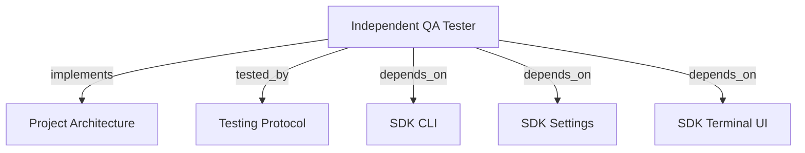

```graph
{
  "node_id": "feature:qa_tester",
  "domain": "qa",
  "implements": ["adr:architecture"],
  "tested_by": ["adr:tests"],
  "entrypoints": ["src/qa/QaAgenticOrchestrator.ts", "src/cli/services/qa-service.ts", "src/cli/services/run-service.ts"],
  "registration_files": ["src/cli/run.ts", "src/cli/utils/constants.ts", "src/cli/services/qa/QaOrchestratorFactory.ts", "src/index.ts", "src/qa/index.ts"],
  "reference_files": ["src/qa/engine/CurlDriver.ts", "src/qa/auth/QaAuthConfigStore.ts", "src/qa/auth/types.ts", "src/cli/services/qa/QaAuthCommand.ts"],
  "code_files": ["src/cli/utils/run-args-parser.ts", "src/cli/services/qa/types.ts", "src/cli/services/qa/QaArgsParser.ts", "src/cli/services/qa/QaDevelopmentRenewal.ts", "src/cli/services/qa/QaExploratoryCommand.ts", "src/qa/services/QaService.ts", "src/qa/services/QaExploratoryService.ts", "src/qa/services/QaExecutionMemory.ts", "src/qa/services/QaPlanValidator.ts", "src/qa/services/QaRuntimeManager.ts", "src/qa/services/QaTargetProbe.ts", "src/qa/types.ts", "src/qa/progress.ts", "src/qa/services/QaRunStore.ts", "src/qa/services/QaVerdictPolicy.ts", "src/qa/engine/PlaywrightDriver.ts", "src/qa/engine/MobileWebDriver.ts", "src/qa/engine/AccessibilityDriver.ts", "src/qa/engine/McpClientDriver.ts", "src/qa/engine/CliDriver.ts", "src/qa/engine/WebSocketDriver.ts", "src/qa/engine/QaAuthRedaction.ts", "src/qa/engine/index.ts", "src/qa/services/index.ts", "src/qa/ui/QaTerminalView.ts", "src/qa/utils/QaAgentFileOutput.ts", "src/qa/phases/types.ts", "src/qa/phases/QaPlanningPhase.ts", "src/qa/phases/QaValidationPhase.ts", "src/qa/phases/QaExecutionPhase.ts", "src/qa/phases/QaAnalysisPhase.ts", "src/qa/phases/QaReportingPhase.ts", "src/qa/phases/index.ts"],
  "test_files": ["src/qa/auth/__tests__/QaAuthConfigStore.test.ts", "src/qa/auth/__tests__/QaAuthExecution.test.ts", "src/qa/__tests__/QaArchitecture.test.ts", "src/qa/__tests__/QaExtendedEngines.test.ts", "src/qa/__tests__/QaAuthEngineSecurity.test.ts", "src/qa/__tests__/QaAgenticOrchestrator.test.ts", "src/qa/__tests__/QaService.test.ts", "src/qa/__tests__/QaImprovements.test.ts", "src/qa/__tests__/QaCurlRegressions.test.ts", "src/qa/__tests__/QaRunStore.test.ts", "src/qa/services/__tests__/QaPlanValidator.test.ts", "src/qa/services/__tests__/QaTargetProbe.test.ts", "src/qa/ui/__tests__/QaTerminalView.test.ts", "src/cli/services/__tests__/qa-service.test.ts", "src/cli/services/__tests__/run-service.test.ts", "src/cli/utils/__tests__/run-args-parser.test.ts"]
}
```

# INDEPENDENT QA TESTER

## OVERVIEW

Run QA independently. Persist plans, runs, evidence, reports in `docs/qa/`.

## FOLDER STRUCTURE

<folder_structure>
```text
src/qa/              # orchestration, phases, drivers, persistence, UI
src/cli/services/    # hrns qa and hrns run facades
src/cli/services/qa/ # QA parsing, handlers, factories, CLI types
```
</folder_structure>

## EXECUTION

1. **Run** with `hrns qa run --agent <runner>`; select `resume` or `new` when plans exist.
2. **Define** scope with `--scope` or prompts; add repeated `--scenario` baselines.
3. **Validate** planner JSON, profile, target, and executable scenarios.
4. **Execute** in order, analyze evidence, report with `--report`; use selected outer runner.
5. **Regenerate** with `hrns qa report --run <id>`; explore with `hrns qa exploratory`.
6. **Authenticate** with `--auth <profile>` and `.harness-kit/auth.json`.

REQUIRED: Preserve scope bytes, use three-digit scenario IDs, and reuse one runner session per execution. Use temporary JSON handoffs under `docs/qa/`; remove them after parsing. Escape raw NUL as `\\u0000` before embedding invalid output in repair prompts. Use response fallback without file tools.

```text
# CORRECT: run QA and generate the report during execution
hrns qa run --report --scope "Test order creation endpoint" --target http://127.0.0.1:3000 --agent codex-cli

# CORRECT: preview and execute through the safety wrapper
python skills/qa-orchestrator/scripts/safe_hrns_qa.py --execute --cwd . -- qa run --report --target http://127.0.0.1:3000 --agent codex-cli

# CORRECT: fix actionable results from one completed QA run
hrns run --reset --run orders-20260911 --mode fast

```

## DEVELOPMENT RENEWAL

Ask **Send failed and blocked scenarios to fix?** with default `false`. Skip reports, noninteractive terminals, and runs without actionable results. After confirmation use `hrns run --reset`, or use `hrns run --reset --run <id>` to generate scope from one completed run. REQUIRED: Preserve accepted overrides, `--agent`, and `--debug`. PROHIBITED: Combine `--run` with `--scope` or include other results.

## VERDICTS

| Verdict | Condition |
| --- | --- |
| PASS | Every required scenario passed with verified assertions and evidence. |
| FAIL | A required assertion demonstrably failed. |
| BLOCKED | A required scenario cannot execute or target is unavailable. |
| INCONCLUSIVE | Required coverage, evidence, or observations are missing or unverified. |

## TERMINAL PROGRESS

REQUIRED: Emit runtime, phase, scenario, and completion events through injected `QaTerminalPresenter`; disable ANSI without a TTY. Aggregate exploratory verdicts as `FAIL`, `BLOCKED`, `INCONCLUSIVE`, then `PASS`. Include IDs, results, totals, and errors. Keep target overrides in memory.

## DRIVERS

Use temporary static servers for browser profiles. Route security HTTP through API unless overridden. Curl does not follow redirects; MCP follows same-origin redirects only. Browser evidence requires screenshots. CLI uses no shell.

## AUTHENTICATION

REQUIRED: Define named `none`, `basic`, `bearer`, `api-key`, or `cookie` profiles. Prefer environment references; allow confirmed `storage: "insecure"` literals locally. Apply credentials only to same-origin API, MCP, and browser traffic. Send Curl config through transient stdin; redact resolved values and raw bearer tokens from evidence and reasons. Inject only explicit CLI mappings.

REQUIRED: Keep `hrns qa auth` form-only and reject duplicate names. Block authenticated CLI without environment mappings and all authenticated WebSocket scenarios. PROHIBITED: Persist resolved secrets or expose literals in logs. OAuth2, HMAC, mTLS, and WebSocket headers remain outside scope.

## EXECUTION MEMORY

`docs/qa/execution-memory.json` retains ten verified target hints for 30 days. REQUIRED: Revalidate hints; explicit input wins. Actionless resume keeps its stored target; use `qa run` when a new target must win. PROHIBITED: Store outcomes, credentials, ports, or agent instructions.

## LIMITS

REQUIRED: Cap `REPORT.md` at 8,000 characters; mark truncation and unresolved **Open Points**. PROHIBITED: LLM prose as verdict truth. Start framework/API processes separately.

## DOCUMENT MAP



## REFERENCES

- [**ARCHITECTURE.md**](../adr/ARCHITECTURE.md): Ports and adapter boundaries.
- [**TESTS.md**](../adr/TESTS.md): Test commands and isolation rules.
- [**SDK_CLI.md**](./SDK_CLI.md): CLI registration and command conventions.
- [**SDK_SETTINGS.md**](./SDK_SETTINGS.md): QA phase defaults.
- [**SDK_TERMINAL_UI.md**](./SDK_TERMINAL_UI.md): Shared terminal helpers.
