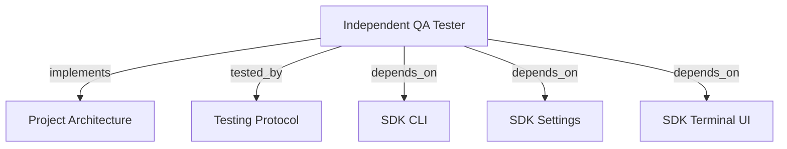

# INDEPENDENT QA TESTER

Run agentic acceptance with LLM-planned scenarios, terminal progress, runtime evidence, and one final report.

```graph
{
  "node_id": "feature:qa_tester",
  "domain": "qa",
  "implements": ["adr:architecture"],
  "tested_by": ["adr:tests"],
  "entrypoints": ["src/qa/QaAgenticOrchestrator.ts", "src/cli/services/qa-service.ts"],
  "registration_files": ["src/cli/run.ts", "src/cli/utils/constants.ts", "src/index.ts", "src/qa/index.ts"],
  "reference_files": ["src/qa/engine/CurlDriver.ts"],
  "code_files": ["src/qa/services/QaService.ts", "src/qa/services/QaPlanValidator.ts", "src/qa/services/QaRuntimeManager.ts", "src/qa/services/QaTargetProbe.ts", "src/qa/types.ts", "src/qa/progress.ts", "src/qa/services/QaRunStore.ts", "src/qa/services/QaVerdictPolicy.ts", "src/qa/engine/PlaywrightDriver.ts", "src/qa/engine/MobileWebDriver.ts", "src/qa/engine/AccessibilityDriver.ts", "src/qa/engine/McpClientDriver.ts", "src/qa/engine/CliDriver.ts", "src/qa/engine/WebSocketDriver.ts", "src/qa/engine/index.ts", "src/qa/services/index.ts", "src/qa/ui/QaTerminalView.ts", "src/qa/phases/types.ts", "src/qa/phases/QaPlanningPhase.ts", "src/qa/phases/QaValidationPhase.ts", "src/qa/phases/QaExecutionPhase.ts", "src/qa/phases/QaAnalysisPhase.ts", "src/qa/phases/QaReportingPhase.ts", "src/qa/phases/index.ts"],
  "test_files": ["src/qa/__tests__/QaArchitecture.test.ts", "src/qa/__tests__/QaExtendedEngines.test.ts", "src/qa/__tests__/QaAgenticOrchestrator.test.ts", "src/qa/__tests__/QaService.test.ts", "src/qa/__tests__/QaRunStore.test.ts", "src/qa/services/__tests__/QaPlanValidator.test.ts", "src/qa/services/__tests__/QaTargetProbe.test.ts", "src/qa/ui/__tests__/QaTerminalView.test.ts", "src/cli/services/__tests__/qa-service.test.ts"]
}
```

## OVERVIEW

Use `QaAgenticOrchestrator` independently of development orchestration. Accept scope and scenarios, emit typed progress, persist plans/runs under `.harness-kit/qa/` atomically, preserve original user scope, and number scenario IDs by execution order.

## FOLDER STRUCTURE

<folder_structure>
```text
src/qa/                     # independent QA module
|-- services/               # planning, persistence, runtime, probe, and verdict
|-- engine/                 # curl, Playwright, and extended execution adapters
|-- phases/                 # planning, validation, execution, analysis, reporting
|-- ui/                     # QA-specific terminal presenter
`-- QaAgenticOrchestrator.ts # phase-chain entrypoint
src/cli/services/            # `hrns qa` command adapter
```
</folder_structure>

## EXECUTION

1. **Supply scope** with `--scope`, or choose short input/editor form. Add scenarios with `--scenario`.
2. **Prepare the runtime**: honor an explicit target or serve static web assets on a collision-free loopback port.
3. **Plan agentically**: map criteria and select the required QA profile. Keep `criterionIds` within the criteria array; retry once with corrective feedback when the planner emits an out-of-range reference.
4. **Validate the plan**: check schema, identifiers, criteria mapping, target protocol, same-origin requests, engine payloads, safety bounds, workspace paths, and driver availability. Print every error and stop before probing or execution.
5. **Probe once** before scenario execution and block the run without invoking drivers when the target is unavailable.
6. **Execute deterministically**: use selected drivers with target-origin checks, redaction, and cancellation.
7. **Analyze and adapt**: add bounded scenarios for coverage gaps; validate each revised plan before execution.
8. **Report agentically**: reconcile bugs/errors with evidence and compute coverage matrices.
9. **Stop managed runtimes** and persist plans, runs, numbered evidence folders (`001-<scenario-id>`, `002-<scenario-id>`, ...). Normalize existing three-digit scenario prefixes before constructing evidence paths.
10. **Preserve the original scope** byte-for-byte in `.harness-kit/qa/plans/<plan-id>/SCOPE.md`; write it once and keep it unchanged across plan versions and adaptive revisions.
11. **Number each scenario ID** with a three-digit execution prefix: `001-<scenario>`, `002-<scenario>`, and so on. Keep prefixes stable when adaptive analysis adds scenarios.

When **resume** is selected, choose exactly one saved plan from `.harness-kit/qa/plans`; only that plan executes. Choose **renew** to create a new plan.

```text
# CORRECT: provide open scope; let LLM generate executable scenarios
hrns qa --scope "Test order creation endpoint" --target http://127.0.0.1:3000

# WRONG: use development validation as runtime acceptance
hrns run --skip-validation
```

## VERDICTS

| Verdict | Condition |
| --- | --- |
| PASS | Every required scenario passed with verified assertions and evidence. |
| FAIL | A required assertion demonstrably failed. |
| BLOCKED | A required scenario cannot execute or target is unavailable. |
| INCONCLUSIVE | Required coverage, evidence, or observations are missing or unverified. |

## TERMINAL PROGRESS

| Event | Terminal output |
| --- | --- |
| `runtime_ready` | Resolved target and whether the CLI started a temporary static server. |
| `phase_started` | Current planning, validation, execution, analysis, or reporting phase. |
| `validation_failed` | Every plan error, printed before execution starts. |
| `scenario_started` | Scenario position and human-readable action. |
| `scenario_completed` | Deterministic runtime status for the scenario. |
| `phase_completed` | Planned count, runtime verdict, adaptive cycles, report readiness, and final summary frame. |

REQUIRED: Emit progress through `QaProgressListener`; keep orchestrator and drivers independent from ANSI output. REQUIRED: Inject `QaTerminalPresenter` at the CLI boundary. REQUIRED: Disable ANSI styles automatically when stdout is not a TTY.

## DRIVERS

`QaRuntimeManager` owns temporary static servers and cleanup, binds `127.0.0.1` to port `0`, and serves only public web assets. `QaService` probes once; path 4xx/5xx block, root 404 stays valid for relative API routes, and `405` means reachable but `HEAD` unsupported.

`QaPlanningPhase` parses plans. `QaValidationPhase` checks plan invariants and driver availability before execution. `CurlDriver` runs bounded, origin-isolated `curl` with redacted evidence. `PlaywrightDriver` performs actions and assertions. `QaAnalysisPhase` adds bounded follow-ups. `QaReportingPhase` reconciles evidence and always emits a report.

`McpClientDriver` executes MCP JSON-RPC over Streamable HTTP, parses JSON/SSE, preserves error evidence, and matches result content case-insensitively without counting envelope metadata. MCP plans may assert `expectedState`, `expectedReasonCode`, and `expectedIsError`; expected tool errors pass only when explicitly declared. `CliDriver` spawns commands without a shell. `MobileWebDriver` adds touch and mobile viewport defaults. `AccessibilityDriver` audits deterministic document rules. `WebSocketDriver` validates bounded message exchanges.

## LIMITS

REQUIRED: Resolve a non-empty scope before agentic QA starts. ALLOWED: Supply `--scope` or use the interactive form. ALLOWED: Omit scenarios or supply baselines for the LLM to expand. PROHIBITED: Treat LLM prose as verdict truth; runtime evidence owns verdicts. Runtime acceptance starts root static sites, but not framework/API processes or native binaries. It does not gate development, retain video, or support desktop apps.

## DOCUMENT MAP



## REFERENCES

- [**ARCHITECTURE.md**](../adr/ARCHITECTURE.md): Ports and adapter boundaries.
- [**TESTS.md**](../adr/TESTS.md): Test commands and isolation rules.
- [**SDK_CLI.md**](./SDK_CLI.md): CLI registration and command conventions.
- [**SDK_SETTINGS.md**](./SDK_SETTINGS.md): Default model and effort for QA planning and reporting phases.
- [**SDK_TERMINAL_UI.md**](./SDK_TERMINAL_UI.md): Shared ANSI helpers used by the QA terminal presenter.
