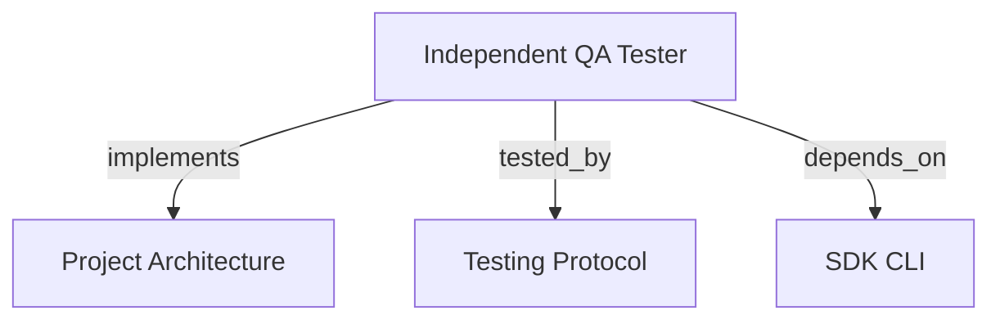

# INDEPENDENT QA TESTER

Run acceptance testing outside development orchestration, with persisted plans, execution evidence, and a strict verdict.

```graph
{
  "node_id": "feature:qa_tester",
  "domain": "qa",
  "implements": ["adr:architecture"],
  "tested_by": ["adr:tests"],
  "entrypoints": ["src/qa/QaService.ts", "src/cli/services/qa-service.ts"],
  "registration_files": ["src/cli/run.ts", "src/cli/utils/constants.ts", "src/index.ts"],
  "reference_files": ["src/qa/CurlDriver.ts"],
  "code_files": ["src/qa/types.ts", "src/qa/QaRunStore.ts", "src/qa/QaVerdictPolicy.ts", "src/qa/PlaywrightDriver.ts", "src/qa/index.ts"],
  "test_files": ["src/qa/__tests__/QaService.test.ts", "src/qa/__tests__/QaRunStore.test.ts", "src/cli/services/__tests__/qa-service.test.ts"]
}
```

## OVERVIEW

Use `QaService` independently of backlog, feature, development session, and review score. Persist plans under `.harness-kit/qa/plans/` and run state/evidence under `.harness-kit/qa/runs/` through atomic replacement.

## FOLDER STRUCTURE

<folder_structure>
```text
src/qa/                     # plans, verdicts, storage, HTTP/browser drivers
src/cli/services/            # `hrns qa` command adapter
```
</folder_structure>

## EXECUTION

1. Create one required scenario per supplied criterion with `hrns qa plan`.
2. Execute a saved plan or create and execute with `hrns qa run`.
3. Inspect the persisted report with `hrns qa report`.
4. Run `hrns qa doctor` before browser validation.

```text
# CORRECT: plan acceptance before product execution
hrns qa plan --plan orders --target http://127.0.0.1:3000 --criterion "Order saves" --method POST --path /orders --expect-status 201
hrns qa execute --plan orders@1

# WRONG: treat a development result as QA acceptance
hrns run --skip-validation
```

## VERDICTS

| Verdict | Condition |
| --- | --- |
| PASS | Every required scenario passed with evidence. |
| FAIL | A required assertion demonstrably failed. |
| BLOCKED | A required scenario cannot execute. |
| INCONCLUSIVE | Required coverage, evidence, or results are insufficient. |

## DRIVERS

`CurlDriver` invokes real `curl`/`curl.exe`, saving request metadata and response bodies. `PlaywrightDriver` launches Chromium, executes declared navigation/control actions, records a final screenshot, and fails scenarios when the page raises a runtime error. Browser execution needs local Playwright and Chromium.

Run this once after dependency changes:

```text
rtk npm install
rtk npx playwright install chromium
```

## LIMITS

Current planning is deterministic: it persists criteria as scenarios and does not infer API paths or browser controls. Provide one API request through CLI flags or add browser actions programmatically before execution. Runtime acceptance does not yet gate `REVIEW`/`TRANSITION`, provide agent-generated plans, retain traces/video, or support native games.

## DOCUMENT MAP



## REFERENCES

- [**ARCHITECTURE.md**](../adr/ARCHITECTURE.md): Ports and adapter boundaries.
- [**TESTS.md**](../adr/TESTS.md): Test commands and isolation rules.
- [**SDK_CLI.md**](./SDK_CLI.md): CLI registration and command conventions.
