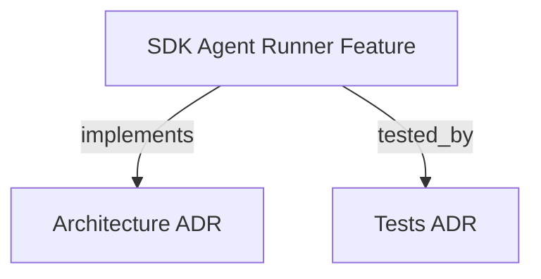

```graph
{
  "node_id":"feature:sdk_agent_runner","domain":"agent_runner","implements":["adr:architecture"],"tested_by":["adr:tests"],
  "entrypoints":["src/agent-runner/IAgentRunner.ts"],
  "registration_files":["src/agent-runner/AgentRunnerRegistry.ts","src/agent-runner/AgentRunnerFactory.ts","src/index.ts"],
  "reference_files":["src/agent-runner/codex-cli/CodexCLIRunner.ts"],
  "code_files":["src/agent-runner/AbstractCliRunner.ts","src/agent-runner/AgentRunnerError.ts","src/agent-runner/CliRunnerProgress.ts","src/agent-runner/NullAgentRunner.ts","src/agent-runner/antigravity-cli/AntigravityCLIErase.ts","src/agent-runner/antigravity-cli/AntigravityCLIRunner.ts","src/agent-runner/claude-cli/ClaudeCLIErase.ts","src/agent-runner/claude-cli/ClaudeCLIRunner.ts","src/agent-runner/claude-sdk/AgentRunnerConfig.ts","src/agent-runner/claude-sdk/ClaudeSDKRunner.ts","src/agent-runner/codex-cli/CodexCLIErase.ts","src/agent-runner/copilot-cli/CopilotCLIErase.ts","src/agent-runner/copilot-cli/CopilotCLIRunner.ts","src/agent-runner/copilot-sdk/CopilotSDKRunner.ts","src/agent-runner/cursor-cli/CursorCLIRunner.ts","src/agent-runner/cursor-sdk/CursorSDKRunner.ts","src/agent-runner/erase/AbstractCLIErase.ts","src/agent-runner/erase/CLIEraseRegistry.ts","src/agent-runner/erase/NodeEraseFileSystem.ts","src/agent-runner/erase/manifest-utils.ts","src/agent-runner/erase/types.ts","src/agent-runner/kiro-cli/KiroCLIRunner.ts","src/agent-runner/opencode-cli/OpenCodeCLIErase.ts","src/agent-runner/opencode-cli/OpenCodeCliRunner.ts","src/agent-runner/types.ts"],
  "test_files":["src/agent-runner/__tests__/AgentRunnerConfig.test.ts","src/agent-runner/__tests__/AgentRunnerError.test.ts","src/agent-runner/__tests__/AgentRunnerModular.test.ts","src/agent-runner/__tests__/AntigravityCLIErase.test.ts","src/agent-runner/__tests__/AntigravityCLIRunner.test.ts","src/agent-runner/__tests__/ClaudeAgentRunner.test.ts","src/agent-runner/__tests__/ClaudeCLIErase.test.ts","src/agent-runner/__tests__/ClaudeCLIRunner.test.ts","src/agent-runner/__tests__/CodexCLIErase.test.ts","src/agent-runner/__tests__/CodexCLIRunner.test.ts","src/agent-runner/__tests__/CopilotCLIErase.test.ts","src/agent-runner/__tests__/CopilotCLIRunner.test.ts","src/agent-runner/__tests__/CopilotRunner.test.ts","src/agent-runner/__tests__/CursorCLIRunner.test.ts","src/agent-runner/__tests__/CursorRunner.test.ts","src/agent-runner/__tests__/EnvFiltering.test.ts","src/agent-runner/__tests__/KiroCLIRunner.test.ts","src/agent-runner/__tests__/OpenCodeCLIErase.test.ts","src/agent-runner/__tests__/OpenCodeCLIRunner.test.ts","src/agent-runner/erase/__tests__/AbstractCLIErase.test.ts","tests/helpers/FakeAgentRunner.ts","tests/integration/t17-cursor-runner.test.ts","tests/integration/t18-antigravity-runner.test.ts","tests/unit/t03-agent-runner.test.ts","tests/unit/t11-copilot-runner.test.ts","tests/unit/t21-copilot-cli-runner.test.ts","tests/unit/t22-cursor-cli-runner.test.ts","tests/unit/t23-abstract-cli-runner.test.ts","tests/unit/t24-agent-invocation-service.test.ts","tests/unit/t25-cli-runner-progress.test.ts"]
}
```

# SDK AGENT RUNNER
Provides pluggable agent execution strategies behind `IAgentRunner`, including the OpenCode CLI adapter.

## OVERVIEW
Use the runner port to keep orchestration independent from vendor clients. `OpenCodeCLIRunner` extends `AbstractCliRunner`, runs the `opencode run` command, writes prompts to stdin, maps invocation options, and normalizes object or JSON-lines output into `AgentOutput`.

## FOLDER STRUCTURE
<folder_structure>
```
src/agent-runner/
├── core ports and types/       # IAgentRunner, invocation, output, and errors
├── registry and factory/       # Strategy registration and construction
├── shared CLI adapter/         # Spawn, timeout, abort, environment, and parsing hooks
├── vendor-cli adapters/        # Claude, Codex, Copilot, Cursor, Kiro, and OpenCode
└── vendor-SDK adapters/        # Provider SDK implementations
```
</folder_structure>

## MAIN CONCEPTS
- **Strategy**: Each runner implements the same invocation and output contract.
- **Composition boundary**: `AgentRunnerRegistry` stores constructors; `AgentRunnerFactory` imports built-ins and creates validated instances.
- **OpenCode adapter**: Registers `Runner.OPENCODE_CLI` (`opencode-cli`) and isolates vendor flags and output events from domain types.
- **Session continuity**: Preserve an incoming session ID and replace it with a native `conversation_id`, `conversationId`, `session_id`, `sessionId`, or `thread_id` when output provides one.

## HOW TO RUN AGENTS
### Prerequisites
1. Install the `opencode` executable and configure its provider credentials.
2. Select `opencode-cli` as the runner type.

### Steps
1. Create the runner through `AgentRunnerFactory` or select it through the SDK CLI.
2. Pass an `AgentInvocation` with the prompt, workspace, optional model, agent, and session.
3. Consume normalized text, artefacts, usage, and session data from `AgentOutput`.

## PARAMETERS / CONFIGURATIONS
| SDK value | OpenCode mapping | Description |
|---|---|---|
| `model` | `--model <provider/model>` | Select the provider/model pair. |
| `effort` | `--variant <value>` | Forward configured effort using OpenCode's variant option. |
| `agent` | `--agent <name>` | Select an OpenCode agent. |
| `session.id` | `--session <id>` | Continue an existing session. |
| `workspacePath` | `--dir <path>` | Set the working directory argument. |
| `additionalDirs` | not forwarded | OpenCode 1.18.21 has no additional-directory CLI flag; workspacePath remains the process working directory. |
| `prompt` | stdin | Avoid positional prompt arguments and preserve prompt length. |

## OUTPUT AND FAILURE BOUNDARIES
- Parse ANSI-clean JSON objects and JSON-lines events; extract response text, structured artefacts, usage, cost, and session identifiers.
- Emit text and tool progress from assistant, item, text, tool, and function-call events through `defaultProgress`.
- Translate missing binaries to `NETWORK_ERROR`, timeouts to `TIMEOUT`, non-zero exits to `API_ERROR`, and parsed agent failures to `API_ERROR`.
- Filter sensitive environment variables after merging process and invocation environments.

## BEST PRACTICES
REQUIRED: Register built-in runners at composition boundaries and resolve them through `AgentRunnerFactory`.
REQUIRED: Propagate `AbortSignal`, apply per-invocation or constructor timeout, and preserve session identifiers.
REQUIRED: Verify installed OpenCode help before relying on vendor flags; this adapter uses `--variant` and `--dir`, while OpenCode 1.18.21 has no additional-directory flag.
PROHIBITED: Bind orchestration decisions to `OpenCodeCLIRunner` or expose OpenCode-specific types through `IAgentRunner`.
PROHIBITED: Pass credentials or other sensitive environment values to child processes.

## DOCUMENT MAP


## REFERENCES
- [**AGENT-RUNNERS.md**](../adr/AGENT-RUNNERS.md): Runner registration, adapter boundaries, and vendor-specific conventions.
- [**ARCHITECTURE.md**](../adr/ARCHITECTURE.md): Ports, layers, composition boundaries, and integrations.
- [**TESTS.md**](../adr/TESTS.md): Vitest commands and external-process test boundaries.
