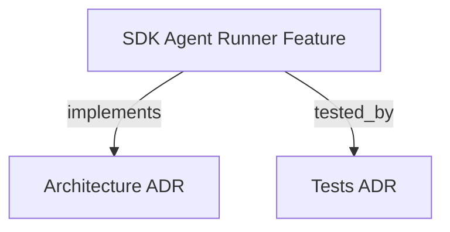

```graph
{
  "node_id":"feature:sdk_agent_runner","domain":"agent_runner","implements":["adr:architecture"],"tested_by":["adr:tests"],
  "entrypoints":["src/agent-runner/IAgentRunner.ts"],
  "registration_files":["src/agent-runner/AgentRunnerRegistry.ts","src/agent-runner/AgentRunnerFactory.ts"],
  "reference_files":["src/agent-runner/codex-cli/CodexCLIRunner.ts"],
  "code_files":["src/agent-runner/AbstractCliRunner.ts","src/agent-runner/AgentRunnerError.ts","src/agent-runner/CliRunnerProgress.ts","src/agent-runner/NullAgentRunner.ts","src/agent-runner/antigravity-cli/AntigravityCLIRunner.ts","src/agent-runner/claude-cli/ClaudeCLIRunner.ts","src/agent-runner/claude-sdk/AgentRunnerConfig.ts","src/agent-runner/claude-sdk/ClaudeSDKRunner.ts","src/agent-runner/copilot-cli/CopilotCLIRunner.ts","src/agent-runner/copilot-sdk/CopilotSDKRunner.ts","src/agent-runner/cursor-cli/CursorCLIRunner.ts","src/agent-runner/cursor-sdk/CursorSDKRunner.ts","src/agent-runner/kiro-cli/KiroCLIRunner.ts","src/agent-runner/types.ts"],
  "test_files":["src/agent-runner/__tests__/AgentRunnerConfig.test.ts","src/agent-runner/__tests__/AgentRunnerError.test.ts","src/agent-runner/__tests__/AgentRunnerModular.test.ts","src/agent-runner/__tests__/AntigravityCLIRunner.test.ts","src/agent-runner/__tests__/ClaudeAgentRunner.test.ts","src/agent-runner/__tests__/ClaudeCLIRunner.test.ts","src/agent-runner/__tests__/CodexCLIRunner.test.ts","src/agent-runner/__tests__/CopilotCLIRunner.test.ts","src/agent-runner/__tests__/CopilotRunner.test.ts","src/agent-runner/__tests__/CursorCLIRunner.test.ts","src/agent-runner/__tests__/CursorRunner.test.ts","src/agent-runner/__tests__/EnvFiltering.test.ts","src/agent-runner/__tests__/KiroCLIRunner.test.ts","tests/helpers/FakeAgentRunner.ts","tests/integration/t17-cursor-runner.test.ts","tests/integration/t18-antigravity-runner.test.ts","tests/unit/t03-agent-runner.test.ts","tests/unit/t11-copilot-runner.test.ts","tests/unit/t21-copilot-cli-runner.test.ts","tests/unit/t22-cursor-cli-runner.test.ts","tests/unit/t23-abstract-cli-runner.test.ts","tests/unit/t24-agent-invocation-service.test.ts","tests/unit/t25-cli-runner-progress.test.ts"]
}
```

# SDK AGENT RUNNER
Provides a decoupled, pluggable architecture for executing coding agents.

## OVERVIEW
The `sdk_agent_runner` module provides a pluggable architecture for executing coding agents. It supports multiple strategies including Claude Code, Anthropic API, GitHub Copilot, OpenAI Codex, and Google's Antigravity (agy).

## FOLDER STRUCTURE
<folder_structure>
```
sdk/src/agent-runner/
├── IAgentRunner.ts           # Outbound port interface
├── NullAgentRunner.ts        # No-op stub implementation
├── AbstractCliRunner.ts      # Base class for all CLI subprocess runners
├── types.ts                  # Shared types and config schemas
├── AgentRunnerRegistry.ts    # Static singleton runner strategy registry
├── AgentRunnerFactory.ts     # Instantiation factory executing validations
├── claude-cli/               # Subdirectory for local Claude Code CLI execution
├── claude-sdk/               # Subdirectory for Anthropic SDK API calls
├── antigravity-cli/          # Subdirectory for Google's agy CLI execution
├── codex-cli/                # Subdirectory for OpenAI Codex CLI execution
├── copilot-cli/              # Subdirectory for GitHub Copilot CLI execution
├── copilot-sdk/              # Subdirectory for GitHub Copilot SDK execution
├── cursor-cli/               # Subdirectory for Cursor agent CLI execution
├── cursor-sdk/               # Subdirectory for Cursor SDK execution
└── README.md                 # Blueprint for custom runner plugins
```
</folder_structure>

## DESIGN SYSTEM & PATTERNS

### Patterns
- **Strategy Pattern**: Concrete execution engines implement the `IAgentRunner` interface.
- **Factory & Registry Pattern**: Decouples orchestrator from concrete implementations.
- **Session Continuity**: `AgentSession` (`{ readonly id: string }`) tracks active conversations. CLI runners extract native session IDs from stdout events and support resuming via native flags (`--resume`, `--conversation`, `exec resume`).

## HOW TO RUN AGENTS

### Prerequisites
1. Provide necessary API keys (e.g. `ANTHROPIC_API_KEY`, `CURSOR_API_KEY`).
2. Have the CLI tool installed for the chosen agent (e.g. `claude`, `agy`).

### Steps
1. Select the agent type using the CLI flag.
2. Execute the `hrns run` command with the selected agent.

<code_example>
# CORRECT: Providing agent flag
hrns run --agent antigravity-cli

# WRONG: Running without configuring the default agent correctly
hrns run --agent unknown-agent
</code_example>

## PARAMETERS / CONFIGURATIONS

| Name | Type | Required | Description | Default |
|------|------|----------|-------------|---------|
| `--agent` | string | No | Resolves custom strategy named `<type>` | `claude-cli` |
| `--model` | string | No | Overrides the default model for the selected runner | Varies |

## BEST PRACTICES
REQUIRED: Pass agent selection flags when running orchestration command.
PROHIBITED: Hardcoding agent implementations directly into the orchestrator.
REQUIRED: Parse and return native session identifiers in `AgentOutput.session` when emitted by CLI or API runners.

## DOCUMENT MAP



## REFERENCES
- [**README.md**](../README.md): Main documentation index.
- [**ARCHITECTURE.md**](../adr/ARCHITECTURE.md): Arch patterns and integrations.
- [**TESTS.md**](../adr/TESTS.md): Testing guidelines.
