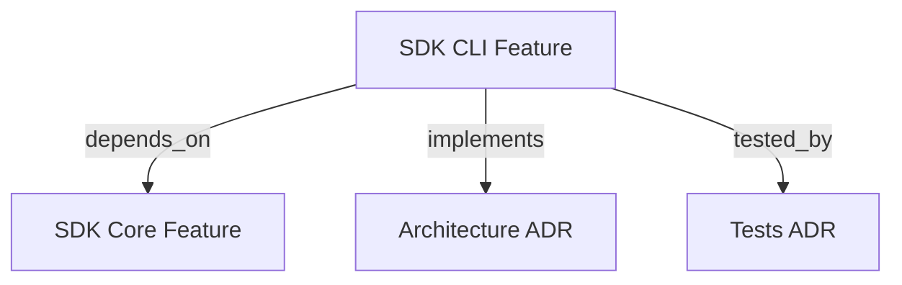

```graph
{
  "node_id":"feature:sdk_cli","domain":"cli","implements":["adr:architecture"],"tested_by":["adr:tests"],"depends_on":["feature:sdk_core"],
  "entrypoints":["src/cli/run.ts"],
  "registration_files":["package.json"],
  "reference_files":["src/cli/services/run-service.ts"],
  "code_files":["src/cli/DebugContext.ts","src/cli/services/candidate-service.ts","src/cli/services/diagnose-service.ts","src/cli/services/init-service.ts","src/cli/services/report-service.ts","src/cli/services/report/ReportDataAggregator.ts","src/cli/services/report/ReportRenderer.ts","src/cli/services/report/types.ts","src/cli/services/reset-service.ts","src/cli/services/settings-service.ts","src/cli/utils/cli-utils.ts","src/cli/utils/constants.ts","src/cli/utils/run-args-parser.ts","src/cli/utils/runner-args-parser.ts"],
  "test_files":["src/cli/services/__tests__/candidate-service.test.ts","src/cli/services/__tests__/diagnose-service.test.ts","src/cli/services/report/__tests__/ReportDataAggregator.test.ts","src/cli/services/report/__tests__/ReportRenderer.test.ts","src/cli/utils/__tests__/run-args-parser.test.ts","src/cli/utils/__tests__/runner-args-parser.test.ts","tests/e2e/integration/cli-sandbox.test.ts","tests/unit/t19-run-args-parser.test.ts","tests/unit/t20-debug-context.test.ts","tests/unit/t27-cli-utils.test.ts","tests/unit/t29-init-service.test.ts","tests/unit/t30-resolve-mode.test.ts","tests/unit/t33-resume-phase-choices.test.ts"]
}
```

# SDK CLI
Provides the `hrns` command-line interface for launching and managing orchestration sessions.

## OVERVIEW
The CLI module delegates execution to `HarnessOrchestrator` after resolving all runtime options. It features commands for initialization, running orchestration sessions, diagnosing performance, reviewing meta-harness candidates, and reporting token usage.

## FOLDER STRUCTURE
<folder_structure>
```
src/cli/
├── run.ts                        # Main CLI binary
├── DebugContext.ts               # Global debug flag singleton
├── services/
│   ├── run-service.ts            # cmdRun() implementation
│   ├── diagnose-service.ts       # cmdDiagnose() implementation
│   ├── candidate-service.ts      # cmdCandidate() implementation
│   ├── init-service.ts           # cmdInit() implementation
│   ├── reset-service.ts          # resetOptions() wizard
│   ├── report-service.ts         # cmdReport() implementation
│   └── settings-service.ts       # cmdSettings() implementation
└── utils/
    ├── run-args-parser.ts        # parseRunArgs() pure parser
    ├── runner-args-parser.ts     # parseStandardRunnerArgs() pure parser
    ├── cli-utils.ts              # Path and validation helpers
    └── constants.ts              # Shared constants and help string
```
</folder_structure>

## COMMANDS

### Available Commands
- **`hrns init`**: Initialize workspace files and configure steering rules.
- **`hrns run`**: Start or resume an orchestration session.
- **`hrns diagnose`**: Run post-orchestration harness diagnosis on pending sessions.
- **`hrns candidate`**: Review and apply meta-harness optimization candidates (`list`, `review [id]`, `review [id] --auto`).
- **`hrns report`**: Print token usage report.
- **`hrns version`**: Show version.
- **`hrns help`**: Show help.

## HOW TO USE CLI COMMANDS

### Prerequisites
1. Ensure the SDK is built (`dist/cli/run.js`).
2. Run from a valid project directory.

### Steps
1. Run `hrns init` for a new workspace.
2. Run `hrns run` to start the autonomous cycle.
3. Run `hrns diagnose` to process pending diagnosis sessions and propose improvements.
4. Run `hrns candidate review <id>` to review and apply improvements with your AI runner.

<code_example>
# CORRECT: Non-interactive full reset
hrns run --reset --scope "Build REST API" --path ./src --score 0.9 --reworks 3

# CORRECT: Run diagnosis separately
hrns diagnose --agent antigravity-cli

# CORRECT: Review candidate with AI runner
hrns candidate review v001 --agent antigravity-cli

# WRONG: Running without path or scope on a new project
hrns run --reset
</code_example>

## PARAMETERS / CONFIGURATIONS

| Name | Type | Required | Description | Default |
|------|------|----------|-------------|---------|
| `--agent, -a` | string | No | Agent type (e.g. `claude-cli`) | — |
| `--model, -m` | string | No | Model name | — |
| `--effort, -e` | string | No | Reasoning effort level for the model | — |
| `--mode, -M` | string | No | Execution mode: `quick \| fast \| thinking \| deep_thinking` | `thinking` |
| `--complexity, -c` | string | No | Scope complexity override: `LOW \| HIGH \| AUTO` | Mode-inferred |
| `--reset` | boolean | No | Force a new cycle | false |
| `--resume` | boolean | No | Resume from last saved session | false |
| `--scope` | string | No | Project scope / PRD | — |
| `--path` | string | No | Add a directory to projectPaths (repeatable) | `cwd` |
| `--score` | float | No | Minimum acceptance score | `0.7` |
| `--reworks` | int | No | Max rework cycles | `2` |
| `--steering` | string | No | Additional orchestration rules | — |
| `--refine` | boolean | No | Enable interactive refinement | false |
| `--skip-validation` | boolean | No | Skip Review phase (Phase C) | false |
| `--skip-memory` | boolean | No | Skip Memory phase (Phase E) | false |
| `--skip-deploy` | boolean | No | Skip Deploy phase | false |
| `--debug` | boolean | No | Enable debug output to stderr | false |

## BEST PRACTICES
REQUIRED: Skip the interactive wizard by providing at least one of `--scope`, `--path`, `--score`, or `--reworks`.
PROHIBITED: Modifying workspace root source or production configuration manually while the CLI is running.

## DOCUMENT MAP



## REFERENCES
- [**SDK_SETTINGS.md**](./SDK_SETTINGS.md): Settings and configuration resolver details.
- [**SDK_STEERING.md**](./SDK_STEERING.md): Orchestration phase steering rules details.
- [**SDK_CORE.md**](./SDK_CORE.md): Core orchestrator lifecycle and phases.
