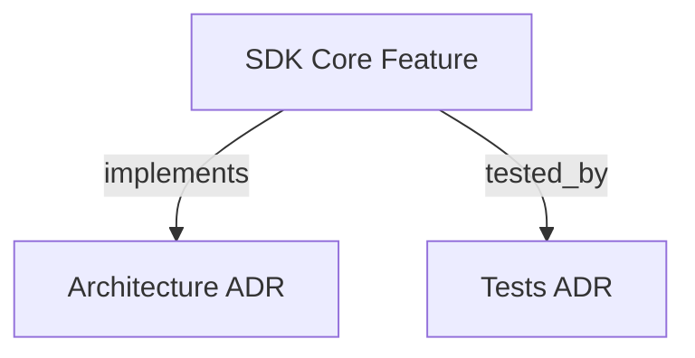

```graph
{
  "node_id": "feature:sdk_core",
  "domain": "core",
  "implements": ["adr:architecture"],
  "tested_by": ["adr:tests"],
  "entrypoints": ["src/orchestrator/HarnessOrchestrator.ts"],
  "registration_files": ["src/orchestrator/ChainBuilder.ts","src/orchestrator/phases/index.ts"],
  "reference_files": ["src/orchestrator/phases/AbstractPhaseHandler.ts"],
  "code_files": ["src/context-assembler/ContextAssembler.ts","src/context-assembler/types.ts","src/json-extraction/JsonExtractionProtocol.ts","src/json-extraction/types.ts","src/orchestrator/ReentryResolver.ts","src/orchestrator/phases/BootstrapHandler.ts","src/orchestrator/phases/CascadeBlockedHandler.ts","src/orchestrator/phases/DeployHandler.ts","src/orchestrator/phases/DevelopmentHandler.ts","src/orchestrator/phases/MemoryHandler.ts","src/orchestrator/phases/PlanningHandler.ts","src/orchestrator/phases/RefinementHandler.ts","src/orchestrator/phases/ReviewHandler.ts","src/orchestrator/phases/TransitionHandler.ts","src/orchestrator/services/AgentInvocationService.ts","src/orchestrator/services/PhaseDecisionLogger.ts","src/orchestrator/services/ProjectStateService.ts","src/orchestrator/types.ts","src/orchestrator/utils/OrchestratorFormatter.ts","src/orchestrator/utils/PhaseFileUtils.ts","src/orchestrator/utils/PromptHelpers.ts","src/telemetry/TokenLedger.ts","src/validation-gate/ValidationGate.ts","src/validation-gate/types.ts"],
  "test_files": ["src/context-assembler/__tests__/ContextAssembler.test.ts","src/orchestrator/__tests__/ChainBuilder.test.ts","src/orchestrator/__tests__/types.test.ts","src/orchestrator/phases/__tests__/PhaseAHandler.test.ts","src/orchestrator/phases/__tests__/PhaseBHandler.test.ts","src/orchestrator/phases/__tests__/PhaseFHandler.test.ts","src/orchestrator/phases/__tests__/RefinementHandler.test.ts","src/orchestrator/services/__tests__/AgentInvocationService.test.ts","src/orchestrator/services/__tests__/PhaseDecisionLogger.test.ts","src/orchestrator/services/__tests__/ProjectStateService.test.ts","src/orchestrator/utils/__tests__/PhaseFileUtils.test.ts","src/orchestrator/utils/__tests__/PromptHelpers.test.ts","src/telemetry/__tests__/TokenLedger.test.ts","src/validation-gate/__tests__/ValidationGate.test.ts","tests/integration/t11-orchestrator-bootstrap-phasea.test.ts","tests/integration/t12-orchestrator-phaseb.test.ts","tests/integration/t13-orchestrator-phasec.test.ts","tests/integration/t14-orchestrator-phased-e.test.ts","tests/unit/phases/t04-phasec-handler.test.ts","tests/unit/phases/t06-phasee-handler.test.ts","tests/unit/phases/t07-deploy-handler.test.ts","tests/unit/phases/t08-refinement-handler.test.ts","tests/unit/t02-types.test.ts","tests/unit/t04-json-extraction.test.ts","tests/unit/t05-validation-gate.test.ts","tests/unit/t08-context-assembler.test.ts","tests/unit/t09-reentry-resolver.test.ts","tests/unit/t10-state-machine.test.ts"]
}
```

# SDK CORE

Implements the autonomous-orchestrator state machine as an importable library.

## OVERVIEW
The `sdk_core` module provides a `HarnessOrchestrator` class and all supporting ports, adapters, and utility types needed to drive a full orchestration cycle.

## FOLDER STRUCTURE
<folder_structure>
```
sdk/src/
├── index.ts                          # Public re-exports only
├── orchestrator/
│   ├── HarnessOrchestrator.ts        # State machine loop
│   ├── phases/                       # Chain-of-Responsibility handlers
│   └── ReentryResolver.ts            # Ordered re-entry predicates
├── file-state/
│   └── FileStateManager.ts           # IFileStateManager implementation
├── agent-runner/
│   └── NullAgentRunner.ts            # No-op stub
├── context-assembler/
│   └── ContextAssembler.ts           # Per-phase payload builders
├── validation-gate/
│   └── ValidationGate.ts             # Pure evaluate() function
└── telemetry/
    └── TokenLedger.ts                # JSONL-backed token usage recorder
```
</folder_structure>

## MAIN CONCEPTS

### State Machine Architecture
- **Ports-and-Adapters**: The orchestrator domain has zero runtime dependencies outside the standard library.
- **Atomic Writes**: `FileStateManager` writes all files via a write-to-temp-then-rename pattern.
- **Never-Throws JSON Extraction**: Returns an outcome union and never throws an exception.
- **Canonical Telemetry Writes**: `TokenLedger` stores token metrics only inside `tokenUsage` while reading legacy flat records.

## HOW TO USE THE ORCHESTRATOR API

### Prerequisites
1. Import `HarnessOrchestrator` from `@romabeckman/hrns`.
2. Provide a valid `IAgentRunner` implementation.

### Steps
1. Instantiate the orchestrator with required options.
2. Call `run()` to start the cycle.

<code_example>
# CORRECT: Instantiating with an agent runner
const orchestrator = new HarnessOrchestrator({
  scope: "Implement login",
  projectPaths: ["./src"],
  agentRunner: myAgentRunner,
  complexity: "AUTO"
});
await orchestrator.run();

# WRONG: Running without passing mandatory options
const orchestrator = new HarnessOrchestrator({});
</code_example>

## PARAMETERS / CONFIGURATIONS

| Name | Type | Required | Description | Default |
|---|---|---|---|---|
| `scope` | string | Yes | The objective for the current cycle | — |
| `projectPaths` | string[] | Yes | Directories involved | — |
| `agentRunner` | IAgentRunner | No | Runner implementation | Auto-detected |
| `productDir` | string | No | Custom output directory for docs | `docs/product/` |

## BEST PRACTICES

REQUIRED: Use the provided `isExtractionError` / `isExtractionResult` type guards to branch on extraction outcomes.
REQUIRED: Keep `001-problem-space.md` and `002-context-map.md` at or below `INLINE_THRESHOLD` (5,000 characters) during scope refinement with `InlinePolicy` = `'never'`. This prevents prompt overflow.
ALLOWED: Generate `003-*` tactical designs and `004-*` test scenarios without this prompt cap with `InlinePolicy` = `'always'`. This is useful for large context.
REQUIRED: Use `inlineOrReference` with `InlinePolicy` (`'never' | 'auto' | 'always'`) to manage context prompt injection with `FORCE_INLINE_MAX` (15,000 characters) safeguard.
PROHIBITED: Mutating state directly without using the `IFileStateManager` port.
REQUIRED: On development retries, resolve `reworkLogPath` from the project working directory and embed its Markdown content in the TDD prompt.

## DOCUMENT MAP



## REFERENCES

- [**ARCHITECTURE.md**](../adr/ARCHITECTURE.md): Architectural decisions like Ports and Adapters.
- [**TESTS.md**](../adr/TESTS.md): Test documentation.
