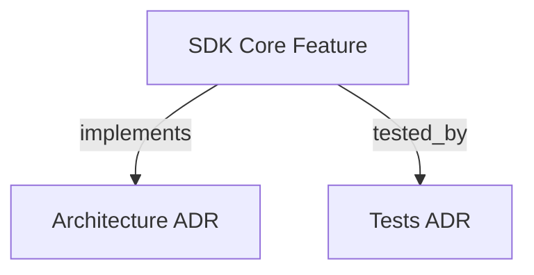

# SDK CORE

```graph
{
  "node_id": "feature:sdk_core",
  "domain": "core",
  "implements": ["adr:architecture"],
  "tested_by": ["adr:tests"],
  "code_files": [
    "src/orchestrator/HarnessOrchestrator.ts",
    "src/orchestrator/StateMachine.ts",
    "src/orchestrator/ReentryResolver.ts",
    "src/file-state/FileStateManager.ts",
    "src/context-assembler/ContextAssembler.ts"
  ],
  "test_files": [
    "tests/unit/t10-state-machine.test.ts",
    "tests/integration/t13-orchestrator-phasec.test.ts"
  ]
}
```

Implements the autonomous-orchestrator state machine as an importable library.

## OVERVIEW
The `sdk_core` module provides a `HarnessOrchestrator` class and all supporting ports, adapters, and utility types needed to drive a full orchestration cycle.

## FOLDER STRUCTURE
<folder_structure>
```
sdk/src/
├── index.ts                          # Public re-exports only
├── orchestrator/
│   ├── HarnessOrchestrator.ts        # State machine loop
│   ├── StateMachine.ts               # Pure phase transition function
│   └── ReentryResolver.ts            # Ordered predicate table
├── file-state/
│   └── FileStateManager.ts           # IFileStateManager implementation
├── agent-runner/
│   └── NullAgentRunner.ts            # No-op stub
├── context-assembler/
│   └── ContextAssembler.ts           # Per-phase payload builders
├── validation-gate/
│   └── ValidationGate.ts             # Pure evaluate() function
└── telemetry/
    └── TokenLedger.ts                # JSONL-backed token usage recorder
```
</folder_structure>

## MAIN CONCEPTS

### State Machine Architecture
- **Ports-and-Adapters**: The orchestrator domain has zero runtime dependencies outside the standard library.
- **Atomic Writes**: `FileStateManager` writes all files via a write-to-temp-then-rename pattern.
- **Never-Throws JSON Extraction**: Returns an outcome union and never throws an exception.

## HOW TO USE THE ORCHESTRATOR API

### Prerequisites
1. Import `HarnessOrchestrator` from `harness-kit-sdk`.
2. Provide a valid `IAgentRunner` implementation.

### Steps
1. Instantiate the orchestrator with required options.
2. Call `run()` to start the cycle.

<code_example>
# CORRECT: Instantiating with an agent runner
const orchestrator = new HarnessOrchestrator({
  scope: "Implement login",
  projectPaths: ["./src"],
  agentRunner: myAgentRunner
});
await orchestrator.run();

# WRONG: Running without passing mandatory options
const orchestrator = new HarnessOrchestrator({});
</code_example>

## PARAMETERS / CONFIGURATIONS

| Name | Type | Required | Description | Default |
|------|------|----------|-------------|---------|
| `scope` | string | Yes | The objective for the current cycle | — |
| `projectPaths` | string[] | Yes | Directories involved | — |
| `agentRunner` | IAgentRunner | No | Runner implementation | Auto-detected |
| `productDir` | string | No | Custom output directory for docs | `docs/product/` |

## BEST PRACTICES
REQUIRED: Use the provided `isExtractionError` / `isExtractionResult` type guards to branch on extraction outcomes.
PROHIBITED: Mutating state directly without using the `IFileStateManager` port.

## DOCUMENT MAP



## REFERENCES
- [**ARCHITECTURE.md**](../adr/ARCHITECTURE.md): Architectural decisions like Ports and Adapters.
- [**TESTS.md**](../adr/TESTS.md): Test documentation.

---

## CHANGE SUMMARY
- **Added:** YAML frontmatter, CHANGE SUMMARY, code examples.
- **Updated:** UPPERCASE sections, standard folder tree format.
- **Removed:** Open limitations section as they are bug tickets, not permanent documentation.
