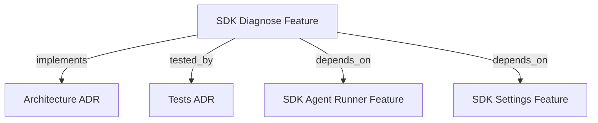

```graph
{
  "node_id": "feature:sdk_diagnose",
  "domain": "diagnose",
  "implements": [
    "adr:architecture"
  ],
  "tested_by": [
    "adr:tests"
  ],
  "depends_on": [
    "feature:sdk_agent_runner",
    "feature:sdk_settings"
  ],
  "entrypoints": [
    "src/diagnose/DiagnoseService.ts"
  ],
  "registration_files": [
    "src/index.ts"
  ],
  "reference_files": [
    "src/diagnose/JsonlSessionLedger.ts",
    "src/diagnose/SessionIdGenerator.ts"
  ],
  "code_files": [
    "src/diagnose/CandidatePromotionService.ts",
    "src/diagnose/CandidateReader.ts",
    "src/diagnose/DiagnoseReportRenderer.ts",
    "src/diagnose/MetaHarnessAgentAdapter.ts",
    "src/diagnose/TraceDirectoryScanner.ts",
    "src/diagnose/types.ts",
    "src/diagnose/utils/DiagnosePaths.ts"
  ],
  "test_files": [
    "src/diagnose/__tests__/CandidatePromotionService.test.ts",
    "src/diagnose/__tests__/CandidateReader.test.ts",
    "src/diagnose/__tests__/DiagnoseReportRenderer.test.ts",
    "src/diagnose/__tests__/DiagnoseService.test.ts",
    "src/diagnose/__tests__/JsonlSessionLedger.test.ts",
    "src/diagnose/__tests__/MetaHarnessAgentAdapter.test.ts",
    "src/diagnose/__tests__/SessionIdGenerator.test.ts",
    "src/diagnose/__tests__/TraceDirectoryScanner.test.ts",
    "src/diagnose/__tests__/types.test.ts",
    "src/diagnose/utils/__tests__/DiagnosePaths.test.ts"
  ]
}
```

# SDK DIAGNOSE
Automates execution trace recording, session ledger persistence, meta-harness optimization triggering, terminal diagnosis reporting, and candidate review delegation.

## OVERVIEW
The diagnose module captures orchestration run performance into `docs/product/diagnose-sessions.jsonl`. It processes pending sessions in batches, generates sequential trace session IDs (`session-YYYY-MM-DD-NNN`), delegates trace logging to `harness-kit:meta-harness-agent`, triggers candidate generation upon completing batches, renders a final summary report with candidate details, and delegates candidate review/promotion interactively or autonomously via `CandidatePromotionService`.

## FOLDER STRUCTURE
<folder_structure>
```
src/diagnose/
├── CandidatePromotionService.ts # Builds interactive prompts, runner CLI commands, and spawns review
├── CandidateReader.ts           # Inspects and extracts candidate metadata from agent output or disk
├── DiagnoseReportRenderer.ts    # Formats and renders final diagnosis report and candidate summary
├── DiagnoseService.ts           # Core service coordinating batch processing and session capture
├── JsonlSessionLedger.ts        # Atomic JSONL persistence for session records
├── SessionIdGenerator.ts        # Sequential session ID generator (session-YYYY-MM-DD-NNN)
├── TraceDirectoryScanner.ts     # Filesystem scanner for trace sequence numbers
├── MetaHarnessAgentAdapter.ts   # Adapter invoking meta-harness agent and tracer
├── types.ts                     # Interfaces, snapshot types, candidate types, and sanitize helpers
└── utils/
    └── DiagnosePaths.ts         # Centralized path builder for traces, candidates, and ledgers
```
</folder_structure>

## ARCHITECTURAL COMPONENTS

### Core Services
- **`DiagnoseService`**: Coordinates session capture, batch resolution, agent adapter execution, status transitions from `pending` to `completed`, and report aggregation.
- **`CandidateReader`**: Parses candidate generation results from meta-harness agent outputs and scans `docs/harness-history/candidates/`.
- **`DiagnoseReportRenderer`**: Renders formatted terminal summary with session counts, trace IDs, and candidate proposal information.
- **`JsonlSessionLedger`**: Implements `ISessionLedger` with atomic file rewriting (`.temp-*` rename) to track session lifecycle without race conditions.
- **`SessionIdGenerator`**: Calculates sequential session IDs matching existing date folders in `docs/harness-history/traces/`.
- **`TraceDirectoryScanner`**: Inspects disk to determine next numerical sequence for the day.
- **`MetaHarnessAgentAdapter`**: Translates diagnose session records into autonomous agent prompts for `harness-tracer`, `harness-evaluator`, and `meta-harness`.

## HOW TO RUN DIAGNOSIS

### Prerequisites
1. Ensure `docs/product/diagnose-sessions.jsonl` exists with at least one pending record, or capture a session during orchestration.
2. Configure agent runner settings for the `diagnose` phase.

### Steps
1. Instantiate `JsonlSessionLedger`, `TraceDirectoryScanner`, `SessionIdGenerator`, and `MetaHarnessAgentAdapter`.
2. Construct `DiagnoseService`.
3. Call `processAllPendingInBatches()` or `processNextBatch()`.

<code_example>
// # CORRECT: Initialize DiagnoseService with injected dependencies
const scanner = new TraceDirectoryScanner(workspacePath);
const idGenerator = new SessionIdGenerator(scanner);
const ledger = new JsonlSessionLedger(ledgerPath);
const agentAdapter = new MetaHarnessAgentAdapter({ workingDir: workspacePath });

const diagnoseService = new DiagnoseService({
  ledger,
  agentAdapter,
  idGenerator,
  settings: HarnessSettings.load(workspacePath),
});

await diagnoseService.processAllPendingInBatches(3);

// # WRONG: Mutating session files directly without atomic ledger or session ID sequencing
fs.writeFileSync('docs/product/diagnose-sessions.jsonl', JSON.stringify({ status: 'completed' }));
</code_example>

## PARAMETERS / CONFIGURATIONS

| Parameter | Type | Required | Description | Default |
|---|---|---|---|---|
| `batchSize` | number | No | Number of pending sessions to process per batch | `3` |
| `onProgress` | function | No | Callback invoked after each batch with `BatchResult` | `undefined` |
| `workingDir` | string | No | Workspace root directory | `process.cwd()` |
| `cliSettings` | DiagnoseSettings | No | CLI model and effort overrides for diagnosis | `undefined` |
| `settings` | HarnessSettings | No | Project settings containing phase-specific overrides | Loaded from disk |

## BEST PRACTICES
REQUIRED: Use `JsonlSessionLedger` for all session state mutations to prevent corruption during concurrent writes.
REQUIRED: Always generate session IDs through `SessionIdGenerator` to ensure strictly monotonic trace numbering.
REQUIRED: Catch and log adapter invocation errors while preserving `pending` status on failed sessions for retry.
REQUIRED: Trigger `invokeMetaHarness` only after successfully processing batches of pending sessions.
PROHIBITED: Hardcoding model or effort levels; resolve configuration through `HarnessSettings` or CLI arguments.
PROHIBITED: Deleting or editing raw trace directories directly from `DiagnoseService`.

## TIPS
Use `captureAndProcessInline()` when running single-session diagnose workflows immediately after orchestrator execution.

<code_tip>
// Inline capture and diagnose processing
await diagnoseService.captureAndProcessInline(orchestrator, {
  runner: 'claude-cli',
  agent: 'orchestrator',
  phaseTimingsMs: { planning: 1200, development: 4500 },
});
</code_tip>

## DOCUMENT MAP



## REFERENCES
- [**SDK_CLI.md**](./SDK_CLI.md): `hrns diagnose` command and options.
- [**SDK_AGENT_RUNNER.md**](./SDK_AGENT_RUNNER.md): `AgentRunnerFactory` and `IAgentRunner` interface.
- [**SDK_SETTINGS.md**](./SDK_SETTINGS.md): `HarnessSettings` resolution for diagnose phase.
- [**ARCHITECTURE.md**](../adr/ARCHITECTURE.md): System architecture and integration boundaries.
- [**TESTS.md**](../adr/TESTS.md): Test guidelines and execution commands.
