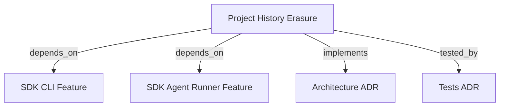

```graph
{
  "node_id": "feature:sdk_project_history_erasure",
  "domain": "project_history_erasure",
  "implements": ["adr:architecture"],
  "tested_by": ["adr:tests"],
  "entrypoints": [
    "src/cli/services/erase-service.ts"
  ],
  "registration_files": [
    "src/agent-runner/erase/CLIEraseRegistry.ts",
    "src/cli/run.ts"
  ],
  "reference_files": [
    "src/agent-runner/erase/AbstractCLIErase.ts"
  ],
  "code_files": [
    "src/agent-runner/erase/types.ts",
    "src/agent-runner/erase/NodeEraseFileSystem.ts",
    "src/agent-runner/erase/manifest-utils.ts",
    "src/agent-runner/claude-cli/ClaudeCLIErase.ts",
    "src/agent-runner/codex-cli/CodexCLIErase.ts",
    "src/agent-runner/copilot-cli/CopilotCLIErase.ts",
    "src/agent-runner/antigravity-cli/AntigravityCLIErase.ts",
    "src/agent-runner/opencode-cli/OpenCodeCLIErase.ts"
  ],
  "test_files": [
    "src/agent-runner/erase/__tests__/AbstractCLIErase.test.ts",
    "src/agent-runner/__tests__/ClaudeCLIErase.test.ts",
    "src/agent-runner/__tests__/CodexCLIErase.test.ts",
    "src/agent-runner/__tests__/CopilotCLIErase.test.ts",
    "src/agent-runner/__tests__/AntigravityCLIErase.test.ts",
    "src/agent-runner/__tests__/OpenCodeCLIErase.test.ts",
    "src/cli/services/__tests__/erase-service.test.ts",
    "tests/e2e/integration/erase-cli.test.ts"
  ]
}
```

# SDK PROJECT HISTORY ERASURE
Provides `hrns erase` to selectively discover and delete agent-generated runtime history while preserving credentials, configuration, and project-authored files.

## OVERVIEW
`hrns erase` targets one of five supported agent CLIs — Claude Code, Codex, Copilot, Antigravity, or OpenCode — enumerates only allowlisted runtime history paths, shows an exact ordered preview, requires an explicit yes/no confirmation (default: false), and then deletes only the confirmed entries. Shell scripts in `docs/sh/` are reference manifests only and are never executed.

## FOLDER STRUCTURE
<folder_structure>
```
src/agent-runner/
├── erase/                         # Shared erasure core
│   ├── AbstractCLIErase.ts        # Base adapter: manifest, discover, erase lifecycle
│   ├── CLIEraseRegistry.ts        # Vendor adapter registry keyed by EraseTarget
│   ├── NodeEraseFileSystem.ts     # Node fs/promises implementation of EraseFileSystem
│   ├── manifest-utils.ts          # Path resolution and MappedEntry helpers
│   └── types.ts                   # All erasure contracts and interfaces
├── claude-cli/ClaudeCLIErase.ts   # Claude Code manifest adapter
├── codex-cli/CodexCLIErase.ts     # Codex manifest adapter
├── copilot-cli/CopilotCLIErase.ts # Copilot manifest adapter (platform-aware cache root)
├── antigravity-cli/AntigravityCLIErase.ts # Antigravity manifest adapter
└── opencode-cli/OpenCodeCLIErase.ts       # OpenCode manifest adapter (XDG roots)

src/cli/services/
└── erase-service.ts               # cmdErase(), ProjectHistoryEraseService
```
</folder_structure>

## MAIN CONCEPTS

### Erasure Contracts
- **`EraseTarget`**: Closed union — `claude-code`, `codex`, `copilot`, `antigravity`, `opencode`.
- **`EraseManifest`**: Immutable approved roots and exact relative entries; rejects absolute entries, `..` segments, and non-recursive patterns.
- **`ErasePreview`**: Immutable snapshot with a unique `planId`, ordered `EraseEntry` list, and `missing` paths not found on disk. Only this exact snapshot is passed to execution.
- **`EraseResult`**: Status `erased`, `cancelled`, `noop`, or `partial` with deleted, skipped, and failed path partitions.
- **`EraseEnvironment`**: Injected platform, home directory, and environment variables — never mutates `process.env`.

### Vendor Manifest Boundaries

| Target | Erased categories | Preserved (never touched) |
|---|---|---|
| Claude Code | Projects, sessions, agent memory, history, file history, logs/debug, session/IDE state, runtime caches, telemetry, plans, tasks, known session DB files | Credentials, settings, CLAUDE*.md, keybindings, commands, agents, skills, rules, plugins, hooks, `~/.claude.json*` |
| Codex | Sessions, indexes, SQLite families, logs, runtime cache, shell snapshots, locks, temporary metadata | `auth.json`, TOML config, AGENTS.md, hooks, rules, skills, plugins/cache |
| Copilot | Session state, legacy sessions, command history, session-store DB, logs, IDE state, plugin runtime data, cache root | Auth, settings, permissions, MCP config, instructions, installed plugins, `.github`, `.mcp.json` |
| Antigravity | Conversations, brain, implicit state, history, cache, logs, scratch, temporary data, mapped DB sidecars | Settings, keybindings, AGENTS.md, MCP/hook config, plugins, skills, global agents, OS keyring, OAuth paths |
| OpenCode | Storage/project history, snapshots, tool outputs, legacy sessions, logs, known DB files, cache root, runtime-state root | Config root, auth, MCP auth, service config, AGENTS.md, plugins, downloaded data/bin, `.opencode` files |

### Safety Rules
- REQUIRED: Discovery uses `lstat`; symlinks are never followed. A mapped symlink is previewed and only the link is removed.
- REQUIRED: Every resolved entry must be contained by an approved root. Filesystem root, home directory, traversal, and unmapped paths are rejected before confirmation.
- REQUIRED: Execution removes entries deepest-first without recursive parent deletion. Files created after confirmation inside a previewed directory remain and keep the parent non-empty.
- REQUIRED: `ENOENT` during discovery or execution is treated as missing/skipped — not a failure. Other errors are collected per path while remaining entries continue.
- REQUIRED: Partial failure produces a failed-path summary and exits with a non-zero status. Cancellation and no-op exit with zero.

## HOW TO USE `hrns erase`

### Prerequisites
1. Build the SDK (`dist/cli/run.js`).
2. Run from any directory — no workspace initialization needed.

### Steps
1. Run `hrns erase` to enter the interactive flow.
2. Select a target from the presented list.
3. Review the exact preview of paths to be deleted.
4. Enter `yes` to confirm or `no` / `Ctrl-C` to cancel without any filesystem mutation.

```text
# CORRECT: Interactive flow
hrns erase

# CORRECT: Non-interactive with pre-selected target
hrns erase --target antigravity

# WRONG: Skipping confirmation — not possible; the prompt always requires explicit yes
```

## PARAMETERS / CONFIGURATIONS

| Name | Type | Required | Description | Default |
|------|------|----------|-------------|---------|
| `--target` | string | No | Pre-select `claude-code`, `codex`, `copilot`, `antigravity`, or `opencode` | Interactive prompt |

`EraseEnvironment` accepts these override variables per vendor:

| Variable | Vendor | Purpose |
|---|---|---|
| `CLAUDE_CONFIG_DIR` | Claude Code | Override runtime root |
| `CODEX_HOME` | Codex | Override runtime root |
| `COPILOT_HOME` | Copilot | Override runtime root |
| `COPILOT_CACHE_HOME` | Copilot | Override platform cache root |
| `AGY_HOME` / `GEMINI_HOME` | Antigravity | Override conversation/brain roots |
| `XDG_DATA_HOME`, `XDG_CACHE_HOME`, `XDG_STATE_HOME` | OpenCode / Copilot | Override XDG roots |

## BEST PRACTICES
REQUIRED: Inject `EraseEnvironment` through constructors; never read `process.env` directly in vendor adapters.
REQUIRED: Pass only the exact `ErasePreview` snapshot returned by `discover` to `erase`; never re-discover before executing.
REQUIRED: Register all vendor adapters through `CLIEraseRegistry` before calling `cmdErase`.
PROHIBITED: Using recursive root deletion or wildcard filesystem removals inside any adapter.
PROHIBITED: Executing or reading shell scripts from `docs/sh/` at runtime; those are reference-only manifests.

## DOCUMENT MAP



## REFERENCES
- [**SDK_CLI.md**](./SDK_CLI.md): `hrns` command registration and CLI service conventions.
- [**SDK_AGENT_RUNNER.md**](./SDK_AGENT_RUNNER.md): Runner port, registry, and vendor adapter patterns.
- [**ARCHITECTURE.md**](../adr/ARCHITECTURE.md): Ports-and-Adapters layers and composition boundaries.
- [**TESTS.md**](../adr/TESTS.md): Vitest commands and test suite boundaries.
