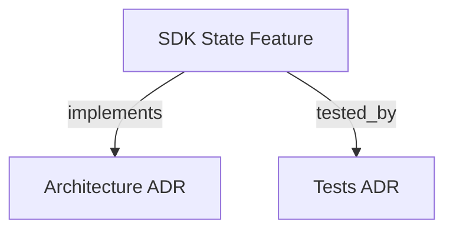

```graph
{"node_id":"feature:sdk_state","domain":"state","implements":["adr:architecture"],"tested_by":["adr:tests"],"entrypoints":["src/file-state/FileStateManager.ts"],"registration_files":[],"reference_files":["src/file-state/parsers/BacklogParser.ts"],"code_files":["src/file-state/parsers/BootstrapConfigParser.ts","src/file-state/parsers/DevStateParser.ts","src/file-state/types.ts"],"test_files":["src/file-state/__tests__/blockDependents.test.ts","src/file-state/parsers/__tests__/BacklogParser.test.ts","tests/integration/FileStateSteering.test.ts","tests/integration/t07-file-state-manager.test.ts","tests/integration/t16-file-state-f002.test.ts","tests/unit/t06-parsers.test.ts","tests/unit/t27-bootstrap-config-parser.test.ts"]}
```

# SDK STATE
Extends `FileStateManager` with high-level state mutation and query methods required by the orchestrator loop.

## OVERVIEW
The `sdk_state` module provides state mutations for tracking features, tasks, decisions, and reworks on disk. All methods operate on markdown files and follow strict idempotency and atomicity rules.

## FOLDER STRUCTURE
<folder_structure>
```
sdk/src/file-state/
├── FileStateManager.ts     # Implementation of state methods
├── types.ts                # Interfaces like DecisionEntry
└── parsers/
    ├── BacklogParser.ts    # Strips markdown wrapping from IDs
    └── DevStateParser.ts   # Parses development state tables
```
</folder_structure>

## HOW TO USE FILE STATE MUTATIONS

### Prerequisites
1. Instantiate a `FileStateManager`.
2. Ensure you have the `IFileStateManager` port accessible.

### Steps
1. Call `updateFeatureStatus()` to modify status.
2. Call `appendDecision()` to log architectural decisions.

<code_example>
# CORRECT: Logging a decision specific to a feature
await fileStateManager.appendDecision({
  featureId: "F001",
  decision: "Use atomic writes"
});

# WRONG: Providing poorly formatted decision strings
await fileStateManager.appendDecision({
  featureId: "F001",
  decision: "Use atomic writes | because" // Pipe chars must be escaped by the parser
});
</code_example>

## BEST PRACTICES
REQUIRED: Call `resetTasksForRetry(featureId)` before re-entering DEVELOPMENT.
REQUIRED: Pass `DecisionEntry` with `featureId` set to the active feature ID.
PROHIBITED: Calling `incrementReworks` more than once per validation failure.

## DOCUMENT MAP



## REFERENCES
- [**SDK_CORE.md**](./SDK_CORE.md): Foundation — IFileStateManager port and adapter.
- [**SDK_AGENT_RUNNER.md**](./SDK_AGENT_RUNNER.md): Outbound port implementation.
- [**ARCHITECTURE.md**](../adr/ARCHITECTURE.md): Ports-and-Adapters structure.

