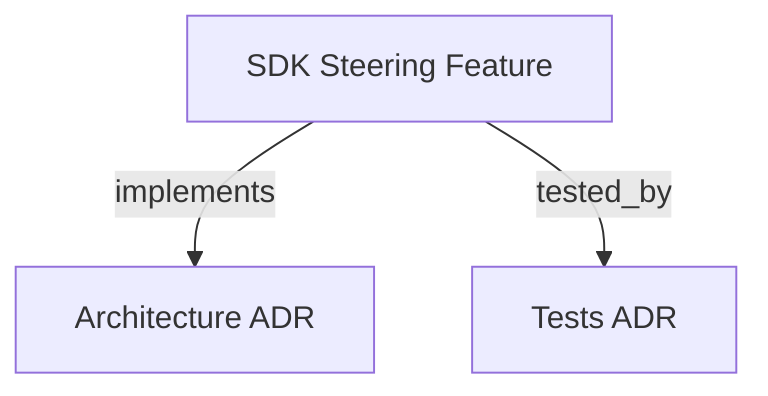

```graph
{"node_id":"feature:sdk_steering","domain":"steering","implements":["adr:architecture"],"tested_by":["adr:tests"],"entrypoints":["src/orchestrator/SteeringAnalyzer.ts"],"registration_files":[],"reference_files":["src/orchestrator/services/SteeringService.ts"],"code_files":[],"test_files":["src/orchestrator/__tests__/SteeringAnalyzer.test.ts","src/orchestrator/services/__tests__/SteeringService.test.ts","tests/integration/FileStateSteering.test.ts","tests/unit/t18-steering-constraints.test.ts","tests/unit/t31-steering-analyzer-and-directives.test.ts"]}
```

# SDK STEERING
Allows developers to inject runtime directives when resuming an orchestration session.

## OVERVIEW
The steering module translates a free-text steering message into structured `SteeringAction` values using an LLM. It modifies `BOOTSTRAP-CONFIG.json` to persist rules or roll back the orchestrator's phase state.

## FOLDER STRUCTURE
<folder_structure>
```
sdk/src/orchestrator/
└── SteeringAnalyzer.ts   # LLM-based steering message classifier

docs/product/
└── BOOTSTRAP-CONFIG.json # Persists steeringRules[]
```
</folder_structure>

## HOW TO APPLY STEERING

### Prerequisites
1. Provide an LLM agent runner instance.
2. Orchestrator must be initialized.

### Steps
1. Run `hrns run --resume`.
2. Provide a steering instruction.

<code_example>
# CORRECT: Context assembler automatically injects rules
const payload = ContextAssembler.buildPlanningPayload(feature, paths, steeringRules);

# WRONG: Omitting rules means agents never see developer constraints
const payload = ContextAssembler.buildPlanningPayload(feature, paths);
</code_example>

## BEST PRACTICES
REQUIRED: Keep steering rules concise and imperative.
REQUIRED: After applying a rollback action, let the orchestrator reset all in-progress tasks automatically.
REQUIRED: Use steering rules to configure phase-specific behavior constraints.
PROHIBITED: Adding duplicate rules. The system does not deduplicate automatically.
PROHIBITED: Calling `applySteeringActions` with an empty array.

## DOCUMENT MAP



## REFERENCES
- [**SDK_CORE.md**](./SDK_CORE.md): `BootstrapConfig` type and `applySteeringActions` method.
- [**SDK_AGENT_RUNNER.md**](./SDK_AGENT_RUNNER.md): `IAgentRunner` interface used by `SteeringAnalyzer`.
- [**ARCHITECTURE.md**](../adr/ARCHITECTURE.md): `SteeringAnalyzer` module responsibilities.

