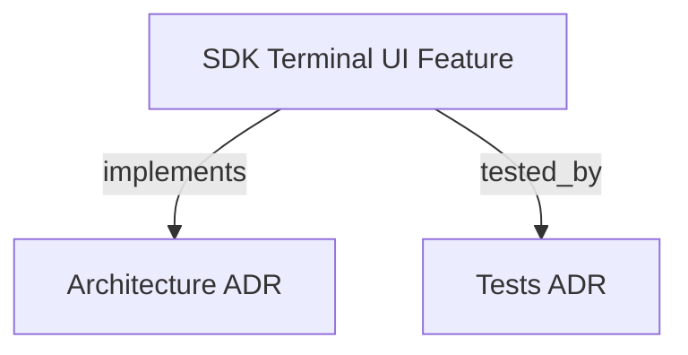

```graph
{"node_id":"feature:sdk_terminal_ui","domain":"terminal_ui","implements":["adr:architecture"],"tested_by":["adr:tests"],"entrypoints":["src/ui/TerminalProgress.ts"],"registration_files":[],"reference_files":["src/ui/AnsiHelpers.ts"],"code_files":["src/ui/StartupBanner.ts"],"test_files":["src/ui/__tests__/StartupBanner.test.ts","tests/unit/t26-terminal-progress.test.ts"]}
```

# SDK TERMINAL UI
Provides ANSI-based terminal rendering utilities for the CLI orchestrator.

## OVERVIEW
The terminal UI module handles visual representation in the CLI, including startup banners, animated spinners, and progress bars. It leverages ANSI escape sequences to provide a rich CLI experience.

## FOLDER STRUCTURE
<folder_structure>
```
sdk/src/ui/
├── StartupBanner.ts      # ASCII welcome banner
├── AnsiHelpers.ts        # Low-level ANSI escape sequences
└── TerminalProgress.ts   # Animated spinner and progress bar
```
</folder_structure>

## HOW TO USE ANSI HELPERS

### Prerequisites
1. Execute within a terminal environment that supports ANSI escape codes.

### Steps
1. Import `AnsiHelpers` statically.
2. Use helper methods to output styled text.

<code_example>
# CORRECT: using AnsiHelpers for styling
console.log(AnsiHelpers.blue("Information"));

# WRONG: using raw escape characters
console.log("\x1b[34mInformation\x1b[0m");
</code_example>

## BEST PRACTICES
REQUIRED: Always call `stopSpinner()` in a `finally` block to prevent terminal corruption.
REQUIRED: Check `process.stdout.columns` before rendering width-dependent components.
REQUIRED: Import `AnsiHelpers` statically — do not use `require()` inline.
PROHIBITED: Writing raw ANSI escape strings outside of `AnsiHelpers`.
PROHIBITED: Calling `startSpinner()` again without calling `stopSpinner()` first.

## DOCUMENT MAP



## REFERENCES
- [**ARCHITECTURE.md**](../adr/ARCHITECTURE.md): Folder structure and module responsibilities.
- [**SDK_CORE.md**](./SDK_CORE.md): Orchestrator integration points.
- [**SDK_STEERING.md**](./SDK_STEERING.md): Steering output confirmation UI dependencies.

