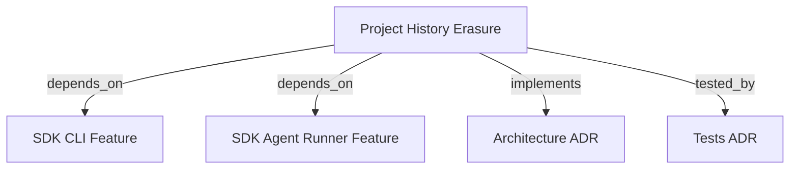

```graph
{"node_id":"feature:sdk_project_history_erasure","domain":"project_history_erasure","implements":["adr:architecture"],"tested_by":["adr:tests"],"entrypoints":["src/cli/services/erase-service.ts"],"registration_files":["src/agent-runner/erase/CLIEraseRegistry.ts","src/cli/run.ts"],"reference_files":["src/agent-runner/erase/AbstractCLIErase.ts"],"code_files":["src/agent-runner/erase/types.ts","src/agent-runner/erase/NodeEraseFileSystem.ts","src/agent-runner/erase/manifest-utils.ts","src/agent-runner/claude-cli/ClaudeCLIErase.ts","src/agent-runner/codex-cli/CodexCLIErase.ts","src/agent-runner/copilot-cli/CopilotCLIErase.ts","src/agent-runner/antigravity-cli/AntigravityCLIErase.ts","src/agent-runner/opencode-cli/OpenCodeCLIErase.ts"],"test_files":["src/agent-runner/erase/__tests__/AbstractCLIErase.test.ts","src/agent-runner/__tests__/ClaudeCLIErase.test.ts","src/agent-runner/__tests__/CodexCLIErase.test.ts","src/agent-runner/__tests__/CopilotCLIErase.test.ts","src/agent-runner/__tests__/AntigravityCLIErase.test.ts","src/agent-runner/__tests__/OpenCodeCLIErase.test.ts","src/cli/services/__tests__/erase-service.test.ts","tests/e2e/integration/erase-cli.test.ts"]}
```

# SDK PROJECT HISTORY ERASURE
Use `hrns erase` to discover and remove allowlisted agent runtime history while preserving credentials, configuration, and project-authored files.

## OVERVIEW
Select Claude Code, Codex, Copilot, Antigravity, or OpenCode. The CLI previews an ordered snapshot, requires explicit confirmation (default `false`), then removes only approved entries. Shell manifests under `docs/sh/` are reference data and never execute.

## KNOWLEDGE

```json
{"schema_version":1,"entities":[{"id":"capability:agent-history-erasure","type":"capability","label":"Agent history erasure","definition":"Discover and remove mapped agent-history files through a reviewed preview.","aliases":[]},{"id":"rule:erase-preview-binding","type":"rule","label":"Erase preview binding","definition":"Execute only the exact discovery preview associated with its prepared plan.","aliases":[]}],"claims":[{"id":"claim:erase-uses-discovery-plan","subject":"capability:agent-history-erasure","relation":"constrained_by","object":"rule:erase-preview-binding","statement":"AbstractCLIErase.erase looks up the prepared plan by preview.planId and returns a failed result when the plan is absent or the preview entries do not match the prepared entries.","kind":"observation","status":"supported","evidence":[{"kind":"code","source":"src/agent-runner/erase/AbstractCLIErase.ts","locator":"erase: preparedPlans lookup and preview validation","snapshot":null}],"derived_from":[],"gap":null}]}
```

## FOLDER STRUCTURE
<folder_structure>
```
src/agent-runner/erase/       # Shared manifests, filesystem port, registry
src/agent-runner/*-cli/       # Vendor-specific erase adapters
src/cli/services/             # Interactive command and confirmation flow
```
</folder_structure>

## MAIN CONCEPTS
- **Manifest**: Approved roots and relative entries; reject absolute paths, traversal, and unmapped patterns.
- **Preview**: Immutable ordered snapshot with `planId`, entries, and missing paths. Execute this snapshot only.
- **Result**: `erased`, `cancelled`, `noop`, or `partial`, with deleted, skipped, and failed partitions.
- **Environment**: Inject platform, home, and environment values; never mutate `process.env`.

## SAFETY RULES
REQUIRED: Discover with `lstat`; never follow symlinks. Remove a mapped symlink itself only.
REQUIRED: Contain every resolved entry in an approved root. Reject filesystem roots, home directories, traversal, and unmapped paths before confirmation.
REQUIRED: Remove entries deepest-first without recursive parent deletion. Preserve files created after confirmation.
REQUIRED: Treat `ENOENT` as missing/skipped; collect other errors and continue remaining entries.
REQUIRED: Return non-zero for partial failure; return zero for cancellation and no-op.

## HOW TO USE `hrns erase`
### Steps
1. Run `hrns erase` after building `dist/cli/run.js`.
2. Select a target or pass `--target`.
3. Review the exact preview.
4. Enter `yes` to erase or `no`/`Ctrl-C` to cancel.

```text
# CORRECT: require interactive confirmation
hrns erase --target antigravity

# WRONG: assume a target is erased without confirmation
hrns erase --target antigravity --yes
```

## PARAMETERS / CONFIGURATIONS
| Name | Type | Required | Description | Default |
|---|---|---|---|---|
| `--target` | string | No | `claude-code`, `codex`, `copilot`, `antigravity`, or `opencode` | Interactive prompt |
| `EraseEnvironment` | object | No | Inject vendor roots and platform overrides | Process environment |

## BEST PRACTICES
REQUIRED: Inject `EraseEnvironment`; do not read `process.env` in vendor adapters.
REQUIRED: Pass the exact `ErasePreview` from `discover` to `erase`; do not re-discover.
REQUIRED: Register adapters through `CLIEraseRegistry` before `cmdErase`.
PROHIBITED: Use recursive root deletion, wildcards, or shell scripts in adapters.

## DOCUMENT MAP


## REFERENCES
- [**SDK_CLI.md**](../cli/sdk_cli.md): Command registration and service conventions.
- [**SDK_AGENT_RUNNER.md**](SDK_AGENT_RUNNER.md): Runner registry and adapter boundaries.
- [**ARCHITECTURE.md**](../../adr/ARCHITECTURE.md): Ports-and-Adapters composition rules.
- [**TESTS.md**](../../adr/TESTS.md): Test commands and isolation boundaries.
