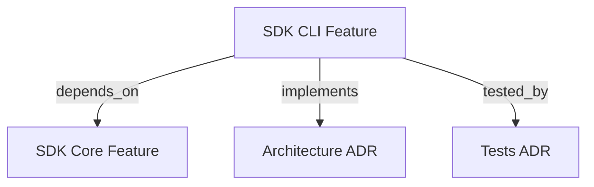

```graph
{"node_id":"feature:sdk_cli","domain":"cli","implements":["adr:architecture"],"tested_by":["adr:tests"],"depends_on":["feature:sdk_core"],"entrypoints":["src/cli/run.ts"],"registration_files":["package.json"],"reference_files":["src/cli/services/run-service.ts"],"code_files":["src/cli/DebugContext.ts","src/cli/services/candidate-service.ts","src/cli/services/diagnose-service.ts","src/cli/services/erase-service.ts","src/cli/services/init-service.ts","src/cli/services/qa-service.ts","src/cli/services/report-service.ts","src/cli/services/report/ReportDataAggregator.ts","src/cli/services/report/ReportExporter.ts","src/cli/services/report/ReportRenderer.ts","src/cli/services/report/types.ts","src/cli/services/reset-service.ts","src/cli/services/settings-service.ts","src/cli/services/qa/QaOrchestratorFactory.ts","src/cli/utils/agent-selection.ts","src/cli/utils/cli-utils.ts","src/cli/utils/constants.ts","src/cli/utils/report-args-parser.ts","src/cli/utils/run-args-parser.ts","src/cli/utils/runner-args-parser.ts"],"test_files":["src/cli/services/__tests__/candidate-service.test.ts","src/cli/services/__tests__/diagnose-service.test.ts","src/cli/services/__tests__/erase-service.test.ts","src/cli/services/__tests__/qa-service.test.ts","src/cli/services/__tests__/run-service.test.ts","src/cli/services/report/__tests__/ReportDataAggregator.test.ts","src/cli/services/report/__tests__/ReportExporter.test.ts","src/cli/services/report/__tests__/ReportRenderer.test.ts","src/cli/services/report/__tests__/report-service.test.ts","src/cli/utils/__tests__/agent-selection.test.ts","src/cli/utils/__tests__/report-args-parser.test.ts","src/cli/utils/__tests__/run-args-parser.test.ts","src/cli/utils/__tests__/runner-args-parser.test.ts","tests/e2e/integration/cli-sandbox.test.ts","tests/e2e/integration/erase-cli.test.ts","tests/unit/t19-run-args-parser.test.ts","tests/unit/t20-debug-context.test.ts","tests/unit/t27-cli-utils.test.ts","tests/unit/t29-init-service.test.ts","tests/unit/t30-resolve-mode.test.ts","tests/unit/t33-resume-phase-choices.test.ts"]}
```

# SDK CLI
Provides the `hrns` command-line interface for launching and managing orchestration sessions.

## OVERVIEW
The CLI module delegates execution to `HarnessOrchestrator` after resolving runtime options. It also exposes independent QA execution, report regeneration, exploratory runs, and correction-scope generation.

## KNOWLEDGE

```json
{"schema_version":1,"entities":[{"id":"capability:hrns-command-dispatch","type":"capability","label":"hrns command dispatch","definition":"Dispatch CLI commands to their command-specific service handlers.","aliases":[]}],"claims":[{"id":"claim:cli-command-routing","subject":"capability:hrns-command-dispatch","relation":null,"object":null,"statement":"The CLI handles help, version, run, init, report, settings, diagnose, qa, candidate, and erase commands; unknown commands print an error and exit with status 1.","kind":"observation","status":"supported","evidence":[{"kind":"code","source":"src/cli/run.ts","locator":"main: command comparisons and unknown-command branch","snapshot":null}],"derived_from":[],"gap":null}]}
```

## FOLDER STRUCTURE
<folder_structure>
```
src/cli/
├── run.ts                        # Main CLI binary
├── DebugContext.ts               # Global debug flag singleton
├── services/
│   ├── run-service.ts            # cmdRun() implementation
│   ├── diagnose-service.ts       # cmdDiagnose() implementation
│   ├── candidate-service.ts      # cmdCandidate() implementation
│   ├── init-service.ts           # cmdInit() implementation
│   ├── reset-service.ts          # resetOptions() wizard
│   ├── report-service.ts         # cmdReport() implementation
│   ├── report/
│   │   ├── ReportDataAggregator.ts
│   │   ├── ReportExporter.ts     # JSON/CSV export serialization
│   │   ├── ReportRenderer.ts     # Human terminal rendering
│   │   └── types.ts
│   └── settings-service.ts       # cmdSettings() implementation
└── utils/                         # Agent selection, argument parsing, validation, and shared help
```
</folder_structure>

## COMMANDS

### Available Commands
Use `hrns init`, `run`, `diagnose`, `candidate`, `report`, `erase`, `qa`, `version`, or `help`; each command delegates to its service.

## HOW TO USE CLI COMMANDS

### Prerequisites
1. Ensure the SDK is built (`dist/cli/run.js`).
2. Run from a valid project directory.

### Steps
1. Run `hrns init` for a new workspace.
2. Run `hrns run` to start the autonomous cycle.
3. Run `hrns diagnose` to process pending diagnosis sessions and propose improvements.
4. Run `hrns candidate review <id>` to review and apply improvements with your AI runner.
5. Run `hrns qa run --report ... --agent <runner>` for independent runtime acceptance tests.
6. Run `hrns run --reset --run <qa-run-id>` to generate a development scope from failed and blocked scenarios.

### AGENT RUNNER SELECTION
Choose an agent runner interactively for `run`, pending `diagnose`, `candidate review/apply`, and QA run/report commands when `--agent` is omitted. The selector preselects `claude-cli`; an explicit `--agent` bypasses the selector. Candidate interactive review lists CLI runners supported by its launcher; autonomous review uses registered runners.

<code_example>
# CORRECT: Non-interactive full reset
hrns run --reset --scope "Build REST API" --path ./src --score 0.9 --reworks 3

# CORRECT: Run diagnosis separately
hrns diagnose --agent antigravity-cli

# CORRECT: Review candidate with AI runner
hrns candidate review v001 --agent antigravity-cli

# CORRECT: Generate correction scope from a completed QA run
hrns run --reset --run orders-20260911 --mode fast

# WRONG: Running without path or scope on a new project
hrns run --reset
</code_example>

## PARAMETERS / CONFIGURATIONS

| Name | Type | Required | Description | Default |
|------|------|----------|-------------|---------|
| `--agent, -a` | string | No | Agent runner; opens a selector when omitted | Interactive choice (`claude-cli` preselected) |
| `--model, -m` | string | No | Model name | — |
| `--effort, -e` | string | No | Reasoning effort level for the model | — |
| `--mode, -M` | string | No | Execution mode: `quick \| fast \| thinking \| deep_thinking`; `thinking` uses `LOW` complexity and runs PBB `REFINEMENT` before `BOOTSTRAP` | `thinking` (interactive) |
| `--complexity, -c` | string | No | Scope complexity override: `LOW \| HIGH \| AUTO` | Mode-inferred |
| `--reset` | boolean | No | Force a new cycle | false |
| `--resume` | boolean | No | Resume from last saved session | false |
| `--scope` | string | No | Project scope / PRD | — |
| `--run` | string | No | Completed QA run ID used to generate correction scope | — |
| `--path` | string | No | Add a directory to projectPaths (repeatable) | `cwd` |
| `--score` | float | No | Minimum acceptance score | `0.7` |
| `--reworks` | int | No | Max rework cycles | `2` |
| `--steering` | string | No | Additional orchestration rules | — |
| `--refine` | boolean | No | Enable interactive refinement | false |
| `--skip-validation` | boolean | No | Skip Review phase (Phase C) | false |
| `--skip-memory` | boolean | No | Skip Memory phase (Phase E) | false |
| `--skip-deploy` | boolean | No | Skip Deploy phase | false |
| `--debug` | boolean | No | Enable debug output to stderr | false |

## BEST PRACTICES
REQUIRED: Skip the reset wizard by providing at least one of `--scope`, `--path`, `--score`, or `--reworks`.
REQUIRED: Use either `--scope` or `--run` for reset; never combine them. Pass `--agent` in automation; interactive sessions can use the runner selector.
PROHIBITED: Modifying workspace root source or production configuration manually while the CLI is running.

## DOCUMENT MAP



## REFERENCES
- [**SDK_SETTINGS.md**](../orchestration/SDK_SETTINGS.md): Settings and configuration resolver details.
- [**SDK_STEERING.md**](../orchestration/SDK_STEERING.md): Orchestration phase steering rules details.
- [**SDK_CORE.md**](../orchestration/SDK_CORE.md): Core orchestrator lifecycle and phases.
