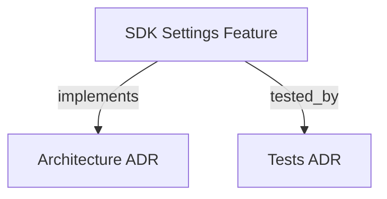

```graph
{"node_id":"feature:sdk_settings","domain":"settings","implements":["adr:architecture"],"tested_by":["adr:tests"],"entrypoints":["src/settings/HarnessSettings.ts"],"registration_files":[],"reference_files":["src/settings/DefaultSettings.ts"],"code_files":["src/settings/SettingsSchema.ts"],"test_files":["tests/unit/t16-settings.test.ts","tests/unit/t17-orchestrator-settings.test.ts","tests/unit/t28-harness-settings.test.ts"]}
```

# SDK SETTINGS
Configure models and effort parameters per orchestration phase and agent runner.

## OVERVIEW
The settings module manages default and project-level configurations. It provides mechanisms to override global settings based on the runner type and specific execution phase.

## KNOWLEDGE

```json
{"schema_version":1,"entities":[{"id":"capability:phase-settings-resolution","type":"capability","label":"Phase settings resolution","definition":"Resolve effective configuration for a runner and orchestration phase.","aliases":[]}],"claims":[{"id":"claim:settings-precedence","subject":"capability:phase-settings-resolution","relation":null,"object":null,"statement":"HarnessSettings.resolve accepts runner type and phase key and resolves the corresponding phase settings.","kind":"observation","status":"supported","evidence":[{"kind":"code","source":"src/settings/HarnessSettings.ts","locator":"resolve(runnerType, phaseKey)","snapshot":null}],"derived_from":[],"gap":null}]}
```

## FOLDER STRUCTURE
<folder_structure>
```
sdk/src/settings/
├── SettingsSchema.ts     # Schema and types for Settings Map
├── DefaultSettings.ts    # Complete out-of-the-box configurations
└── HarnessSettings.ts    # Settings loader, merger, and resolver
```
</folder_structure>

## HOW TO CONFIGURE SETTINGS

### Prerequisites
1. Ensure the SDK is initialized.
2. Locate the global or project-level `.harness-kit/settings.json` file.

### Steps
1. Open `settings.json`.
2. Add configurations keyed by agent runner type and phase.

<code_example>
# CORRECT: Valid settings schema structure
{
  "claude-cli": {
    "phases": {
      "bootstrap": { "model": "claude-sonnet-4-6", "effort": "high" }
    }
  }
}

# WRONG: Missing agent runner top-level key
{
  "phases": {
    "bootstrap": { "model": "claude-sonnet-4-6" }
  }
}
</code_example>

## BEST PRACTICES
REQUIRED: Use valid phase keys (`bootstrap`, `planning`, `implementation`, `review_tl`, `review_adv`, `memory`, `diagnose`, `qa_planning`, `qa_analysis`, `qa_reporting`).
REQUIRED: Resolve settings using the precedence order: Project > Global > Internal Defaults.
REQUIRED: Use `qa_planning`, `qa_analysis`, and `qa_reporting` for QA phases. CLI `--model` and `--effort` values override phase settings.

## DOCUMENT MAP



## REFERENCES
- [**ARCHITECTURE.md**](../../adr/ARCHITECTURE.md): Structural details and registry patterns.
