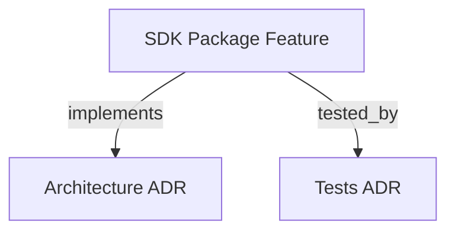

```graph
{"node_id":"feature:sdk_package","domain":"package","implements":["adr:architecture"],"tested_by":["adr:tests"],"entrypoints":["src/index.ts","src/cli/run.ts"],"registration_files":["package.json"],"reference_files":[],"code_files":["tsconfig.json","tsconfig.build.json"],"test_files":["tests/unit/t01-scaffold.test.ts","tests/unit/t15-public-api.test.ts"],"knowledge":{"schema_version":1,"entities":[{"id":"contract:npm-package-surface","type":"contract","label":"SDK package surface","definition":"Package metadata that selects the published version, public entry, and included files.","aliases":[]}],"claims":[{"id":"claim:package-version-and-exports","subject":"contract:npm-package-surface","relation":null,"object":null,"statement":"package.json sets version 0.9.3, exposes dist/index.js and dist/index.d.ts from the root export, and allows dist plus README.md in the package.","kind":"observation","status":"supported","evidence":[{"kind":"configuration","source":"package.json","locator":"version, exports['.'], and files","snapshot":null}],"derived_from":[],"gap":null}]}}
```

# SDK PACKAGE
Defines the publication surface of `@romabeckman/hrns` for npm.

## OVERVIEW
The package manifest sets `@romabeckman/hrns` to version `0.9.3`. Its exports map exposes the compiled CommonJS entry and declarations; the publish allowlist contains `dist` and `README.md`.

## FOLDER STRUCTURE
<folder_structure>
```
sdk/
├── package.json          # npm config with prepublishOnly gate
├── tsconfig.build.json   # Scoped to src/**/*, excludes tests
├── README.md             # Package documentation
└── src/
    └── cli/
        └── run.ts        # CLI entry point
```
</folder_structure>

## MAIN CONCEPTS

### Package configuration
- **Exports Map**: Exposes a single `.` entry, forcing callers through the public index.
- **Files Whitelist**: Explicitly lists `dist` and `README.md` to prevent publishing test artifacts.

## HOW TO CONFIGURE PACKAGE EXPORTS

### Prerequisites
1. Ensure the build pipeline works correctly.
2. Ensure you have `package.json` properly configured.

### Steps
1. Add explicit `exports` map.
2. Define the `files` array.

<code_example>
# CORRECT: single "." entry — forces callers through the public index
"exports": {
  ".": {
    "require": "./dist/index.js",
    "types": "./dist/index.d.ts"
  }
}

# WRONG: no exports field — allows deep imports to private modules
"main": "dist/index.js"
</code_example>

## PARAMETERS / CONFIGURATIONS

| Name | Type | Required | Description | Default |
|------|------|----------|-------------|---------|
| `name` | string | Yes | Scoped package name for npm registry | `@romabeckman/hrns` |
| `version` | string | Yes | Published SDK version | `0.9.3` |
| `exports["."].require` | string | Yes | CJS entry via `exports` map | `./dist/index.js` |
| `files` | string[] | Yes | Tarball whitelist | `["dist", "README.md"]` |

## BEST PRACTICES
REQUIRED: Keep `exports` map as the authoritative entry point.
REQUIRED: Add new public exports only through `src/index.ts`.
PROHIBITED: Committing the `dist/` directory to source control.

## DOCUMENT MAP



## REFERENCES
- [**SDK_CORE.md**](../orchestration/SDK_CORE.md): Public API surface compiled into `dist/`.
- [**SDK_STATE.md**](../orchestration/SDK_STATE.md): High-level state mutation methods included in the published package.
- [**SDK_AGENT_RUNNER.md**](../agents/SDK_AGENT_RUNNER.md): Agent Runner error types included in the published package.
- [**ARCHITECTURE.md**](../../adr/ARCHITECTURE.md): CJS-only exports boundary decision.
