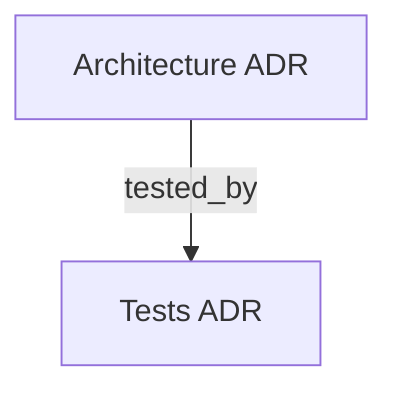

# Rules for docs/adr/ARCHITECTURE.md

Defines the analysis framework and strict rules for generating and maintaining `docs/adr/ARCHITECTURE.md`.

---

## EXPECTED OUTPUT

| Field | Value |
|---|---|
| Target file | `docs/adr/ARCHITECTURE.md` |
| Agent action | Read the repository, apply the PRE-GENERATION ANALYSIS below, then generate or overwrite the file using the MANDATORY TEMPLATE exactly as specified |

---

## PRE-GENERATION ANALYSIS

REQUIRED: Complete all three analyses by inspecting the repository before writing a single line of the document. Each analysis maps directly to a template section.

| Analysis item | Where to look | Feeds template section |
|---|---|---|
| Structure | Application root directory (e.g., `src/`, `app/`), organization by feature vs layer, global configs | `## FOLDER STRUCTURE` |
| Patterns | Class/function definitions, naming conventions, DI, error handling, REQUIRED/FORBIDDEN constraints | `## LAYERS` and `## PATTERNS` |
| Integrations | Registration logic (routes, services), external calls (DBs, APIs) | `## INTEGRATIONS` |

---

## MANDATORY TEMPLATE

REQUIRED: Use the exact structure below as literal output when generating or updating `docs/adr/ARCHITECTURE.md`. UPPERCASE section titles are mandatory and must not be renamed or removed.

```markdown
---
doc_type: adr
domain: architecture
stack: [list of main technologies]
node_id: "adr:architecture"
tags: [architecture, design-patterns, folder-structure]
edges:
  - relation: tested_by
    target: "adr:tests"
    path: "./TESTS.md"
updated: YYYY-MM-DD
---
# Arquitetura do Projeto

## OVERVIEW
[Maximum 3 lines. State the main architectural pattern (e.g., Clean Architecture, Hexagonal, MVC), primary languages/frameworks, and the general data flow.]

## FOLDER STRUCTURE
[Directory tree from Structure Analysis. Show the most important structural folders. Use aligned comments to explain the purpose of each. Do not list every file — focus on the root structure of features/domains.]
<folder_structure>
```
[project_root]/
├── [config_folder]/              # [Purpose, e.g., Environment configuration]
├── [features_folder]/            # [Purpose, e.g., Business domain modules]
│   └── [domain_example]/
│       ├── [layer_1]/            # [Layer responsibility within this domain]
│       └── [layer_2]/            # [Layer responsibility within this domain]
└── [shared_folder]/              # [Purpose, e.g., Generic utils and helpers]
```
</folder_structure>

## LAYERS
[List main architectural layers and their strict responsibilities.]
- **[Layer 1]**: [Responsibility and constraints of this layer]
- **[Layer 2]**: [Responsibility and constraints of this layer]

## MODULES
| Module | Responsibility | Location |
|--------|-----------------|-------------|
| [Name] | [What it does]  | `[path]/`   |

## PATTERNS
[Code rules from Pattern Recognition. Use REQUIRED and FORBIDDEN prefixes.]

<code_patterns>
# REQUIRED: [Pattern name — e.g., Constructor dependency injection]
[Code example demonstrating the correct pattern]

# FORBIDDEN: [Anti-pattern name — e.g., Global state usage]
[Code example demonstrating what NOT to do]
</code_patterns>

## INTEGRATIONS
| External Service / Component | Purpose | Connection / Authentication Method |
|------------------------------|---------|-------------------------------------|
| [Name]                       | [Use]   | [How it connects]                   |

## DOCUMENT MAP



## REFERENCES

- [**README.md**](../README.md): Main documentation index.
- [**TESTS.md**](./TESTS.md): Testing strategies and commands.
```

---

## LLM OPTIMIZATION RULES (MANDATORY)

- REQUIRED: Use tables for `## MODULES` and `## INTEGRATIONS` — never prose paragraphs for relational data.
- REQUIRED: Annotate every directory in `## FOLDER STRUCTURE` with a `#` comment explaining where new files of each type should be created.